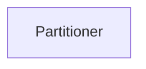
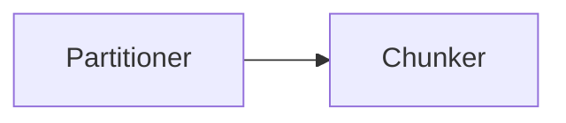

To use the [Unstructured Workflow Endpoint](/api-reference/workflow/overview) to manage workflows, do the following:

- To get a list of available workflows, use the `UnstructuredClient` object's `workflows.list_workflows` function (for the Python SDK) or 
  the `GET` method to call the `/workflows` endpoint (for `curl` or Postman). [Learn more](/api-reference/workflow/overview#list-workflows).
- To get information about a workflow, use the `UnstructuredClient` object's `workflows.get_workflow` function (for the Python SDK) or 
  the `GET` method to call the `/workflows/<workflow-id>` endpoint (for `curl` or Postman)use the `GET` method to call the `/workflows/<workflow-id>` endpoint. [Learn more](/api-reference/workflow/overview#get-a-workflow).
- To create a workflow, use the `UnstructuredClient` object's `workflows.create_workflow` function (for the Python SDK) or 
  the `POST` method to call the `/workflows` endpoint (for `curl` or Postman). [Learn more](#create-a-workflow).
- To run a workflow manually, use the `UnstructuredClient` object's `workflows.run_workflow` function (for the Python SDK) or 
  the `POST` method to call the `/workflows/<workflow-id>/run` endpoint (for `curl` or Postman). [Learn more](/api-reference/workflow/overview#run-a-workflow).
- To update a workflow, use the `UnstructuredClient` object's `workflows.update_workflow` function (for the Python SDK) or 
  the `PUT` method to call the `/workflows/<workflow-id>` endpoint (for `curl` or Postman). [Learn more](#update-a-workflow).
- To delete a workflow, use the `UnstructuredClient` object's `workflows.delete_workflow` function (for the Python SDK) or 
  the `DELETE` method to call the `/workflows/<workflow-id>` endpoint (for `curl` or Postman). [Learn more](/api-reference/workflow/overview#delete-a-workflow).

The following examples assume that you have already met the [requirements](/api-reference/workflow/overview#requirements) and 
understand the [basics](/api-reference/workflow/overview#basics) of working with the Unstructured Workflow Endpoint.

## Create a workflow

To create a workflow, use the `UnstructuredClient` object's `workflows.create_workflow` function (for the Python SDK) or 
the `POST` method to call the `/workflows` endpoint (for `curl` or Postman). 
  
In the `CreateWorkflow` object (for the Python SDK) or 
the request body (for `curl` or Postman), 
specify the settings for the workflow, as follows:

<AccordionGroup>
    <Accordion title="Python SDK (remote source and remote destination)">
        ```python
        import os

        from unstructured_client import UnstructuredClient
        from unstructured_client.models.shared import (
            WorkflowNode,
            CreateWorkflow,
            WorkflowType,
            Schedule
        )
        from unstructured_client.models.operations import CreateWorkflowRequest
        

        client = UnstructuredClient(
            api_key_auth=os.getenv("UNSTRUCTURED_API_KEY")
        )

        workflow_node = WorkflowNode(
            name="<node-name>",
            type="<node-type>",
            subtype="<node-subtype>",
            settings={
                "...": "..."
            }
        )

        another_workflow_node = WorkflowNode(
            name="<node-name>",
            type="<node-type>",
            subtype="<node-subtype>",
            settings={
                "...": "..."
            }
        )

        # And so on for any additional nodes.

        workflow = CreateWorkflow(
            name="<name>",
            source_id="<source-connector-id>",
            destination_id="<destination-connector-id>",
            workflow_type=WorkflowType.<TYPE>,
            workflow_nodes=[
                workflow_node,
                another_workflow_node
                # And so on for any additional nodes.
            ],
            schedule=Schedule("<schedule-timeframe>")
        )

        response = client.workflows.create_workflow(
            request=CreateWorkflowRequest(
                create_workflow=workflow
            )
        )

        info = response.workflow_information

        print(f"name:           {info.name}")
        print(f"id:             {info.id}")
        print(f"status:         {info.status}")
        print(f"type:           {info.workflow_type}")
        print("source(s):")

        for source in info.sources:
            print(f"            {source}")

        print("destination(s):")

        for destination in info.destinations:
            print(f"            {destination}")

        print("schedule(s):")

        for crontab_entry in info.schedule.crontab_entries:
            print(f"            {crontab_entry.cron_expression}")
        ```
    </Accordion>
    <Accordion title="Python SDK (local source and local destination)">
        To use a local source and a local destination, do not specify a `source_id` or `destination_id` value. Also, the `workflow_type` must be set to `CUSTOM`.

        <Note>
            A workflow with a local source has the following limitations:

            - The workflow cannot be set to run on a repeating schedule.
            - The workflow cannot be run with the Unstructured Python SDK or from the Unstructured user interface (UI), 
              even though the workflows is visible in the UI. However, you can 
              run the workflow with REST API clients such as `curl` or Postman. [Learn how](/api-reference/workflow/overview#run-a-workflow).
        </Note>
        
        ```python
        import os

        from unstructured_client import UnstructuredClient
        from unstructured_client.models.shared import (
            WorkflowNode,
            CreateWorkflow,
            WorkflowType
        )
        from unstructured_client.models.operations import CreateWorkflowRequest

        workflow_node = WorkflowNode(
            name="<node-name>",
            type="<node-type>",
            subtype="<node-subtype>",
            settings={
                "...": "..."
            }
        )

        another_workflow_node = WorkflowNode(
            name="<node-name>",
            type="<node-type>",
            subtype="<node-subtype>",
            settings={
                "...": "..."
            }
        )

        # And so on for any additional nodes.

        workflow=CreateWorkflow(
            name="<name>",
            workflow_type=WorkflowType.CUSTOM,
            workflow_nodes=[
                workflow_node,
                another_workflow_node
                # And so on for any additional nodes.
            ]
        )

        with UnstructuredClient(api_key_auth=os.getenv("UNSTRUCTURED_API_KEY")) as client:
            response = client.workflows.create_workflow(
                request=CreateWorkflowRequest(
                    create_workflow=workflow
                )
            )

            info = response.workflow_information

            print(f"name: {info.name}")
            print(f"id: {info.id}")
            print(f"status: {info.status}")
            print(f"type: {info.workflow_type}")
            print("source(s):")

            for source in info.sources:
                print(f"    {source}")

            print("destination(s):")

            for destination in info.destinations:
                print(f"    {destination}")

            print("schedule(s):")

            for crontab_entry in info.schedule.crontab_entries:
                print(f"    {crontab_entry.cron_expression}")
        ```
    </Accordion>
    <Accordion title="Python SDK (local source and remote destination)">
        To use a local source and a remote destination, specify a `destination_id` value, and do not specify a `source_id` value. Also, the `workflow_type` must be set to `CUSTOM`.

        <Note>
            A workflow with a local source has the following limitations:

            - The workflow cannot be set to run on a repeating schedule.
            - The workflow cannot be run with the Unstructured Python SDK or from the Unstructured user interface (UI), 
              even though the workflows is visible in the UI. However, you can 
              run the workflow with REST API clients such as `curl` or Postman. [Learn how](/api-reference/workflow/overview#run-a-workflow).
        </Note>

        ```python
        import os

        from unstructured_client import UnstructuredClient
        from unstructured_client.models.shared import (
            WorkflowNode,
            CreateWorkflow,
            WorkflowType
        )
        from unstructured_client.models.operations import CreateWorkflowRequest

        workflow_node = WorkflowNode(
            name="<node-name>",
            type="<node-type>",
            subtype="<node-subtype>",
            settings={
                "...": "..."
            }
        )

        another_workflow_node = WorkflowNode(
            name="<node-name>",
            type="<node-type>",
            subtype="<node-subtype>",
            settings={
                "...": "..."
            }
        )

        # And so on for any additional nodes.

        workflow=CreateWorkflow(
            name="<name>",
            destination_id="<destination-connector-id>",
            workflow_type=WorkflowType.CUSTOM,
            workflow_nodes=[
                workflow_node,
                another_workflow_node
                # And so on for any additional nodes.
            ]
        )

        with UnstructuredClient(api_key_auth=os.getenv("UNSTRUCTURED_API_KEY")) as client:
            response = client.workflows.create_workflow(
                request=CreateWorkflowRequest(
                    create_workflow=workflow
                )
            )

            info = response.workflow_information

            print(f"name: {info.name}")
            print(f"id: {info.id}")
            print(f"status: {info.status}")
            print(f"type: {info.workflow_type}")
            print("source(s):")

            for source in info.sources:
                print(f"    {source}")

            print("destination(s):")

            for destination in info.destinations:
                print(f"    {destination}")

            print("schedule(s):")

            for crontab_entry in info.schedule.crontab_entries:
                print(f"    {crontab_entry.cron_expression}")
        ```
    </Accordion>
    <Accordion title="Python SDK (async) (remote source and remote destination)">
        ```python
        import os
        import asyncio

        from unstructured_client import UnstructuredClient
        from unstructured_client.models.shared import (
            WorkflowNode,
            CreateWorkflow,
            WorkflowType,
            Schedule
        )
        from unstructured_client.models.operations import CreateWorkflowRequest
        
        async def create_workflow():
            client = UnstructuredClient(
                api_key_auth=os.getenv("UNSTRUCTURED_API_KEY")
            )

            workflow_node = WorkflowNode(
                name="<node-name>",
                type="<node-type>",
                subtype="<node-subtype>",
                settings={
                    "...": "..."
                }
            )

            another_workflow_node = WorkflowNode(
                name="<node-name>",
                type="<node-type>",
                subtype="<node-subtype>",
                settings={
                    "...": "..."
                }
            )

            # And so on for any additional nodes.

            workflow = CreateWorkflow(
                name="<name>",
                source_id="<source-connector-id>",
                destination_id="<destination-connector-id>",
                workflow_type=WorkflowType.<TYPE>,
                workflow_nodes=[
                    workflow_node,
                    another_workflow_node
                    # And so on for any additional nodes.
                ],
                schedule=Schedule("<schedule-timeframe>")
            )

            response = await client.workflows.create_workflow_async(
                request=CreateWorkflowRequest(
                    create_workflow=workflow
                )
            )

            info = response.workflow_information

            print(f"name:           {info.name}")
            print(f"id:             {info.id}")
            print(f"status:         {info.status}")
            print(f"type:           {info.workflow_type}")
            print("source(s):")

            for source in info.sources:
                print(f"            {source}")

            print("destination(s):")

            for destination in info.destinations:
                print(f"            {destination}")

            print("schedule(s):")

            for crontab_entry in info.schedule.crontab_entries:
                print(f"            {crontab_entry.cron_expression}")

        asyncio.run(create_workflow())
        ```
    </Accordion>
    <Accordion title="Python SDK (async) (local source and local destination)">
        To use a local source and a local destination, do not specify a `source_id` or `destination_id` value. Also, the `workflow_type` must be set to `CUSTOM`.

        <Note>
            A workflow with a local source has the following limitations:

            - The workflow cannot be set to run on a repeating schedule.
            - The workflow cannot be run with the Unstructured Python SDK or from the Unstructured user interface (UI), 
              even though the workflows is visible in the UI. However, you can 
              run the workflow with REST API clients such as `curl` or Postman. [Learn how](/api-reference/workflow/overview#run-a-workflow).
        </Note>

        ```python
        import os
        import asyncio

        from unstructured_client import UnstructuredClient
        from unstructured_client.models.shared import (
            WorkflowNode,
            CreateWorkflow,
            WorkflowType
        )
        from unstructured_client.models.operations import CreateWorkflowRequest

        async def create_workflow():
            workflow_node = WorkflowNode(
                name="<node-name>",
                type="<node-type>",
                subtype="<node-subtype>",
                settings={
                    "...": "..."
                }
            )

            another_workflow_node = WorkflowNode(
                name="<node-name>",
                type="<node-type>",
                subtype="<node-subtype>",
                settings={
                    "...": "..."
                }
            )

            # And so on for any additional nodes.

            workflow = CreateWorkflow(
                name="<name>",
                workflow_type=WorkflowType.CUSTOM,
                workflow_nodes=[
                    workflow_node,
                    another_workflow_node
                    # And so on for any additional nodes.
                ]
            )

            with UnstructuredClient(api_key_auth=os.getenv("UNSTRUCTURED_API_KEY")) as client:
                response = await client.workflows.create_workflow_async(
                    request=CreateWorkflowRequest(
                        create_workflow=workflow
                    )
                )

                info = response.workflow_information

                print(f"name: {info.name}")
                print(f"id: {info.id}")
                print(f"status: {info.status}")
                print(f"type: {info.workflow_type}")
                print("source(s):")

                for source in info.sources:
                    print(f"    {source}")

                print("destination(s):")

                for destination in info.destinations:
                    print(f"    {destination}")

                print("schedule(s):")

                for crontab_entry in info.schedule.crontab_entries:
                    print(f"    {crontab_entry.cron_expression}")

        asyncio.run(create_workflow())
        ```
    </Accordion>
    <Accordion title="Python SDK (async) (local source and remote destination)">
        To use a local source and a remote destination, specify a `destination_id` value, and do not specify a `source_id` value. Also, the `workflow_type` must be set to `CUSTOM`.

        <Note>
            A workflow with a local source has the following limitations:

            - The workflow cannot be set to run on a repeating schedule.
            - The workflow cannot be run with the Unstructured Python SDK or from the Unstructured user interface (UI), 
              even though the workflows is visible in the UI. However, you can 
              run the workflow with REST API clients such as `curl` or Postman. [Learn how](/api-reference/workflow/overview#run-a-workflow).
        </Note>

        ```python
        import os
        import asyncio

        from unstructured_client import UnstructuredClient
        from unstructured_client.models.shared import (
            WorkflowNode,
            CreateWorkflow,
            WorkflowType
        )
        from unstructured_client.models.operations import CreateWorkflowRequest

        async def create_workflow():
            workflow_node = WorkflowNode(
                name="<node-name>",
                type="<node-type>",
                subtype="<node-subtype>",
                settings={
                    "...": "..."
                }
            )

            another_workflow_node = WorkflowNode(
                name="<node-name>",
                type="<node-type>",
                subtype="<node-subtype>",
                settings={
                    "...": "..."
                }
            )

            # And so on for any additional nodes.

            workflow = CreateWorkflow(
                name="<name>",
                destination_id="<destination-connector-id>",
                workflow_type=WorkflowType.CUSTOM,
                workflow_nodes=[
                    workflow_node,
                    another_workflow_node
                    # And so on for any additional nodes.
                ]
            )

            with UnstructuredClient(api_key_auth=os.getenv("UNSTRUCTURED_API_KEY")) as client:
                response = await client.workflows.create_workflow_async(
                    request=CreateWorkflowRequest(
                        create_workflow=workflow
                    )
                )

                info = response.workflow_information

                print(f"name: {info.name}")
                print(f"id: {info.id}")
                print(f"status: {info.status}")
                print(f"type: {info.workflow_type}")
                print("source(s):")

                for source in info.sources:
                    print(f"    {source}")

                print("destination(s):")

                for destination in info.destinations:
                    print(f"    {destination}")

                print("schedule(s):")

                for crontab_entry in info.schedule.crontab_entries:
                    print(f"    {crontab_entry.cron_expression}")

        asyncio.run(create_workflow())
        ```
    </Accordion>
    <Accordion title="curl (remote source and remote destination)">
        ```bash
        curl --request 'POST' --location \
        "$UNSTRUCTURED_API_URL/workflows" \
        --header "unstructured-api-key: $UNSTRUCTURED_API_KEY" \
        --header 'accept: application/json' \
        --data \
        '{
            "name": "<name>",
            "source_id": "<source-connector-id>",
            "destination_id": "<destination-connector-id>",
            "workflow_type": "<type>",
            "workflow_nodes": [
                {
                    "name": "<node-name>",
                    "type": "<node-type>",
                    "subtype": "<node-subtype>",
                    "settings": {
                        "...": "..."
                    }
                },
                {
                    "...": "..." 
                } 
            ],
            "schedule": "<schedule-timeframe>"
        }'
        ```
    </Accordion>
    <Accordion title="curl (local source and local destination)">
        To use a local source and a local destination, do not specify a `source_id` or `destination_id` value. Also, the `workflow_type` must be set to `custom`.

        <Note>
            A workflow with a local source has the following limitations:

            - The workflow cannot be set to run on a repeating schedule.
            - The workflow cannot be run with the Unstructured Python SDK or from the Unstructured user interface (UI), 
              even though the workflows is visible in the UI. However, you can 
              run the workflow with REST API clients such as `curl` (or Postman). [Learn how](/api-reference/workflow/overview#run-a-workflow).
        </Note>

        ```bash
        curl --request 'POST' --location \
        "$UNSTRUCTURED_API_URL/workflows" \
        --header "unstructured-api-key: $UNSTRUCTURED_API_KEY" \
        --header 'accept: application/json' \
        --data \
        '{
            "name": "<name>",
            "workflow_type": "custom",
            "workflow_nodes": [
                {
                    "name": "<node-name>",
                    "type": "<node-type>",
                    "subtype": "<node-subtype>",
                    "settings": {
                        "...": "..."
                    }
                },
                {
                    "...": "..." 
                } 
            ]
        }'
        ```
    </Accordion>
    <Accordion title="curl (local source and remote destination)">
        To use a local source and a remote destination, specify a `destination_id` value, and do not specify a `source_id` value. Also, the `workflow_type` must be set to `custom`.

        <Note>
            A workflow with a local source has the following limitations:

            - The workflow cannot be set to run on a repeating schedule.
            - The workflow cannot be run with the Unstructured Python SDK or from the Unstructured user interface (UI), 
              even though the workflows is visible in the UI. However, you can 
              run the workflow with REST API clients such as `curl` (or Postman). [Learn how](/api-reference/workflow/overview#run-a-workflow).
        </Note>

        ```bash
        curl --request 'POST' --location \
        "$UNSTRUCTURED_API_URL/workflows" \
        --header "unstructured-api-key: $UNSTRUCTURED_API_KEY" \
        --header 'accept: application/json' \
        --data \
        '{
            "name": "<name>",
            "destination_id": "<destination-connector-id>",
            "workflow_type": "custom",
            "workflow_nodes": [
                {
                    "name": "<node-name>",
                    "type": "<node-type>",
                    "subtype": "<node-subtype>",
                    "settings": {
                        "...": "..."
                    }
                },
                {
                    "...": "..." 
                } 
            ]
        }'
        ```
    </Accordion>
    <Accordion title="Postman (remote source and remote destination)">
        1. In the method drop-down list, select **POST**.
        2. In the address box, enter the following URL:

            ```text
            {{UNSTRUCTURED_API_URL}}/workflows
            ```

        3. On the **Headers** tab, enter the following headers:

            - **Key**: `unstructured-api-key`, **Value**: `{{UNSTRUCTURED_API_KEY}}`
            - **Key**: `accept`, **Value**: `application/json`

        4. On the **Body** tab, select **raw** and **JSON**, and specify the settings for the workflow:

           ```json
           {
               "name": "<name>",
               "source_id": "<source-connector-id>",
               "destination_id": "<destination-connector-id>",
               "workflow_type": "<type>",
               "workflow_nodes": [
                   {
                       "name": "<node-name>",
                       "type": "<node-type>",
                       "subtype": "<node-subtype>",
                       "settings": {
                           "...": "..."
                       }
                   },
                   {
                       "...": "..." 
                   } 
               ],
               "schedule": "<schedule-timeframe>"
           }
           ```

        5. Click **Send**.
    </Accordion>
    <Accordion title="Postman (local source and local destination)">
        To use a local source and a local destination do not specify a `source_id` or `destination_id` value. Also, the `workflow_type` must be set to `custom`.

        <Note>
            A workflow with a local source has the following limitations:

            - The workflow cannot be set to run on a repeating schedule.
            - The workflow cannot be run with the Unstructured Python SDK or from the Unstructured user interface (UI), 
              even though the workflows is visible in the UI. However, you can 
              run the workflow with REST API clients such as Postman (or `curl`). [Learn how](/api-reference/workflow/overview#run-a-workflow).
        </Note>

        1. In the method drop-down list, select **POST**.
        2. In the address box, enter the following URL:

            ```text
            {{UNSTRUCTURED_API_URL}}/workflows
            ```

        3. On the **Headers** tab, enter the following headers:

            - **Key**: `unstructured-api-key`, **Value**: `{{UNSTRUCTURED_API_KEY}}`
            - **Key**: `accept`, **Value**: `application/json`

        4. On the **Body** tab, select **raw** and **JSON**, and specify the settings for the workflow:

           ```json
           {
               "name": "<name>",
               "workflow_type": "custom",
               "workflow_nodes": [
                   {
                       "name": "<node-name>",
                       "type": "<node-type>",
                       "subtype": "<node-subtype>",
                       "settings": {
                           "...": "..."
                       }
                   },
                   {
                       "...": "..." 
                   } 
               ]
           }
           ```

        5. Click **Send**.
    </Accordion>
    <Accordion title="Postman (local source and remote destination)">
        To use a local source and a remote destination, specify a `destination_id` value, and do not specify a `source_id` value. Also, the `workflow_type` must be set to `custom`.

        <Note>
            A workflow with a local source has the following limitations:

            - The workflow cannot be set to run on a repeating schedule.
            - The workflow cannot be run with the Unstructured Python SDK or from the Unstructured user interface (UI), 
              even though the workflows is visible in the UI. However, you can 
              run the workflow with REST API clients such as Postman (or `curl`). [Learn how](/api-reference/workflow/overview#run-a-workflow).
        </Note>

        1. In the method drop-down list, select **POST**.
        2. In the address box, enter the following URL:

            ```text
            {{UNSTRUCTURED_API_URL}}/workflows
            ```

        3. On the **Headers** tab, enter the following headers:

            - **Key**: `unstructured-api-key`, **Value**: `{{UNSTRUCTURED_API_KEY}}`
            - **Key**: `accept`, **Value**: `application/json`

        4. On the **Body** tab, select **raw** and **JSON**, and specify the settings for the workflow:

           ```json
           {
               "name": "<name>",
               "workflow_type": "custom",
               "workflow_nodes": [
                   {
                       "name": "<node-name>",
                       "destination_id": "<destination-connector-id>",
                       "type": "<node-type>",
                       "subtype": "<node-subtype>",
                       "settings": {
                           "...": "..."
                       }
                   },
                   {
                       "...": "..." 
                   } 
               ]
           }
           ```

        5. Click **Send**.
    </Accordion>
</AccordionGroup>

Replace the preceding placeholders as follows:

- `<name>` (_required_) - A unique name for this workflow.
- `<source-connector-id>` (_required_) - The ID of the target source connector. To get the ID, 
  use the `UnstructuredClient` object's `sources.list_sources` function (for the Python SDK) or 
  the `GET` method to call the `/sources` endpoint (for `curl` or Postman). [Learn more](/api-reference/workflow/overview#list-source-connectors).
- `<destination-connector-id>` (_required_) - The ID of the target destination connector. To get the ID, 
  use the `UnstructuredClient` object's `destinations.list_destinations` function (for the Python SDK) or 
  the `GET` method to call the `/destinations` endpoint (for `curl` or Postman). [Learn more](/api-reference/workflow/overview#list-destination-connectors).
- `<TYPE>` (for the Python SDK) or `<type>` (for `curl` or Postman) (_required_) - The workflow type. Available values include `CUSTOM` (for the Python SDK) and `custom` (for `curl` or Postman).

  If `<TYPE>` is set to `CUSTOM` (for the Python SDK), or if `<type>` is set to `custom` (for `curl` or Postman), you must add a `workflow_nodes` array. For instructions, see [Custom workflow DAG nodes](#custom-workflow-dag-nodes).

  <Note>
      The previously-available workflow optimization types `ADVANCED`, `BASIC`, and `PLATINUM` (for the Python SDK) and 
      `advanced`, `basic`, and `platinum` (for `curl` or Postman) are non-operational and planned to be fully removed in a future release. 

      The ability to create an [automatic workflow](/ui/workflows#create-an-automatic-workflow) type is currently not available but is planned to be added in a future release.
  </Note>

- `<schedule-timeframe>` - The repeating automatic run schedule, specified as a predefined phrase. The available predefined phrases are:

  - `every 15 minutes` (for `curl` or Postman): Every 15 minutes (cron expression: `*/15 * * * *`).
  - `every hour`: At the first minute of every hour (cron expression: `0 * * * *`).
  - `every 2 hours`: At the first minute of every second hour (cron expression: `0 */2 * * *`).
  - `every 4 hours`: At the first minute of every fourth hour (cron expression: `0 */4 * * *`).
  - `every 6 hours`: At the first minute of every sixth hour (cron expression: `0 */6 * * *`).
  - `every 8 hours`: At the first minute of every eighth hour (cron expression: `0 */8 * * *`).
  - `every 10 hours`: At the first minute of every tenth hour (cron expression: `0 */10 * * *`).
  - `every 12 hours`: At the first minute of every twelfth hour (cron expression: `0 */12 * * *`).
  - `daily`: At the first minute of every day (cron expression: `0 0 * * *`).
  - `weekly`: At the first minute of every Sunday (cron expression: `0 0 * * 0`).
  - `monthly`: At the first minute of the first day of every month (cron expression: `0 0 1 * *`).
    
  If `schedule` is not specified, the workflow does not automatically run on a repeating schedule.

  Workflows with a local source cannot be set to run on a repeating schedule.

## Update a workflow

To update information about a workflow, use the `UnstructuredClient` object's `workflows.update_workflow` function (for the Python SDK) or 
the `PUT` method to call the `/workflows/<workflow-id>` endpoint (for `curl` or Postman), replacing 
`<workflow-id>` with the workflow's unique ID. To get this ID, see [List workflows](#list-workflows).

In the request body, specify the settings for the workflow. For the specific settings to include, see 
[Create a workflow](/api-reference/workflow/workflows#create-a-workflow).

<AccordionGroup>
    <Accordion title="Python SDK">
        ```python
        import os

        from unstructured_client import UnstructuredClient
        from unstructured_client.models.shared import (
            WorkflowNode,
            UpdateWorkflow,
            WorkflowType,
            Schedule,
        ),
        from unstructured_client.models.operations import UpdateWorkflowRequest
        
        
        client = UnstructuredClient(
            api_key_auth=os.getenv("UNSTRUCTURED_API_KEY")
        )

        workflow_node = WorkflowNode(
            # Specify the settings for a workflow node here.
        )

        another_workflow_node = WorkflowNode(
            # Specify the settings for another workflow node here.
        )

        # And so on for any additional nodes.

        workflow = UpdateWorkflow(
            # Specify the settings for the workflow here.
        )

        response = client.workflows.update_workflow(
            request=UpdateWorkflowRequest(
                workflow_id="<workflow-id>",
                update_workflow=workflow
            )
        )

        info = response.workflow_information

        print(f"name:           {info.name}")
        print(f"id:             {info.id}")
        print(f"status:         {info.status}")
        print(f"type:           {info.workflow_type}")
        print("source(s):")

        for source in info.sources:
            print(f"            {source}")

        print("destination(s):")

        for destination in info.destinations:
            print(f"            {destination}")

        print("schedule(s):")

        for crontab_entry in info.schedule.crontab_entries:
            print(f"            {crontab_entry.cron_expression}")
        ```
    </Accordion>
    <Accordion title="Python SDK (async)">
        ```python
        import os
        import asyncio

        from unstructured_client import UnstructuredClient
        from unstructured_client.models.shared import (
            WorkflowNode,
            UpdateWorkflow,
            WorkflowType,
            Schedule,
        ),
        from unstructured_client.models.operations import UpdateWorkflowRequest
        
        async def update_workflow():
            client = UnstructuredClient(
                api_key_auth=os.getenv("UNSTRUCTURED_API_KEY")
            )

            workflow_node = WorkflowNode(
                # Specify the settings for a workflow node here.
            )

            another_workflow_node = WorkflowNode(
                # Specify the settings for another workflow node here.
            )

            # And so on for any additional nodes.

            workflow = UpdateWorkflow(
                # Specify the settings for the workflow here.
            )

            response = await client.workflows.update_workflow_async(
                request=UpdateWorkflowRequest(
                    workflow_id="<workflow-id>",
                    update_workflow=workflow
                )
            )

            info = response.workflow_information

            print(f"name:           {info.name}")
            print(f"id:             {info.id}")
            print(f"status:         {info.status}")
            print(f"type:           {info.workflow_type}")
            print("source(s):")

            for source in info.sources:
                print(f"            {source}")

            print("destination(s):")

            for destination in info.destinations:
                print(f"            {destination}")

            print("schedule(s):")

            for crontab_entry in info.schedule.crontab_entries:
                print(f"            {crontab_entry.cron_expression}")

        asyncio.run(update_workflow())
        ```
    </Accordion>
    <Accordion title="curl">
        ```bash
        curl --request 'PUT' --location \
        "$UNSTRUCTURED_API_URL/workflows/<workflow-id>" \
        --header "unstructured-api-key: $UNSTRUCTURED_API_KEY" \
        --header 'accept: application/json' \
        --data \
        '{
            # Specify the settings for the workflow here.
        }'
        ```
    </Accordion>
    <Accordion title="Postman">
        1. In the method drop-down list, select **PUT**.
        2. In the address box, enter the following URL:

            ```text
            {{UNSTRUCTURED_API_URL}}/workflows/<workflow-id>
            ```

        3. On the **Headers** tab, enter the following headers:

            - **Key**: `unstructured-api-key`, **Value**: `{{UNSTRUCTURED_API_KEY}}`
            - **Key**: `accept`, **Value**: `application/json`

        4. On the **Body** tab, select **raw** and **JSON**, and specify the settings for the workflow.
        5. Click **Send**.
    </Accordion>
</AccordionGroup>

## Custom workflow DAG nodes

import EnrichmentImagesTablesHiResOnly from '/snippets/general-shared-text/enrichment-images-tables-hi-res-only.mdx';

If `WorkflowType` is set to `CUSTOM` (for the Python SDK), or if `workflow_type` is set to `custom` (for `curl` or Postman), you must also specify the settings for the workflow's 
directed acyclic graph (DAG) nodes. These nodes' settings are specified in the `workflow_nodes` array.

- A **Source** node is automatically created when you specify the `source_id` value outside of the  
  `workflow_nodes` array.
- A **Destination** node is automatically created when you specify the `destination_id` value outside of the 
  `workflow_nodes` array.
- You can specify [Partitioner](#partitioner-node), [Chunker](#chunker-node), 
  [Enrichment](#enrichment-node), and [Embedder](#embedder-node) nodes.

  <EnrichmentImagesTablesHiResOnly />

- The order of the nodes in the `workflow_nodes` array will be the same order that these nodes appear in the DAG, 
  with the first node in the array added directly after the **Source** node. The **Destination** node 
  follows the last node in the array. 
- Be sure to specify nodes in the allowed order. The following DAG placements are all allowed:





### Partitioner node

A **Partitioner** node has a `type` of `partition`. 

[Learn about the available partitioning strategies](/ui/partitioning).

#### Auto strategy

<AccordionGroup>
    <Accordion title="Python SDK">
        ```python
        auto_partitioner_workflow_node = WorkflowNode(
            name="Partitioner",
            subtype="vlm",
            type="partition",
            settings={
               "provider": "anthropic",
               "model": "claude-3-5-sonnet-20241022",
               "output_format": "text/html",
               "user_prompt": None,
               "format_html": True,
               "unique_element_ids": True,
               "is_dynamic": True,
               "allow_fast": True
           }
        )
        ```
    </Accordion>
    <Accordion title="curl, Postman">
        ```json
        {
            "name": "Partitioner",
            "type": "partition",
            "subtype": "vlm",
            "settings": {
                "provider": "anthropic",
                "model": "claude-3-5-sonnet-20241022",
                "output_format": "text/html",
                "user_prompt": null,
                "format_html": true,
                "unique_element_ids": true,
                "is_dynamic": true,
                "allow_fast": true
            }
        }
        ```
    </Accordion>
</AccordionGroup>

#### VLM strategy

<AccordionGroup>
    <Accordion title="Python SDK">
        ```python
        vlm_partitioner_workflow_node = WorkflowNode(
            name="Partitioner",
            subtype="vlm",
            type="partition",
            settings={
                "provider": "<provider>",
                "model": "<model>",
                "output_format": "text/html",
                "user_prompt": None,
                "format_html": True,
                "unique_element_ids": <True|False>
            }
        )
        ```
    </Accordion>
    <Accordion title="curl, Postman">
        ```json
        {
            "name": "Partitioner",
            "type": "partition",
            "subtype": "vlm",
            "settings": {
                "provider": "<provider>",
                "model": "<model>",
                "output_format": "text/html",
                "user_prompt": null,
                "format_html": true,
                "unique_element_ids": <true|false>
            }
        }
        ```
    </Accordion>
</AccordionGroup>

Allowed values for `provider` and `model` include:

- `"provider": "anthropic"`

  - `"model": "claude-3-5-sonnet-20241022"`

- `"provider": "openai"`

  - `"model": "gpt-4o"`

- `"provider": "bedrock"`

  - `"model": "us.anthropic.claude-3-5-sonnet-20241022-v2:0"`
  - `"model": "us.anthropic.claude-3-opus-20240229-v1:0"`
  - `"model": "us.anthropic.claude-3-haiku-20240307-v1:0"`
  - `"model": "us.anthropic.claude-3-sonnet-20240229-v1:0"`
  - `"model": "us.amazon.nova-pro-v1:0"`
  - `"model": "us.amazon.nova-lite-v1:0"`
  - `"model": "us.meta.llama3-2-90b-instruct-v1:0"`
  - `"model": "us.meta.llama3-2-11b-instruct-v1:0"`

- `"provider": "vertexai"`

  - `"model": "gemini-2.0-flash-001"`

#### High Res strategy

<AccordionGroup>
    <Accordion title="Python SDK">
        ```python
        high_res_paritioner_workflow_node = WorkflowNode(
            name="Partitioner",
            subtype="unstructured_api",
            type="partition",
            settings={
                "strategy": "hi_res",
                "include_page_breaks": <True|False>,
                "exclude_elements": [
                    "<element-name>",
                    "<element-name>"
                ],
                "xml_keep_tags": <True|False>,
                "encoding": "<encoding>",
                "ocr_languages": [
                    "<language>",
                    "<language>"
                ],
                "extract_image_block_types": [
                    "image",
                    "table"
                ],
                "skip_infer_table_types": <True|False>
            }
        )
        ```
    </Accordion>
    <Accordion title="curl, Postman">
        ```json
        {
            "name": "Partitioner",
            "type": "partition",
            "subtype": "unstructured_api",
            "settings": {
                "strategy": "hi_res",
                "include_page_breaks": <true|false>,
                "exclude_elements": [
                    "<element-name>",
                    "<element-name>"
                ],
                "xml_keep_tags": <true|false>,
                "encoding": "<encoding>",
                "ocr_languages": [
                    "<language>",
                    "<language>"
                ],
                "extract_image_block_types": [
                    "image",
                    "table"
                ],
                "skip_infer_table_types": <true|false>
            }
        }
        ```
    </Accordion>
</AccordionGroup>

#### Fast strategy

<AccordionGroup>
    <Accordion title="Python SDK">
        ```python
        fast_partitioner_workflow_node = WorkflowNode(
            name="Partitioner",
            subtype="unstructured_api",
            type="partition",
            settings={
                "strategy": "fast",
                "include_page_breaks": <True|False>,
                "exclude_elements": [
                    "<element-name>",
                    "<element-name>"
                ],
                "xml_keep_tags": <True|False>,
                "encoding": "<encoding>",
                "ocr_languages": [
                    "<language>",
                    "<language>"
                ],
                "extract_image_block_types": [
                    "image",
                    "table"
                ],
                "skip_infer_table_types": <True|False>
            }
        )
        ```
    </Accordion>
    <Accordion title="curl, Postman">
        ```json
        {
            "name": "Partitioner",
            "type": "partition",
            "subtype": "unstructured_api",
            "settings": {
                "strategy": "fast",
                "include_page_breaks": <true|false>,
                "exclude_elements": [
                    "<element-name>",
                    "<element-name>"
                ],
                "xml_keep_tags": <true|false>,
                "encoding": "<encoding>",
                "ocr_languages": [
                    "<language-code>",
                    "<language-code>"
                ],
                "extract_image_block_types": [
                    "image",
                    "table"
                ],
                "skip_infer_table_types": <true|false>
            }
        }
        ```   
    </Accordion>
</AccordionGroup>

### Chunker node

A **Chunker** node has a `type` of `chunk`. 

[Learn about the available chunking strategies](/ui/chunking).

#### Chunk by Character strategy

<AccordionGroup>
    <Accordion title="Python SDK">
        ```python
        chunk_by_character_chunker_workflow_node = WorkflowNode(
            name="Chunker",
            subtype="chunk_by_character",
            type="chunk",
            settings={
                "include_orig_elements": <True|False>,
                "new_after_n_chars": <new-after-n-chars>,
                "max_characters": <max-characters>,
                "overlap": <overlap>,
                "overlap_all": <True|False>,
                "contextual_chunking_strategy": "v1"
            }
        )
        ```
    </Accordion>
    <Accordion title="curl, Postman">
        ```json
        {
            "name": "Chunker",
            "type": "chunk",
            "subtype": "chunk_by_character",
            "settings": {
                "include_orig_elements": <true|false>,
                "new_after_n_chars": <new-after-n-chars>,
                "max_characters": <max-characters>,
                "overlap": <overlap>,
                "overlap_all": <true|false>,
                "contextual_chunking_strategy": "v1"
            }
        }
        ```
    </Accordion>
</AccordionGroup>

#### Chunk by Title strategy

<AccordionGroup>
    <Accordion title="Python SDK">
        ```python
        chunk_by_title_chunker_workflow_node = WorkflowNode(
            name="Chunker",
            subtype="chunk_by_title",
            type="chunk",
            settings={
                "multipage_sections": <True|False>,
                "combine_text_under_n_chars": <combine-text-under-n-chars>,
                "include_orig_elements": <True|False>,
                "new_after_n_chars": <new-after-n-chars>,
                "max_characters": <max-characters>,
                "overlap": <overlap>,
                "overlap_all": <True|False>,
                "contextual_chunking_strategy": "v1"
            }
        )
        ```
    </Accordion>
    <Accordion title="curl, Postman">
        ```json
        {
            "name": "Chunker",
            "type": "chunk",
            "subtype": "chunk_by_title",
            "settings": {
                "multipage_sections": <true|false>,
                "combine_text_under_n_chars": <combine-text-under-n-chars>,
                "include_orig_elements": <true|false>,
                "new_after_n_chars": <new-after-n-chars>,
                "max_characters": <max-characters>,
                "overlap": <overlap>,
                "overlap_all": <true|false>,
                "contextual_chunking_strategy": "v1"
            }
        }
        ```
    </Accordion>
</AccordionGroup>

#### Chunk by Page strategy

<AccordionGroup>
    <Accordion title="Python SDK">
        ```python
        chunk_by_page_chunker_workflow_node = WorkflowNode(
            name="Chunker",
            subtype="chunk_by_page",
            type="chunk",
            settings={
                "include_orig_elements": <True|False>,
                "new_after_n_chars": <new-after-n-chars>,
                "max_characters": <max-characters>,
                "overlap": <overlap>,
                "overlap_all": <True|False>,
                "contextual_chunking_strategy": "v1"
            }
        )
        ```
    </Accordion>
    <Accordion title="curl, Postman">
        ```json
        {
            "name": "Chunker",
            "type": "chunk",
            "subtype": "chunk_by_page",
            "settings": {
                "include_orig_elements": <true|false>,
                "new_after_n_chars": <new-after-n-chars>,
                "max_characters": <max-characters>,
                "overlap": <overlap>,
                "overlap_all": <true|false>,
                "contextual_chunking_strategy": "v1"
            }
        }
        ```
    </Accordion>
</AccordionGroup>

#### Chunk by Similarity strategy

<AccordionGroup>
    <Accordion title="Python SDK">
        ```python
        chunk_by_similarity_chunker_workflow_node = WorkflowNode(
            name="Chunker",
            subtype="chunk_by_similarity",
            type="chunk",
            settings={
                "include_orig_elements": <True|False>,
                "new_after_n_chars": <True|False>,
                "max_characters": <max-characters>,
                "overlap": <overlap>,
                "overlap_all": <True|False>,
                "contextual_chunking_strategy": "v1",
                "similarity_threshold": <similarity-threshold>
            }
        )
        ```
    </Accordion>
    <Accordion title="curl, Postman">
        ```json
        {
            "name": "Chunker",
            "type": "chunk",
            "subtype": "chunk_by_similarity",
            "settings": {
                "include_orig_elements": <true|false>,
                "new_after_n_chars": <true|false>,
                "max_characters": <max-characters>,
                "overlap": <overlap>,
                "overlap_all": <true|false>,
                "contextual_chunking_strategy": "v1",
                "similarity_threshold": <similarity-threshold>
            }
        }
        ```
    </Accordion>
</AccordionGroup>

### Enrichment node

An **Enrichment** node has a `type` of `prompter`. 

[Learn about the available enrichments](/ui/enriching/overview).

<EnrichmentImagesTablesHiResOnly />

#### Image Description task

import EnrichmentImageSummaryHiResOnly from '/snippets/general-shared-text/enrichment-image-summary-hi-res-only.mdx';

<EnrichmentImageSummaryHiResOnly />

<AccordionGroup>
    <Accordion title="Python SDK">
        ```python
        image_description_enrichment_workflow_node = WorkflowNode(
            name="Enrichment",
            subtype="<subtype>",
            type="prompter",
            settings={}
        )
        ```
    </Accordion>
    <Accordion title="curl, Postman">
        ```json
        {
            "name": "Enrichment",
            "type": "prompter",
            "subtype": "<subtype>",
            "settings": {}
        }
        ```
    </Accordion>
</AccordionGroup>

Allowed values for `<subtype>` include:

- `openai_image_description`
- `anthropic_image_description`
- `bedrock_image_description`
- `vertexai_image_description`

#### Table Description task

import EnrichmentTableSummaryHiResOnly from '/snippets/general-shared-text/enrichment-table-summary-hi-res-only.mdx';

<EnrichmentTableSummaryHiResOnly />

<AccordionGroup>
    <Accordion title="Python SDK">
        ```python
        table_description_enrichment_workflow_node = WorkflowNode(
            name="Enrichment",
            subtype="<subtype>",
            type="prompter",
            settings={}
        )
        ```
    </Accordion>
    <Accordion title="curl, Postman">
        ```json
        {
            "name": "Enrichment",
            "type": "prompter",
            "subtype": "<subtype>",
            "settings": {}
        }
        ```
    </Accordion>
</AccordionGroup>

Allowed values for `<subtype>` include:

- `openai_table_description`
- `anthropic_table_description`
- `bedrock_table_description`
- `vertexai_table_description`

#### Table to HTML task

import EnrichmentTableToHTMLHiResOnly from '/snippets/general-shared-text/enrichment-table-to-html-hi-res-only.mdx';

<EnrichmentTableToHTMLHiResOnly />

<AccordionGroup>
    <Accordion title="Python SDK">
        ```python
        table_to_html_enrichment_workflow_node = WorkflowNode(
            name="Enrichment",
            subtype="openai_table2html",
            type="prompter",
            settings={}
        )
        ```
    </Accordion>
    <Accordion title="curl, Postman">
        ```json
        {
            "name": "Enrichment",
            "type": "prompter",
            "subtype": "openai_table2html",
            "settings": {}
        }
        ```
    </Accordion>
</AccordionGroup>

#### Named Entity Recognition (NER) task

<AccordionGroup>
    <Accordion title="Python SDK">
        ```python
        ner_enrichment_workflow_node = WorkflowNode(
            name="Enrichment",
            subtype="openai_ner",
            type="prompter",
            settings={
                "prompt_interface_overrides": {
                    "prompt": {
                        "user": "<user-prompt-override>"
                    } 
                }             
            }
        )
        ```
    </Accordion>
    <Accordion title="curl, Postman">
        ```json
        {
            "name": "Enrichment",
            "type": "prompter",
            "subtype": "openai_ner",
            "settings": {
                "prompt_interface_overrides": {
                    "prompt": {
                        "user": "<user-prompt-override>"
                    } 
                }
            }
        }
        ```
    </Accordion>
</AccordionGroup>

### Embedder node

An **Embedder** node has a `type` of `embed`. 

[Learn about the available embedding providers and models](/ui/embedding).

<AccordionGroup>
    <Accordion title="Python SDK">
        ```python
       embedder_workflow_node = WorkflowNode(
            name="Embedder",
            subtype="<subtype>",
            type="embed",
            settings={
                "model_name": "<model-name>"             
            }
        )
        ```
    </Accordion>
    <Accordion title="curl, Postman">
        ```json
        {
            "name": "Embedder",
            "type": "embed",
            "subtype": "<subtype>",
            "settings": {
                "model_name": "<model-name>"
            }
        }
        ```
    </Accordion>
</AccordionGroup>

Allowed values for `subtype` and `model_name` include:

- `"subtype": "azure_openai"`

  - `"model_name": "text-embedding-3-small"`
  - `"model_name": "text-embedding-3-large"`
  - `"model_name": "text-embedding-ada-002"`

- `"subtype": "bedrock"`

  - `"model_name": "amazon.titan-embed-text-v2:0"`
  - `"model_name": "amazon.titan-embed-text-v1"`
  - `"model_name": "amazon.titan-embed-image-v1"`
  - `"model_name": "cohere.embed-english-v3"`
  - `"model_name": "cohere.embed-multilingual-v3"`

- `"subtype": "togetherai"`

  - `"model_name": "togethercomputer/m2-bert-80M-2k-retrieval"`
  - `"model_name": "togethercomputer/m2-bert-80M-8k-retrieval"`
  - `"model_name": "togethercomputer/m2-bert-80M-32k-retrieval"`
