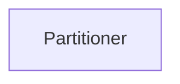
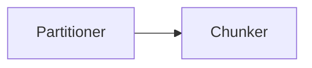
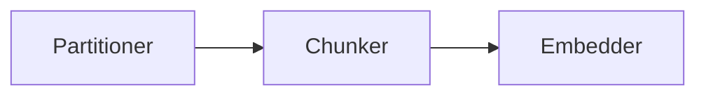
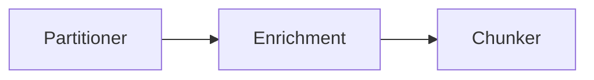

To use the [Unstructured API's workflow operations](/api-reference/workflow/overview) to manage workflows, do the following:

- To get a list of available workflows, use the `UnstructuredClient` object's `workflows.list_workflows` function (for the Python SDK) or 
  the `GET` method to call the `/workflows` endpoint (for `curl` or Postman). [Learn more](/api-reference/workflow/overview#list-workflows).
- To get information about a workflow, use the `UnstructuredClient` object's `workflows.get_workflow` function (for the Python SDK) or 
  the `GET` method to call the `/workflows/<workflow-id>` endpoint (for `curl` or Postman)use the `GET` method to call the `/workflows/<workflow-id>` endpoint. [Learn more](/api-reference/workflow/overview#get-a-workflow).
- To create a workflow, use the `UnstructuredClient` object's `workflows.create_workflow` function (for the Python SDK) or 
  the `POST` method to call the `/workflows` endpoint (for `curl` or Postman). [Learn more](#create-a-workflow).
- To run a workflow manually, use the `UnstructuredClient` object's `workflows.run_workflow` function (for the Python SDK) or 
  the `POST` method to call the `/workflows/<workflow-id>/run` endpoint (for `curl` or Postman). [Learn more](/api-reference/workflow/overview#run-a-workflow).
- To update a workflow, use the `UnstructuredClient` object's `workflows.update_workflow` function (for the Python SDK) or 
  the `PUT` method to call the `/workflows/<workflow-id>` endpoint (for `curl` or Postman). [Learn more](#update-a-workflow).
- To delete a workflow, use the `UnstructuredClient` object's `workflows.delete_workflow` function (for the Python SDK) or 
  the `DELETE` method to call the `/workflows/<workflow-id>` endpoint (for `curl` or Postman). [Learn more](/api-reference/workflow/overview#delete-a-workflow).
- To get a list of available workflow templates, use the `GET` method to call the `/templates` endpoint (for `curl` or Postman). 
  [Learn more](#list-templates).
- To get information about a workflow template, use the `GET` method to call the `/templates/<template-id>` endpoint (for `curl` or Postman). 
  [Learn more](#get-a-template).

The following examples assume that you have already met the [requirements](/api-reference/workflow/overview#requirements) and 
understand the [basics](/api-reference/workflow/overview#basics) of working with the Unstructured API's workflow operations.

## Create a workflow

To create a workflow, use the `UnstructuredClient` object's `workflows.create_workflow` function (for the Python SDK) or 
the `POST` method to call the `/workflows` endpoint (for `curl` or Postman). 

<Note>
    The following instructions create a workflow that exists until it is explicitly deleted (also known as a _long-lived workflow_). 
    To create a workflow that exists only for the duration of 
    that workflow's associated job run, and that job run's temporary workflow takes one or more local files only as input, see [Run an on-demand job](/api-reference/workflow/overview#run-an-on-demand-job).
</Note>
  
In the `CreateWorkflow` object (for the Python SDK) or 
the request body (for `curl` or Postman), 
specify the settings for the workflow, as follows:

<AccordionGroup>
    <Accordion title="Python SDK (remote source and remote destination)">
        ```python
        import os

        from unstructured_client import UnstructuredClient
        from unstructured_client.models.shared import (
            WorkflowNode,
            CreateWorkflow,
            WorkflowType,
            Schedule
        )
        from unstructured_client.models.operations import CreateWorkflowRequest
        

        client = UnstructuredClient(
            api_key_auth=os.getenv("UNSTRUCTURED_API_KEY")
        )

        workflow_node = WorkflowNode(
            name="<node-name>",
            type="<node-type>",
            subtype="<node-subtype>",
            settings={
                "...": "..."
            }
        )

        another_workflow_node = WorkflowNode(
            name="<node-name>",
            type="<node-type>",
            subtype="<node-subtype>",
            settings={
                "...": "..."
            }
        )

        # And so on for any additional nodes.

        workflow = CreateWorkflow(
            name="<name>",
            source_id="<source-connector-id>",
            destination_id="<destination-connector-id>",
            workflow_type=WorkflowType.<workflow-type>,
            reprocess_all=True|False,
            template_id="<workflow-template-id>",
            workflow_nodes=[
                workflow_node,
                another_workflow_node
                # And so on for any additional nodes.
            ],
            schedule=Schedule("<schedule-timeframe>")
        )

        response = client.workflows.create_workflow(
            request=CreateWorkflowRequest(
                create_workflow=workflow
            )
        )

        info = response.workflow_information

        print(f"name:           {info.name}")
        print(f"id:             {info.id}")
        print(f"status:         {info.status}")
        print(f"type:           {info.workflow_type}")
        print("source(s):")

        for source in info.sources:
            print(f"            {source}")

        print("destination(s):")

        for destination in info.destinations:
            print(f"            {destination}")

        print("schedule(s):")

        for crontab_entry in info.schedule.crontab_entries:
            print(f"            {crontab_entry.cron_expression}")
        ```
    </Accordion>
    <Accordion title="Python SDK (local source and local destination)">
        To use a local source and a local destination, do not specify a `source_id` or `destination_id` value. Also, the `workflow_type` must be set to `CUSTOM`.

        <Note>
            A workflow with a local source has the following limitations:

            - The workflow cannot be set to run on a repeating schedule.
            - The workflow cannot be run from the Unstructured user interface (UI), 
              even though the workflow is visible in the UI. However, you can 
              run the workflow with the Unstructured Python SDK, or REST API clients such as `curl` or Postman. [Learn how](/api-reference/workflow/overview#run-a-workflow).
        </Note>
        
        ```python
        import os

        from unstructured_client import UnstructuredClient
        from unstructured_client.models.shared import (
            WorkflowNode,
            CreateWorkflow,
            WorkflowType
        )
        from unstructured_client.models.operations import CreateWorkflowRequest

        workflow_node = WorkflowNode(
            name="<node-name>",
            type="<node-type>",
            subtype="<node-subtype>",
            settings={
                "...": "..."
            }
        )

        another_workflow_node = WorkflowNode(
            name="<node-name>",
            type="<node-type>",
            subtype="<node-subtype>",
            settings={
                "...": "..."
            }
        )

        # And so on for any additional nodes.

        workflow=CreateWorkflow(
            name="<name>",
            workflow_type=WorkflowType.CUSTOM,
            workflow_nodes=[
                workflow_node,
                another_workflow_node
                # And so on for any additional nodes.
            ]
        )

        with UnstructuredClient(api_key_auth=os.getenv("UNSTRUCTURED_API_KEY")) as client:
            response = client.workflows.create_workflow(
                request=CreateWorkflowRequest(
                    create_workflow=workflow
                )
            )

            info = response.workflow_information

            print(f"name: {info.name}")
            print(f"id: {info.id}")
            print(f"status: {info.status}")
            print(f"type: {info.workflow_type}")
            print("source(s):")

            for source in info.sources:
                print(f"    {source}")

            print("destination(s):")

            for destination in info.destinations:
                print(f"    {destination}")

            print("schedule(s):")

            for crontab_entry in info.schedule.crontab_entries:
                print(f"    {crontab_entry.cron_expression}")
        ```
    </Accordion>
    <Accordion title="Python SDK (local source and remote destination)">
        To use a local source and a remote destination, specify a `destination_id` value, and do not specify a `source_id` value. Also, the `workflow_type` must be set to `CUSTOM`.

        <Note>
            A workflow with a local source has the following limitations:

            - The workflow cannot be set to run on a repeating schedule.
            - The workflow cannot be run from the Unstructured user interface (UI), 
              even though the workflow is visible in the UI. However, you can 
              run the workflow with the Unstructured Python SDK, or REST API clients such as `curl` or Postman. [Learn how](/api-reference/workflow/overview#run-a-workflow).
        </Note>

        ```python
        import os

        from unstructured_client import UnstructuredClient
        from unstructured_client.models.shared import (
            WorkflowNode,
            CreateWorkflow,
            WorkflowType
        )
        from unstructured_client.models.operations import CreateWorkflowRequest

        workflow_node = WorkflowNode(
            name="<node-name>",
            type="<node-type>",
            subtype="<node-subtype>",
            settings={
                "...": "..."
            }
        )

        another_workflow_node = WorkflowNode(
            name="<node-name>",
            type="<node-type>",
            subtype="<node-subtype>",
            settings={
                "...": "..."
            }
        )

        # And so on for any additional nodes.

        workflow=CreateWorkflow(
            name="<name>",
            destination_id="<destination-connector-id>",
            workflow_type=WorkflowType.CUSTOM,
            workflow_nodes=[
                workflow_node,
                another_workflow_node
                # And so on for any additional nodes.
            ]
        )

        with UnstructuredClient(api_key_auth=os.getenv("UNSTRUCTURED_API_KEY")) as client:
            response = client.workflows.create_workflow(
                request=CreateWorkflowRequest(
                    create_workflow=workflow
                )
            )

            info = response.workflow_information

            print(f"name: {info.name}")
            print(f"id: {info.id}")
            print(f"status: {info.status}")
            print(f"type: {info.workflow_type}")
            print("source(s):")

            for source in info.sources:
                print(f"    {source}")

            print("destination(s):")

            for destination in info.destinations:
                print(f"    {destination}")

            print("schedule(s):")

            for crontab_entry in info.schedule.crontab_entries:
                print(f"    {crontab_entry.cron_expression}")
        ```
    </Accordion>
    <Accordion title="Python SDK (async) (remote source and remote destination)">
        ```python
        import os
        import asyncio

        from unstructured_client import UnstructuredClient
        from unstructured_client.models.shared import (
            WorkflowNode,
            CreateWorkflow,
            WorkflowType,
            Schedule
        )
        from unstructured_client.models.operations import CreateWorkflowRequest
        
        async def create_workflow():
            client = UnstructuredClient(
                api_key_auth=os.getenv("UNSTRUCTURED_API_KEY")
            )

            workflow_node = WorkflowNode(
                name="<node-name>",
                type="<node-type>",
                subtype="<node-subtype>",
                settings={
                    "...": "..."
                }
            )

            another_workflow_node = WorkflowNode(
                name="<node-name>",
                type="<node-type>",
                subtype="<node-subtype>",
                settings={
                    "...": "..."
                }
            )

            # And so on for any additional nodes.

            workflow = CreateWorkflow(
                name="<name>",
                source_id="<source-connector-id>",
                destination_id="<destination-connector-id>",
                workflow_type=WorkflowType.<workflow-type>,
                reprocess_all=True|False,
                template_id="<workflow-template-id>",
                workflow_nodes=[
                    workflow_node,
                    another_workflow_node
                    # And so on for any additional nodes.
                ],
                schedule=Schedule("<schedule-timeframe>")
            )

            response = await client.workflows.create_workflow_async(
                request=CreateWorkflowRequest(
                    create_workflow=workflow
                )
            )

            info = response.workflow_information

            print(f"name:           {info.name}")
            print(f"id:             {info.id}")
            print(f"status:         {info.status}")
            print(f"type:           {info.workflow_type}")
            print("source(s):")

            for source in info.sources:
                print(f"            {source}")

            print("destination(s):")

            for destination in info.destinations:
                print(f"            {destination}")

            print("schedule(s):")

            for crontab_entry in info.schedule.crontab_entries:
                print(f"            {crontab_entry.cron_expression}")

        asyncio.run(create_workflow())
        ```
    </Accordion>
    <Accordion title="Python SDK (async) (local source and local destination)">
        To use a local source and a local destination, do not specify a `source_id` or `destination_id` value. Also, the `workflow_type` must be set to `CUSTOM`.

        <Note>
            A workflow with a local source has the following limitations:

            - The workflow cannot be set to run on a repeating schedule.
            - The workflow cannot be run from the Unstructured user interface (UI), 
              even though the workflow is visible in the UI. However, you can 
              run the workflow with the Unstructured Python SDK, or REST API clients such as `curl` or Postman. [Learn how](/api-reference/workflow/overview#run-a-workflow).
        </Note>

        ```python
        import os
        import asyncio

        from unstructured_client import UnstructuredClient
        from unstructured_client.models.shared import (
            WorkflowNode,
            CreateWorkflow,
            WorkflowType
        )
        from unstructured_client.models.operations import CreateWorkflowRequest

        async def create_workflow():
            workflow_node = WorkflowNode(
                name="<node-name>",
                type="<node-type>",
                subtype="<node-subtype>",
                settings={
                    "...": "..."
                }
            )

            another_workflow_node = WorkflowNode(
                name="<node-name>",
                type="<node-type>",
                subtype="<node-subtype>",
                settings={
                    "...": "..."
                }
            )

            # And so on for any additional nodes.

            workflow = CreateWorkflow(
                name="<name>",
                workflow_type=WorkflowType.CUSTOM,
                workflow_nodes=[
                    workflow_node,
                    another_workflow_node
                    # And so on for any additional nodes.
                ]
            )

            with UnstructuredClient(api_key_auth=os.getenv("UNSTRUCTURED_API_KEY")) as client:
                response = await client.workflows.create_workflow_async(
                    request=CreateWorkflowRequest(
                        create_workflow=workflow
                    )
                )

                info = response.workflow_information

                print(f"name: {info.name}")
                print(f"id: {info.id}")
                print(f"status: {info.status}")
                print(f"type: {info.workflow_type}")
                print("source(s):")

                for source in info.sources:
                    print(f"    {source}")

                print("destination(s):")

                for destination in info.destinations:
                    print(f"    {destination}")

                print("schedule(s):")

                for crontab_entry in info.schedule.crontab_entries:
                    print(f"    {crontab_entry.cron_expression}")

        asyncio.run(create_workflow())
        ```
    </Accordion>
    <Accordion title="Python SDK (async) (local source and remote destination)">
        To use a local source and a remote destination, specify a `destination_id` value, and do not specify a `source_id` value. Also, the `workflow_type` must be set to `CUSTOM`.

        <Note>
            A workflow with a local source has the following limitations:

            - The workflow cannot be set to run on a repeating schedule.
            - The workflow cannot be run from the Unstructured user interface (UI), 
              even though the workflow is visible in the UI. However, you can 
              run the workflow with the Unstructured Python SDK, or REST API clients such as `curl` or Postman. [Learn how](/api-reference/workflow/overview#run-a-workflow).
        </Note>

        ```python
        import os
        import asyncio

        from unstructured_client import UnstructuredClient
        from unstructured_client.models.shared import (
            WorkflowNode,
            CreateWorkflow,
            WorkflowType
        )
        from unstructured_client.models.operations import CreateWorkflowRequest

        async def create_workflow():
            workflow_node = WorkflowNode(
                name="<node-name>",
                type="<node-type>",
                subtype="<node-subtype>",
                settings={
                    "...": "..."
                }
            )

            another_workflow_node = WorkflowNode(
                name="<node-name>",
                type="<node-type>",
                subtype="<node-subtype>",
                settings={
                    "...": "..."
                }
            )

            # And so on for any additional nodes.

            workflow = CreateWorkflow(
                name="<name>",
                destination_id="<destination-connector-id>",
                workflow_type=WorkflowType.CUSTOM,
                workflow_nodes=[
                    workflow_node,
                    another_workflow_node
                    # And so on for any additional nodes.
                ]
            )

            with UnstructuredClient(api_key_auth=os.getenv("UNSTRUCTURED_API_KEY")) as client:
                response = await client.workflows.create_workflow_async(
                    request=CreateWorkflowRequest(
                        create_workflow=workflow
                    )
                )

                info = response.workflow_information

                print(f"name: {info.name}")
                print(f"id: {info.id}")
                print(f"status: {info.status}")
                print(f"type: {info.workflow_type}")
                print("source(s):")

                for source in info.sources:
                    print(f"    {source}")

                print("destination(s):")

                for destination in info.destinations:
                    print(f"    {destination}")

                print("schedule(s):")

                for crontab_entry in info.schedule.crontab_entries:
                    print(f"    {crontab_entry.cron_expression}")

        asyncio.run(create_workflow())
        ```
    </Accordion>
    <Accordion title="curl (remote source and remote destination)">
        ```bash
        curl --request 'POST' --location \
        "$UNSTRUCTURED_API_URL/workflows" \
        --header "unstructured-api-key: $UNSTRUCTURED_API_KEY" \
        --header 'accept: application/json' \
        --data \
        '{
            "name": "<name>",
            "source_id": "<source-connector-id>",
            "destination_id": "<destination-connector-id>",
            "workflow_type": "<workflow-type>",
            "reprocess_all": "true"|"false",
            "template_id": "<workflow-template-id>",
            "workflow_nodes": [
                {
                    "name": "<node-name>",
                    "type": "<node-type>",
                    "subtype": "<node-subtype>",
                    "settings": {
                        "...": "..."
                    }
                },
                {
                    "...": "..." 
                } 
            ],
            "schedule": "<schedule-timeframe>"
        }'
        ```
    </Accordion>
    <Accordion title="curl (local source and local destination)">
        To use a local source and a local destination, do not specify a `source_id` or `destination_id` value. Also, the `workflow_type` must be set to `custom`.

        <Note>
            A workflow with a local source has the following limitations:

            - The workflow cannot be set to run on a repeating schedule.
            - The workflow cannot be run from the Unstructured user interface (UI), 
              even though the workflow is visible in the UI. However, you can 
              run the workflow with the Unstructured Python SDK, or REST API clients such as `curl` (or Postman). [Learn how](/api-reference/workflow/overview#run-a-workflow).
        </Note>

        ```bash
        curl --request 'POST' --location \
        "$UNSTRUCTURED_API_URL/workflows" \
        --header "unstructured-api-key: $UNSTRUCTURED_API_KEY" \
        --header 'accept: application/json' \
        --data \
        '{
            "name": "<name>",
            "workflow_type": "custom",
            "template_id": "<workflow-template-id>",
            "workflow_nodes": [
                {
                    "name": "<node-name>",
                    "type": "<node-type>",
                    "subtype": "<node-subtype>",
                    "settings": {
                        "...": "..."
                    }
                },
                {
                    "...": "..." 
                } 
            ]
        }'
        ```
    </Accordion>
    <Accordion title="curl (local source and remote destination)">
        To use a local source and a remote destination, specify a `destination_id` value, and do not specify a `source_id` value. Also, the `workflow_type` must be set to `custom`.

        <Note>
            A workflow with a local source has the following limitations:

            - The workflow cannot be set to run on a repeating schedule.
            - The workflow cannot be run from the Unstructured user interface (UI), 
              even though the workflow is visible in the UI. However, you can 
              run the workflow with the Unstructured Python SDK, or REST API clients such as `curl` (or Postman). [Learn how](/api-reference/workflow/overview#run-a-workflow).
        </Note>

        ```bash
        curl --request 'POST' --location \
        "$UNSTRUCTURED_API_URL/workflows" \
        --header "unstructured-api-key: $UNSTRUCTURED_API_KEY" \
        --header 'accept: application/json' \
        --data \
        '{
            "name": "<name>",
            "destination_id": "<destination-connector-id>",
            "workflow_type": "custom",
            "template_id": "<workflow-template-id>",
            "workflow_nodes": [
                {
                    "name": "<node-name>",
                    "type": "<node-type>",
                    "subtype": "<node-subtype>",
                    "settings": {
                        "...": "..."
                    }
                },
                {
                    "...": "..." 
                } 
            ]
        }'
        ```
    </Accordion>
    <Accordion title="Postman (remote source and remote destination)">
        1. In the method drop-down list, select **POST**.
        2. In the address box, enter the following URL:

            ```text
            {{UNSTRUCTURED_API_URL}}/workflows
            ```

        3. On the **Headers** tab, enter the following headers:

            - **Key**: `unstructured-api-key`, **Value**: `{{UNSTRUCTURED_API_KEY}}`
            - **Key**: `accept`, **Value**: `application/json`

        4. On the **Body** tab, select **raw** and **JSON**, and specify the settings for the workflow:

           ```json
           {
               "name": "<name>",
               "source_id": "<source-connector-id>",
               "destination_id": "<destination-connector-id>",
               "workflow_type": "<workflow-type>",
               "reprocess_all": "true"|"false",
               "template_id": "<workflow-template-id>",
               "workflow_nodes": [
                   {
                       "name": "<node-name>",
                       "type": "<node-type>",
                       "subtype": "<node-subtype>",
                       "settings": {
                           "...": "..."
                       }
                   },
                   {
                       "...": "..." 
                   } 
               ],
               "schedule": "<schedule-timeframe>"
           }
           ```

        5. Click **Send**.
    </Accordion>
    <Accordion title="Postman (local source and local destination)">
        To use a local source and a local destination do not specify a `source_id` or `destination_id` value. Also, the `workflow_type` must be set to `custom`.

        <Note>
            A workflow with a local source has the following limitations:

            - The workflow cannot be set to run on a repeating schedule.
            - The workflow cannot be run from the Unstructured user interface (UI), 
              even though the workflow is visible in the UI. However, you can 
              run the workflow with the Unstructured Python SDK, or REST API clients such as Postman (or `curl`). [Learn how](/api-reference/workflow/overview#run-a-workflow).
        </Note>

        1. In the method drop-down list, select **POST**.
        2. In the address box, enter the following URL:

            ```text
            {{UNSTRUCTURED_API_URL}}/workflows
            ```

        3. On the **Headers** tab, enter the following headers:

            - **Key**: `unstructured-api-key`, **Value**: `{{UNSTRUCTURED_API_KEY}}`
            - **Key**: `accept`, **Value**: `application/json`

        4. On the **Body** tab, select **raw** and **JSON**, and specify the settings for the workflow:

           ```json
           {
               "name": "<name>",
               "workflow_type": "custom",
               "template_id": "<workflow-template-id>",
               "workflow_nodes": [
                   {
                       "name": "<node-name>",
                       "type": "<node-type>",
                       "subtype": "<node-subtype>",
                       "settings": {
                           "...": "..."
                       }
                   },
                   {
                       "...": "..." 
                   } 
               ]
           }
           ```

        5. Click **Send**.
    </Accordion>
    <Accordion title="Postman (local source and remote destination)">
        To use a local source and a remote destination, specify a `destination_id` value, and do not specify a `source_id` value. Also, the `workflow_type` must be set to `custom`.

        <Note>
            A workflow with a local source has the following limitations:

            - The workflow cannot be set to run on a repeating schedule.
            - The workflow cannot be run from the Unstructured user interface (UI), 
              even though the workflow is visible in the UI. However, you can 
              run the workflow with the Unstructured Python SDK, or REST API clients such as Postman (or `curl`). [Learn how](/api-reference/workflow/overview#run-a-workflow).
        </Note>

        1. In the method drop-down list, select **POST**.
        2. In the address box, enter the following URL:

            ```text
            {{UNSTRUCTURED_API_URL}}/workflows
            ```

        3. On the **Headers** tab, enter the following headers:

            - **Key**: `unstructured-api-key`, **Value**: `{{UNSTRUCTURED_API_KEY}}`
            - **Key**: `accept`, **Value**: `application/json`

        4. On the **Body** tab, select **raw** and **JSON**, and specify the settings for the workflow:

           ```json
           {
               "name": "<name>",
               "workflow_type": "custom",
               "template_id": "<workflow-template-id>",
               "workflow_nodes": [
                   {
                       "name": "<node-name>",
                       "destination_id": "<destination-connector-id>",
                       "type": "<node-type>",
                       "subtype": "<node-subtype>",
                       "settings": {
                           "...": "..."
                       }
                   },
                   {
                       "...": "..." 
                   } 
               ]
           }
           ```

        5. Click **Send**.
    </Accordion>
</AccordionGroup>

Replace the preceding placeholders as follows:

- `<name>` (_required_) - A unique name for this workflow.
- `<source-connector-id>` (_required_) - The ID of the target source connector. To get the ID, 
  use the `UnstructuredClient` object's `sources.list_sources` function (for the Python SDK) or 
  the `GET` method to call the `/sources` endpoint (for `curl` or Postman). [Learn more](/api-reference/workflow/overview#list-source-connectors).
- `<destination-connector-id>` (_required_) - The ID of the target destination connector. To get the ID, 
  use the `UnstructuredClient` object's `destinations.list_destinations` function (for the Python SDK) or 
  the `GET` method to call the `/destinations` endpoint (for `curl` or Postman). [Learn more](/api-reference/workflow/overview#list-destination-connectors).
- `<workflow-type>` (_required_) - The workflow type. Available values include:

  - `CUSTOM` (for the Python SDK) and `custom` (for `curl` or Postman) - This workflow's nodes are manually specified in the `workflow_nodes` array. For instructions, see [Custom workflow DAG nodes](#custom-workflow-dag-nodes).
  - `TEMPLATE` (for the Python SDK) and `template` (for `curl` or Postman) - This workflow's nodes are specified by a workflow template. In this case, you would not add a `workflow_nodes` array. Instead, you must specify the workflow template's unique ID in the `template_id` field. For instructions, see [List workflow templates](#get-a-template).
  
  <Note>
      The previously-available workflow optimization types `ADVANCED`, `BASIC`, and `PLATINUM` (for the Python SDK) and 
      `advanced`, `basic`, and `platinum` (for `curl` or Postman) are non-operational and planned to be fully removed in a future release. 

      The ability to create an [automatic workflow](/ui/workflows#create-an-automatic-workflow) type is currently not available but is planned to be added in a future release.
  </Note>

- `reprocess_all`: _Optional_. If set to true (the default), the workflow will reprocess all documents in the source location on every workflow run. 
  If set to `false`, the workflow will only process new documents that are added to the source location, or existing documents that are updated in the 
  source location (as determined by checking whether the file's version has changed), since the last workflow run. This setting applies only to blob storage 
  connectors such as the Amazon S3, Azure Blob Storage, and Google Cloud Storage source connectors.
- `<schedule-timeframe>` - The repeating automatic run schedule, specified as a predefined phrase. The available predefined phrases are:

  - `every 15 minutes` (for `curl` or Postman): Every 15 minutes (cron expression: `*/15 * * * *`).
  - `every hour`: At the first minute of every hour (cron expression: `0 * * * *`).
  - `every 2 hours`: At the first minute of every second hour (cron expression: `0 */2 * * *`).
  - `every 4 hours`: At the first minute of every fourth hour (cron expression: `0 */4 * * *`).
  - `every 6 hours`: At the first minute of every sixth hour (cron expression: `0 */6 * * *`).
  - `every 8 hours`: At the first minute of every eighth hour (cron expression: `0 */8 * * *`).
  - `every 10 hours`: At the first minute of every tenth hour (cron expression: `0 */10 * * *`).
  - `every 12 hours`: At the first minute of every twelfth hour (cron expression: `0 */12 * * *`).
  - `daily`: At the first minute of every day (cron expression: `0 0 * * *`).
  - `weekly`: At the first minute of every Sunday (cron expression: `0 0 * * 0`).
  - `monthly`: At the first minute of the first day of every month (cron expression: `0 0 1 * *`).
    
  If `schedule` is not specified, the workflow does not automatically run on a repeating schedule.

  Workflows with a local source cannot be set to run on a repeating schedule.

## Update a workflow

To update information about a workflow, use the `UnstructuredClient` object's `workflows.update_workflow` function (for the Python SDK) or 
the `PUT` method to call the `/workflows/<workflow-id>` endpoint (for `curl` or Postman), replacing 
`<workflow-id>` with the workflow's unique ID. To get this ID, see [List workflows](#list-workflows).

<Note>
    The following instructions can be used only to update a long-lived workflow (a workflow that exists until it is explicitly deleted). 
    A workflow that exists only for the duration of a running [on-demand job](/api-reference/workflow/overview#run-an-on-demand-job) 
    cannot be updated.
</Note>

In the request body, specify the settings for the workflow. For the specific settings to include, see 
[Create a workflow](/api-reference/workflow/workflows#create-a-workflow).

<AccordionGroup>
    <Accordion title="Python SDK">
        ```python
        import os

        from unstructured_client import UnstructuredClient
        from unstructured_client.models.shared import (
            WorkflowNode,
            UpdateWorkflow,
            WorkflowType,
            Schedule,
        ),
        from unstructured_client.models.operations import UpdateWorkflowRequest
        
        
        client = UnstructuredClient(
            api_key_auth=os.getenv("UNSTRUCTURED_API_KEY")
        )

        workflow_node = WorkflowNode(
            # Specify the settings for a workflow node here.
        )

        another_workflow_node = WorkflowNode(
            # Specify the settings for another workflow node here.
        )

        # And so on for any additional nodes.

        workflow = UpdateWorkflow(
            # Specify the settings for the workflow here.
        )

        response = client.workflows.update_workflow(
            request=UpdateWorkflowRequest(
                workflow_id="<workflow-id>",
                update_workflow=workflow
            )
        )

        info = response.workflow_information

        print(f"name:           {info.name}")
        print(f"id:             {info.id}")
        print(f"status:         {info.status}")
        print(f"type:           {info.workflow_type}")
        print("source(s):")

        for source in info.sources:
            print(f"            {source}")

        print("destination(s):")

        for destination in info.destinations:
            print(f"            {destination}")

        print("schedule(s):")

        for crontab_entry in info.schedule.crontab_entries:
            print(f"            {crontab_entry.cron_expression}")
        ```
    </Accordion>
    <Accordion title="Python SDK (async)">
        ```python
        import os
        import asyncio

        from unstructured_client import UnstructuredClient
        from unstructured_client.models.shared import (
            WorkflowNode,
            UpdateWorkflow,
            WorkflowType,
            Schedule,
        ),
        from unstructured_client.models.operations import UpdateWorkflowRequest
        
        async def update_workflow():
            client = UnstructuredClient(
                api_key_auth=os.getenv("UNSTRUCTURED_API_KEY")
            )

            workflow_node = WorkflowNode(
                # Specify the settings for a workflow node here.
            )

            another_workflow_node = WorkflowNode(
                # Specify the settings for another workflow node here.
            )

            # And so on for any additional nodes.

            workflow = UpdateWorkflow(
                # Specify the settings for the workflow here.
            )

            response = await client.workflows.update_workflow_async(
                request=UpdateWorkflowRequest(
                    workflow_id="<workflow-id>",
                    update_workflow=workflow
                )
            )

            info = response.workflow_information

            print(f"name:           {info.name}")
            print(f"id:             {info.id}")
            print(f"status:         {info.status}")
            print(f"type:           {info.workflow_type}")
            print("source(s):")

            for source in info.sources:
                print(f"            {source}")

            print("destination(s):")

            for destination in info.destinations:
                print(f"            {destination}")

            print("schedule(s):")

            for crontab_entry in info.schedule.crontab_entries:
                print(f"            {crontab_entry.cron_expression}")

        asyncio.run(update_workflow())
        ```
    </Accordion>
    <Accordion title="curl">
        ```bash
        curl --request 'PUT' --location \
        "$UNSTRUCTURED_API_URL/workflows/<workflow-id>" \
        --header "unstructured-api-key: $UNSTRUCTURED_API_KEY" \
        --header 'accept: application/json' \
        --data \
        '{
            # Specify the settings for the workflow here.
        }'
        ```
    </Accordion>
    <Accordion title="Postman">
        1. In the method drop-down list, select **PUT**.
        2. In the address box, enter the following URL:

            ```text
            {{UNSTRUCTURED_API_URL}}/workflows/<workflow-id>
            ```

        3. On the **Headers** tab, enter the following headers:

            - **Key**: `unstructured-api-key`, **Value**: `{{UNSTRUCTURED_API_KEY}}`
            - **Key**: `accept`, **Value**: `application/json`

        4. On the **Body** tab, select **raw** and **JSON**, and specify the settings for the workflow.
        5. Click **Send**.
    </Accordion>
</AccordionGroup>

## Custom workflow DAG nodes

import EnrichmentImagesTablesOCRHiResOnly from '/snippets/general-shared-text/enrichment-images-tables-ocr-hi-res-only.mdx';

If `WorkflowType` is set to `CUSTOM` (for the Python SDK), or if `workflow_type` is set to `custom` (for `curl` or Postman), you must also specify the settings for the workflow's 
directed acyclic graph (DAG) nodes. These nodes' settings are specified in the `workflow_nodes` array.

- A **Source** node is automatically created when you specify the `source_id` value outside of the  
  `workflow_nodes` array.
- A **Destination** node is automatically created when you specify the `destination_id` value outside of the 
  `workflow_nodes` array.
- You can specify [Partitioner](#partitioner-node), [Enrichment](#enrichment-node), 
  [Chunker](#chunker-node), and [Embedder](#embedder-node) nodes.

  <EnrichmentImagesTablesOCRHiResOnly />

- The order of the nodes in the `workflow_nodes` array will be the same order that these nodes appear in the DAG, 
  with the first node in the array added directly after the **Source** node. The **Destination** node 
  follows the last node in the array. 
- Be sure to specify nodes in the allowed order. The following DAG placements are all allowed:







<Note>
    For workflows that use **Chunker** and **Enrichment** nodes together, the **Chunker** node should be placed after all **Enrichment** nodes. Placing the 
    **Chunker** node before any **Enrichment** nodes could cause incomplete or no enrichment results to be generated.
</Note>

### Partitioner node

A **Partitioner** node has a `type` of `partition`. 

[Learn about the available partitioning strategies](/ui/partitioning).

#### Auto strategy

import DeprecatedModelsAPI from '/snippets/general-shared-text/deprecated-models-api.mdx';

<AccordionGroup>
    <Accordion title="Python SDK">
        ```python
        auto_partitioner_workflow_node = WorkflowNode(
            name="Partitioner",
            subtype="vlm",
            type="partition",
            settings={
                "provider": "<provider>",
                "provider_api_key": None,
                "model": "<model>",
                "output_format": "<output-format>",
                "format_html": <True|False>,
                "unique_element_ids": <True|False>,
                "is_dynamic": True,
                "allow_fast": True
           }
        )
        ```
    </Accordion>
    <Accordion title="curl, Postman">
        ```json
        {
            "name": "Partitioner",
            "type": "vlm",
            "subtype": "partition",
            "settings": {
                "provider": "<provider>",
                "provider_api_key": null,
                "model": "<model>",
                "output_format": "<output-format>",
                "format_html": <true|false>,
                "unique_element_ids": <true|false>,
                "is_dynamic": true,
                "allow_fast": true
            }
        }
        ```
    </Accordion>
</AccordionGroup>

Fields for `settings` include:

- `strategy`: _Required_. The partitioning strategy to use. This field must be set to `auto`.
- `provider`: _Optional_. If the Auto partitioning strategy needs to use the VLM partitioning strategy, then use the specified VLM provider. Allowed values include `anthropic`, `auto`, `bedrock`, `openai`, and `vertexai`. The default value is `anthropic`.
- `provider_api_key`: _Optional_. If specified, use a non-default API key for calls to the specified VLM provider as needed. The default is none, which means to rely on using Unstructured's internal default API key for the VLM provider.
- `model`: _Optional_. If the Auto partitioning strategy needs to use the VLM partitioning strategy, then use the specified VLM. The default value is `claude-sonnet-4-20250514`.

  <DeprecatedModelsAPI />

  <Note>
      The following list applies only to Unstructured **Let's Go** and **Pay-As-You-Go** accounts.

      For Unstructured **Business** accounts, to get your current list of available models, contact your 
      Unstructured account administrator or Unstructured sales representative, or email Unstructured Support at 
      [support@unstructured.io](mailto:support@unstructured.io).
  </Note>

  - For `anthropic`, available values for `model` are:
  
    - `claude-3-7-sonnet-20250219`
    - `claude-sonnet-4-20250514`
    - `claude-sonnet-4-5-20250929`

  - For `bedrock`, available values for `model` are:

    - `us.amazon.nova-lite-v1:0` 
    - `us.amazon.nova-pro-v1:0`
    - `us.anthropic.claude-3-opus-20240229-v1:0`
    - `us.anthropic.claude-3-haiku-20240307-v1:0`
    - `us.anthropic.claude-3-sonnet-20240229-v1:0`
    - `us.anthropic.claude-3-7-sonnet-20250219-v1:0`
    - `us.anthropic.claude-sonnet-4-20250514-v1:0`

  - For `openai`, available values for `model` are:
  
    - `gpt-4o`
    - `gpt-5-mini-2025-08-07`

  - For `vertexai`, available values for `model` are:

    - `gemini-2.0-flash-001`

- `output_format`: _Output_. The format of the response. Allowed values include `text/html` and `application/json`. The default is `text/html`.
- `format_html`: _Optional_. If the Auto partitioning strategy needs to use the VLM partitioning strategy, true (the default) to apply Beautiful Soup's `prettify` method to the HTML that is generated by the VLM partitioner, which for example adds indentation for better readability.
- `unique_element_ids`: _Optional_. True (the default) to assign UUIDs to element IDs, which guarantees their uniqueness. This is useful for example when using them as primary keys in a database. False to assign a SHA-256 of the element's text as its element ID.
- `is_dynamic`: _Required_. True to enable dynamic routing of pages to Fast, High Res, or VLM as needed for better overall performance and cost savings.
- `allow_fast`: _Required_. True to allow routing of pages to Fast as needed for better overall performance and cost savings.

#### VLM strategy

<AccordionGroup>
    <Accordion title="Python SDK">
        ```python
        vlm_partitioner_workflow_node = WorkflowNode(
            name="Partitioner",
            subtype="vlm",
            type="partition",
            settings={
                "provider": "<provider>",
                "provider_api_key": None,
                "model": "<model>",
                "output_format": "<output-format>",
                "format_html": <True|False>,
                "unique_element_ids": <True|False>,
                "is_dynamic": False,
                "allow_fast": True|False
            }
        )
        ```
    </Accordion>
    <Accordion title="curl, Postman">
        ```json
        {
            "name": "Partitioner",
            "type": "partition",
            "subtype": "vlm",
            "settings": {
                "provider": "<provider>",
                "provider_api_key": null,
                "model": "<model>",
                "output_format": "<output-format>",
                "format_html": <true|false>,
                "unique_element_ids": <true|false>,
                "is_dynamic": false,
                "allow_fast": <true|false>
            }
        }
        ```
    </Accordion>
</AccordionGroup>

Fields for `settings` include:

- `provider`: _Optional_. Use the specified VLM provider. Allowed values include `anthropic`, `auto`, `bedrock`, `openai`, and `vertexai`. The default value is `anthropic`.
- `provider_api_key`: _Optional_. If specified, use a non-default API key for calls to the specified VLM provider as needed. The default is none, which means to rely on using Unstructured's internal default API key for the VLM provider.
- `model`: _Optional_. If the Auto partitioning strategy needs to use the VLM partitioning strategy, then use the specified VLM. The default value is `claude-sonnet-4-20250514`.

  <DeprecatedModelsAPI />

  <Note>
      The following list applies only to Unstructured **Let's Go** and **Pay-As-You-Go** accounts.

      For Unstructured **Business** accounts, to get your current list of available models, contact your 
      Unstructured account administrator or Unstructured sales representative, or email Unstructured Support at 
      [support@unstructured.io](mailto:support@unstructured.io).
  </Note>

  - For `anthropic`, available values for `model` are:
  
    - `claude-3-7-sonnet-20250219`
    - `claude-sonnet-4-20250514`
    - `claude-sonnet-4-5-20250929`

  - For `bedrock`, available values for `model` are:

    - `us.amazon.nova-lite-v1:0` 
    - `us.amazon.nova-pro-v1:0`
    - `us.anthropic.claude-3-opus-20240229-v1:0`
    - `us.anthropic.claude-3-haiku-20240307-v1:0`
    - `us.anthropic.claude-3-sonnet-20240229-v1:0`
    - `us.anthropic.claude-3-7-sonnet-20250219-v1:0`
    - `us.anthropic.claude-sonnet-4-20250514-v1:0`

  - For `openai`, available values for `model` are:
  
    - `gpt-4o`
    - `gpt-5-mini-2025-08-07`

  - For `vertexai`, available values for `model` are:

    - `gemini-2.0-flash-001`

- `output_format`: _Output_. The format of the response. Allowed values include `text/html` and `application/json`. The default is `text/html`.
- `format_html`: _Optional_. True (the default) to apply Beautiful Soup's `prettify` method to the HTML that is generated by the VLM partitioner, which for example adds indentation for better readability.
- `unique_element_ids`: _Optional_. True (the default) to assign UUIDs to element IDs, which guarantees their uniqueness. This is useful for example when using them as primary keys in a database. False to assign a SHA-256 of the element's text as its element ID.
- `is_dynamic`: _Required_. False to use the VLM strategy.
- `allow_fast`: _Optional_. True (the default) to allow routing of pages to Fast as needed for better overall performance and cost savings.

#### High Res strategy

<AccordionGroup>
    <Accordion title="Python SDK">
        ```python
        high_res_paritioner_workflow_node = WorkflowNode(
            name="Partitioner",
            subtype="unstructured_api",
            type="partition",
            settings={
                "strategy": "hi_res",
                "include_page_breaks": <True|False>,
                "pdf_infer_table_structure": <True|False>,
                "exclude_elements": [
                    "<element-name>",
                    "<element-name>"
                ],
                "xml_keep_tags": <True|False>,
                "encoding": "<encoding>",
                "ocr_languages": [
                    "<language>",
                    "<language>"
                ],
                "extract_image_block_types": [
                    "image",
                    "table"
                ],
                "infer_table_structure": <True|False>,
            }
        )
        ```
    </Accordion>
    <Accordion title="curl, Postman">
        ```json
        {
            "name": "Partitioner",
            "type": "partition",
            "subtype": "unstructured_api",
            "settings": {
                "strategy": "hi_res",
                "include_page_breaks": <true|false>,
                "pdf_infer_table_structure": <true|false>,
                "exclude_elements": [
                    "<element-name>",
                    "<element-name>"
                ],
                "xml_keep_tags": <true|false>,
                "encoding": "<encoding>",
                "ocr_languages": [
                    "<language>",
                    "<language>"
                ],
                "extract_image_block_types": [
                    "image",
                    "table"
                ],
                "infer_table_structure": <true|false>,
            }
        }
        ```
    </Accordion>
</AccordionGroup>

- `strategy`: _Required_. The partitioning strategy to use. This field must be set to `hi_res`.
- `include_page_breaks`: _Optional_. True to include page breaks in the output if supported by the file type. The default is false.
- `pdf_infer_table_structure`: _Optional_. True for any `Table` elements extracted from a PDF to include an additional metadata field, `text_as_html`, where the value (string) is a just a transformation of the data into an HTML table. The default is false.
- `exclude_elements`: _Optional_. A list of any Unstructured element types to exclude from the output. The default is none. Available values include:

  - `Address`
  - `EmailAddress`
  - `FigureCaption`
  - `Footer`
  - `Formula`
  - `Header`
  - `Image`
  - `ListItem`
  - `NarrativeText`
  - `PageBreak`
  - `Table`
  - `Title`
  - `UncategorizedText`

- `xml_keep_tags`: _Optional_. True to retain any XML tags in the output. False (the default) to just extract the text from any XML tags instead.
- `encoding`: _Optional_. The encoding method used to decode the text input. The default is `utf-8`.
- `ocr_languages`: _Optional_. A list of languages present in the input, for use in partitioning, OCR, or both. Multiple languages indicate that the text could be in any of the specified languages. The default is `[ 'eng' ]`. [See the language codes list](https://github.com/Unstructured-IO/unstructured/blob/main/unstructured/partition/common/lang.py).
- `extract_image_block_types`: _Optional_. A list of the Unstructured element types for use in extracting image blocks as Base64 encoded data stored in `metadata` fields. Available values include:

  - `Abstract`
  - `BulletedText`
  - `Caption`
  - `CodeSnippet`
  - `CompositeElement`
  - `Figure`
  - `FigureCaption`
  - `Form`
  - `FormKeysValues`
  - `Formula`
  - `Header`
  - `Image`
  - `List`
  - `List-item`
  - `ListItem`
  - `NarrativeText`
  - `Paragraph`
  - `Picture`
  - `Table`
  - `Text`
  - `Threading`
  - `Title`
  - `UncategorizedText`
 
- `infer_table_structure`: _Optional_. True to have any table elements extracted from a PDF to include an additional `metadata` field named `text_as_html`, containing an HTML `<table>` transformation. The default is false.

#### Fast strategy

<AccordionGroup>
    <Accordion title="Python SDK">
        ```python
        fast_partitioner_workflow_node = WorkflowNode(
            name="Partitioner",
            subtype="unstructured_api",
            type="partition",
            settings={
                "strategy": "fast",
                "include_page_breaks": <True|False>,
                "pdf_infer_table_structure": <True|False>,
                "exclude_elements": [
                    "<element-name>",
                    "<element-name>"
                ],
                "xml_keep_tags": <True|False>,
                "encoding": "<encoding>",
                "ocr_languages": [
                    "<language>",
                    "<language>"
                ],
                "extract_image_block_types": [
                    "image",
                    "table"
                ],
                "infer_table_structure": <True|False>
            }
        )
        ```
    </Accordion>
    <Accordion title="curl, Postman">
        ```json
        {
            "name": "Partitioner",
            "type": "partition",
            "subtype": "unstructured_api",
            "settings": {
                "strategy": "fast",
                "include_page_breaks": <true|false>,
                "pdf_infer_table_structure": <true|false>,
                "exclude_elements": [
                    "<element-name>",
                    "<element-name>"
                ],
                "xml_keep_tags": <true|false>,
                "encoding": "<encoding>",
                "ocr_languages": [
                    "<language-code>",
                    "<language-code>"
                ],
                "extract_image_block_types": [
                    "image",
                    "table"
                ],
                "infer_table_structure": <true|false>
            }
        }
        ```   
    </Accordion>
</AccordionGroup>

Fields for `settings` include:

- `strategy`: _Required_. The partitioning strategy to use. This field must be set to `fast`.
- `include_page_breaks: _Optional_. True to include page breaks in the output if supported by the file type. The default is false.
- `pdf_infer_table_structure`: _Optional_. Although this field is listed, it applies only to the `hi_res` strategy and will not work if set to true. The default is false.
- `exclude_elements`: _Optional_. A list of any Unstructured element types to exclude from the output. The default is none. Available values include:

  - `Address`
  - `EmailAddress`
  - `FigureCaption`
  - `Footer`
  - `Formula`
  - `Header`
  - `Image`
  - `ListItem`
  - `NarrativeText`
  - `PageBreak`
  - `Table`
  - `Title`
  - `UncategorizedText`

- `xml_keep_tags`: _Optional_. True to retain any XML tags in the output. False (the default) to just extract the text from any XML tags instead.
- `encoding`: _Optional_. The encoding method used to decode the text input. The default is `utf-8`.
- `ocr_languages`: _Optional_. A list of languages present in the input, for use in partitioning, OCR, or both. Multiple languages indicate that the text could be in any of the specified languages. The default is `[ 'eng' ]`. [See the language codes list](https://github.com/Unstructured-IO/unstructured/blob/main/unstructured/partition/common/lang.py).
- `extract_image_block_types`: _Optional_. A list of the Unstructured element types for use in extracting image blocks as Base64 encoded data stored in `metadata` fields. Available values include:

  - `Abstract`
  - `BulletedText`
  - `Caption`
  - `CodeSnippet`
  - `CompositeElement`
  - `Figure`
  - `FigureCaption`
  - `Form`
  - `FormKeysValues`
  - `Formula`
  - `Header`
  - `Image`
  - `List`
  - `List-item`
  - `ListItem`
  - `NarrativeText`
  - `Paragraph`
  - `Picture`
  - `Table`
  - `Text`
  - `Threading`
  - `Title`
  - `UncategorizedText`

- `infer_table_structure`: _Optional_. True to have any table elements extracted from a PDF to include an additional `metadata` field named `text_as_html`, containing an HTML `<table>` transformation. The default is false.

### Enrichment node

An **Enrichment** node has a `type` of `prompter`. 

[Learn about the available enrichments](/ui/enriching/overview).

<EnrichmentImagesTablesOCRHiResOnly />

#### Image Description task

import EnrichmentImageSummaryHiResOnly from '/snippets/general-shared-text/enrichment-image-summary-hi-res-only.mdx';

<EnrichmentImageSummaryHiResOnly />

<AccordionGroup>
    <Accordion title="Python SDK">
        ```python
        image_description_enrichment_workflow_node = WorkflowNode(
            name="Enrichment",
            subtype="<subtype>",
            type="prompter",
            settings={}
        )
        ```
    </Accordion>
    <Accordion title="curl, Postman">
        ```json
        {
            "name": "Enrichment",
            "type": "prompter",
            "subtype": "<subtype>",
            "settings": {}
        }
        ```
    </Accordion>
</AccordionGroup>

Allowed values for `<subtype>` include:

- `openai_image_description`
- `anthropic_image_description`
- `bedrock_image_description`

<Note>
    The preceding list applies only to Unstructured **Let's Go** and **Pay-As-You-Go** accounts.

    For Unstructured **Business** accounts, to get your current list of available `<subtype>` values, contact your 
    Unstructured account administrator or Unstructured sales representative, or email Unstructured Support at 
    [support@unstructured.io](mailto:support@unstructured.io).
</Note>

#### Table Description task

import EnrichmentTableSummaryHiResOnly from '/snippets/general-shared-text/enrichment-table-summary-hi-res-only.mdx';

<EnrichmentTableSummaryHiResOnly />

<AccordionGroup>
    <Accordion title="Python SDK">
        ```python
        table_description_enrichment_workflow_node = WorkflowNode(
            name="Enrichment",
            subtype="<subtype>",
            type="prompter",
            settings={}
        )
        ```
    </Accordion>
    <Accordion title="curl, Postman">
        ```json
        {
            "name": "Enrichment",
            "type": "prompter",
            "subtype": "<subtype>",
            "settings": {}
        }
        ```
    </Accordion>
</AccordionGroup>

Allowed values for `<subtype>` include:

- `openai_table_description`
- `anthropic_table_description`
- `bedrock_table_description`

<Note>
    The preceding list applies only to Unstructured **Let's Go** and **Pay-As-You-Go** accounts.

    For Unstructured **Business** accounts, to get your current list of available `<subtype>` values, contact your 
    Unstructured account administrator or Unstructured sales representative, or email Unstructured Support at 
    [support@unstructured.io](mailto:support@unstructured.io).
</Note>

#### Table to HTML task

import EnrichmentTableToHTMLHiResOnly from '/snippets/general-shared-text/enrichment-table-to-html-hi-res-only.mdx';

<EnrichmentTableToHTMLHiResOnly />

<AccordionGroup>
    <Accordion title="Python SDK">
        ```python
        table_to_html_enrichment_workflow_node = WorkflowNode(
            name="Enrichment",
            subtype="openai_table2html",
            type="prompter",
            settings={}
        )
        ```
    </Accordion>
    <Accordion title="curl, Postman">
        ```json
        {
            "name": "Enrichment",
            "type": "prompter",
            "subtype": "openai_table2html",
            "settings": {}
        }
        ```
    </Accordion>
</AccordionGroup>

<Note>
    The preceding `subtype` value applies only to Unstructured **Let's Go** and **Pay-As-You-Go** accounts.

    For Unstructured **Business** accounts, to get your current list of available `subtype` values, contact your 
    Unstructured account administrator or Unstructured sales representative, or email Unstructured Support at 
    [support@unstructured.io](mailto:support@unstructured.io).
</Note>

#### Named Entity Recognition (NER) task

<AccordionGroup>
    <Accordion title="Python SDK">
        ```python
        ner_enrichment_workflow_node = WorkflowNode(
            name="Enrichment",
            subtype="<subtype>",
            type="prompter",
            settings={
                "prompt_interface_overrides": {
                    "prompt": {
                        "user": "<user-prompt-override>"
                    } 
                }             
            }
        )
        ```
    </Accordion>
    <Accordion title="curl, Postman">
        ```json
        {
            "name": "Enrichment",
            "type": "prompter",
            "subtype": "<subtype>",
            "settings": {
                "prompt_interface_overrides": {
                    "prompt": {
                        "user": "<user-prompt-override>"
                    } 
                }
            }
        }
        ```
    </Accordion>
</AccordionGroup>

Fields for settings include:

- `prompt_interface_overrides.prompt.user`: _Optional_. Any alternative prompt to use with the underlying NER model. The default is none, which means to rely on using Unstructured's internal default prompt when calling the NER model. 
  The internal default prompt is as follows, which you can override by providing an alternative prompt:

  ```text
  Extract named entities and their relationships from the following text.

  Provide the entities, their corresponding types and relationships as a structured JSON response.

  Entity types:
  - PERSON
  - ORGANIZATION
  - LOCATION
  - DATE
  - TIME
  - EVENT
  - MONEY
  - PERCENT
  - FACILITY
  - PRODUCT
  - ROLE
  - DOCUMENT
  - DATASET

  Relationship types:
  - PERSON - ORGANIZATION: works_for, affiliated_with, founded
  - PERSON - LOCATION: born_in, lives_in, traveled_to
  - ORGANIZATION - LOCATION: based_in, has_office_in
  - Entity - DATE: occurred_on, founded_on, died_on, published_in
  - PERSON - PERSON: married_to, parent_of, colleague_of
  - PRODUCT - ORGANIZATION: developed_by, owned_by
  - EVENT - LOCATION: held_in, occurred_in
  - Entity - ROLE: has_title, acts_as, has_role
  - DATASET - PERSON: mentions
  - DATASET - DOCUMENT: located_in
  - PERSON - DATASET: published
  - DOCUMENT - DOCUMENT: referenced_in, contains
  - DOCUMENT - DATE: dated
  - PERSON - DOCUMENT: published

  [START OF TEXT]
  {{text}}
  [END OF TEXT]


  Response format json schema: {
      "items": [
          { "entity": "Entity name", "type": "Entity type" },
          { "entity": "Entity name", "type": "Entity type" }
      ],
      "relationships": [
          {"from": "Entity name", "relationship": "Relationship type", "to": "Entity name"},
          {"from": "Entity name", "relationship": "Relationship type", "to": "Entity name"}
      ]
  }
  ```

  If you provide an alternative prompt, you must provide the entire alternative prompt in the preceding format. For best results, Unstructured strongly recommends that you limit your changes only to certain portions of the internal default prompt, specifically:

  - Adding, renaming, or deleting items in the list of predefined types (such as `PERSON`, `ORGANIZATION`, `LOCATION`, and so on).
  - Adding, renaming, or deleting items in the list of predefined relationships (such as `works_for`, `based_in`, `has_role`, and so on).
  - As needed, adding any clarifying instructions only between these two lines:

    ```text
    ...
    Provide the entities and their corresponding types as a structured JSON response.

    (Add any clarifying instructions here only.)

    [START OF TEXT]
    ...
    ```

  - Changing any other portions of the internal default prompt could produce unexpected results.

Allowed values for `<subtype>` include:

- `openai_ner`
- `anthropic_ner`

<Note>
    The preceding list applies only to Unstructured **Let's Go** and **Pay-As-You-Go** accounts.

    For Unstructured **Business** accounts, to get your current list of available `<subtype>` values, contact your 
    Unstructured account administrator or Unstructured sales representative, or email Unstructured Support at 
    [support@unstructured.io](mailto:support@unstructured.io).
</Note>

#### Generative OCR task

import EnrichmentOCRHiResOnly from '/snippets/general-shared-text/enrichment-ocr-high-res-only.mdx';

<EnrichmentOCRHiResOnly />

<Warning>
    Generative OCR does not process any text blocks by default. You must also explicitly specify which document element 
    types containing text that you want generative OCR to process. 

    To do this, in a workflow's [High Res](#high-res-strategy) partitioner node, 
    add each [document element type](/ui/document-elements#element-type) that you want generative OCR to process to the 
    `extract_image_block_types` list within the partitioner node's `settings` field definition.

    Generative OCR does not process the text of any `Image` or `Table` elements if they have already been processed by 
    [image description](#image-description-task) or [table description](#table-description-task) enrichments, respectively.
</Warning>

<AccordionGroup>
    <Accordion title="Python SDK">
        ```python
        generative_ocr_enrichment_workflow_node = WorkflowNode(
            name="Enrichment",
            subtype="<subtype>",
            type="prompter",
            settings={}
        )
        ```
    </Accordion>
    <Accordion title="curl, Postman">
        ```json
        {
            "name": "Enrichment",
            "type": "prompter",
            "subtype": "<subtype>",
            "settings": {}
        }
        ```
    </Accordion>
</AccordionGroup>

Allowed values for `<subtype>` include:

- `anthropic_ocr`
- `openai_ocr`
- `vertexai_ocr`

<Note>
    The preceding list applies only to Unstructured **Let's Go** and **Pay-As-You-Go** accounts.

    For Unstructured **Business** accounts, to get your current list of available `<subtype>` values, contact your 
    Unstructured account administrator or Unstructured sales representative, or email Unstructured Support at 
    [support@unstructured.io](mailto:support@unstructured.io).
</Note>

### Chunker node

A **Chunker** node has a `type` of `chunk`. 

[Learn about the available chunking strategies](/ui/chunking).

#### Chunk by Character strategy

<AccordionGroup>
    <Accordion title="Python SDK">
        ```python
        chunk_by_character_chunker_workflow_node = WorkflowNode(
            name="Chunker",
            subtype="chunk_by_character",
            type="chunk",
            settings={
                "unstructured_api_url": None,
                "unstructured_api_key": None,
                "include_orig_elements": <True|False>,
                "new_after_n_chars": <new-after-n-chars>,
                "max_characters": <max-characters>,
                "overlap": <overlap>,
                "overlap_all": <True|False>,
                "contextual_chunking_strategy": "<contextual-chunking-strategy>"
            }
        )
        ```
    </Accordion>
    <Accordion title="curl, Postman">
        ```json
        {
            "name": "Chunker",
            "type": "chunk",
            "subtype": "chunk_by_character",
            "settings": {
                "unstructured_api_url": null,
                "unstructured_api_key": null,
                "include_orig_elements": <true|false>,
                "new_after_n_chars": <new-after-n-chars>,
                "max_characters": <max-characters>,
                "overlap": <overlap>,
                "overlap_all": <true|false>,
                "contextual_chunking_strategy": "<contextual-chunking-strategy>"
            }
        }
        ```
    </Accordion>
</AccordionGroup>

Fields for `settings` include:

- `unstructured_api_url`: _Optional_. If specified, use a non-default API URL for calls to the specified chunker as needed. The default is none, which means to rely on using Unstructured's internal default API URL for the chunker.
- `unstructured_api_key`: _Optional_. If specified, use a non-default API key for calls to the specified chunker as needed. The default is none, which means to rely on using Unstructured's internal default API key for the chunker.
- `include_orig_elements`: _Optional_. True to have the elements that are used to form a chunk appear in `.metadata.orig_elements` for that chunk. The default is false.
- `new_after_n_chars`: _Optional_. Closes new sections after reaching a length of this many characters. This is an approximate limit. The default is none.
- `max_characters`: _Optional_. The absolute maximum number of characters in a chunk. The default is none. 
- `overlap`: _Optional_. Applies a prefix of this many trailing characters from the prior text-split chunk to second and later chunks formed from oversized elements by text-splitting. The default is none.
- `overlap_all`: _Optional_. True to apply overlap to "normal" chunks formed by combining whole elements. Use with caution as this can introduce noise into otherwise clean semantic units. The default is false.
- `contextual_chunking_strategy`: _Optional_. If specified, prepends chunk-specific explanatory context to each chunk. Allowed values include `v1`. The default is none.

#### Chunk by Title strategy

<AccordionGroup>
    <Accordion title="Python SDK">
        ```python
        chunk_by_title_chunker_workflow_node = WorkflowNode(
            name="Chunker",
            subtype="chunk_by_title",
            type="chunk",
            settings={
                "unstructured_api_url": None,
                "unstructured_api_key": None,
                "multipage_sections": <True|False>,
                "combine_text_under_n_chars": <combine-text-under-n-chars>,
                "include_orig_elements": <True|False>,
                "new_after_n_chars": <new-after-n-chars>,
                "max_characters": <max-characters>,
                "overlap": <overlap>,
                "overlap_all": <True|False>,
                "contextual_chunking_strategy": "<contextual-chunking-strategy>"
            }
        )
        ```
    </Accordion>
    <Accordion title="curl, Postman">
        ```json
        {
            "name": "Chunker",
            "type": "chunk",
            "subtype": "chunk_by_title",
            "settings": {
                "unstructured_api_url": null,
                "unstructured_api_key": null,
                "multipage_sections": <true|false>,
                "combine_text_under_n_chars": <combine-text-under-n-chars>,
                "include_orig_elements": <true|false>,
                "new_after_n_chars": <new-after-n-chars>,
                "max_characters": <max-characters>,
                "overlap": <overlap>,
                "overlap_all": <true|false>,
                "contextual_chunking_strategy": "<contextual-chunking-strategy>"
            }
        }
        ```
    </Accordion>
</AccordionGroup>

Fields for `settings` include:

- `unstructured_api_url`: _Optional_. If specified, use a non-default API URL for calls to the specified chunker as needed. The default is none, which means to rely on using Unstructured's internal default API URL for the chunker.
- `unstructured_api_key`: _Optional_. If specified, use a non-default API key for calls to the specified chunker as needed. The default is none, which means to rely on using Unstructured's internal default API key for the chunker.- `multipage_sections`: _Optional_. ... The default is false.
- `combine_text_under_n_chars`: _Optional_. Combines elements from a section into a chunk until a section reaches a length of this many characters. The default is none.
- `include_orig_elements`: _Optional_. True to have the elements that are used to form a chunk appear in `.metadata.orig_elements` for that chunk. The default is false.
- `new_after_n_chars`: _Optional_. Closes new sections after reaching a length of this many characters. This is an approximate limit. The default is none.
- `max_characters`: _Optional_. The absolute maximum number of characters in a chunk. The default is none. 
- `overlap`: _Optional_. Applies a prefix of this many trailing characters from the prior text-split chunk to second and later chunks formed from oversized elements by text-splitting. The default is none.
- `overlap_all`: _Optional_. True to apply overlap to "normal" chunks formed by combining whole elements. Use with caution as this can introduce noise into otherwise clean semantic units. The default is false.
- `contextual_chunking_strategy`: _Optional_. If specified, prepends chunk-specific explanatory context to each chunk. Allowed values include `v1`. The default is none.

#### Chunk by Page strategy

<AccordionGroup>
    <Accordion title="Python SDK">
        ```python
        chunk_by_page_chunker_workflow_node = WorkflowNode(
            name="Chunker",
            subtype="chunk_by_page",
            type="chunk",
            settings={
                "unstructured_api_url": None,
                "unstructured_api_key": None,
                "include_orig_elements": <True|False>,
                "new_after_n_chars": <new-after-n-chars>,
                "max_characters": <max-characters>,
                "overlap": <overlap>,
                "overlap_all": <True|False>,
                "contextual_chunking_strategy": "<contextual-chunking-strategy>"
            }
        )
        ```
    </Accordion>
    <Accordion title="curl, Postman">
        ```json
        {
            "name": "Chunker",
            "type": "chunk",
            "subtype": "chunk_by_page",
            "settings": {
                "unstructured_api_url": null,
                "unstructured_api_key": null,
                "include_orig_elements": <true|false>,
                "new_after_n_chars": <new-after-n-chars>,
                "max_characters": <max-characters>,
                "overlap": <overlap>,
                "overlap_all": <true|false>,
                "contextual_chunking_strategy": "<contextual-chunking-strategy>"
            }
        }
        ```
    </Accordion>
</AccordionGroup>

Fields for `settings` include:

- `unstructured_api_url`: _Optional_. If specified, use a non-default API URL for calls to the specified chunker as needed. The default is none, which means to rely on using Unstructured's internal default API URL for the chunker.
- `unstructured_api_key`: _Optional_. If specified, use a non-default API key for calls to the specified chunker as needed. The default is none, which means to rely on using Unstructured's internal default API key for the chunker.- `include_orig_elements`: _Optional_. ... The default is false.
- `include_orig_elements`: _Optional_. True to have the elements that are used to form a chunk appear in `.metadata.orig_elements` for that chunk. The default is false.
- `new_after_n_chars`: _Optional_. Closes new sections after reaching a length of this many characters. This is an approximate limit. The default is none.
- `max_characters`: _Optional_. The absolute maximum number of characters in a chunk. The default is none. 
- `overlap`: _Optional_. Applies a prefix of this many trailing characters from the prior text-split chunk to second and later chunks formed from oversized elements by text-splitting. The default is none.
- `overlap_all`: _Optional_. True to apply overlap to "normal" chunks formed by combining whole elements. Use with caution as this can introduce noise into otherwise clean semantic units. The default is false.
- `contextual_chunking_strategy`: _Optional_. If specified, prepends chunk-specific explanatory context to each chunk. Allowed values include `v1`. The default is none.

#### Chunk by Similarity strategy

<AccordionGroup>
    <Accordion title="Python SDK">
        ```python
        chunk_by_similarity_chunker_workflow_node = WorkflowNode(
            name="Chunker",
            subtype="chunk_by_similarity",
            type="chunk",
            settings={
                "unstructured_api_url": None,
                "unstructured_api_key": None,
                "include_orig_elements": <True|False>,
                "new_after_n_chars": <True|False>,
                "max_characters": <max-characters>,
                "overlap": <overlap>,
                "overlap_all": <True|False>,
                "contextual_chunking_strategy": "<contextual-chunking-strategy>",
                "similarity_threshold": <similarity-threshold>
            }
        )
        ```
    </Accordion>
    <Accordion title="curl, Postman">
        ```json
        {
            "name": "Chunker",
            "type": "chunk",
            "subtype": "chunk_by_similarity",
            "settings": {
                "unstructured_api_url": null,
                "unstructured_api_key": null,
                "include_orig_elements": <true|false>,
                "new_after_n_chars": <true|false>,
                "max_characters": <max-characters>,
                "overlap": <overlap>,
                "overlap_all": <true|false>,
                "contextual_chunking_strategy": "<contextual-chunking-strategy>",
                "similarity_threshold": <similarity-threshold>
            }
        }
        ```
    </Accordion>
</AccordionGroup>

Fields for `settings` include:

- `unstructured_api_url`: _Optional_. If specified, use a non-default API URL for calls to the specified chunker as needed. The default is none, which means to rely on using Unstructured's internal default API URL for the chunker.
- `unstructured_api_key`: _Optional_. If specified, use a non-default API key for calls to the specified chunker as needed. The default is none, which means to rely on using Unstructured's internal default API key for the chunker.
- `include_orig_elements`: _Optional_. True to have the elements that are used to form a chunk appear in `.metadata.orig_elements` for that chunk. The default is false.
- `new_after_n_chars`: _Optional_. Closes new sections after reaching a length of this many characters. This is an approximate limit. The default is none.
- `max_characters`: _Optional_. The absolute maximum number of characters in a chunk. The default is none. 
- `overlap`: _Optional_. Applies a prefix of this many trailing characters from the prior text-split chunk to second and later chunks formed from oversized elements by text-splitting. The default is none.
- `overlap_all`: _Optional_. True to apply overlap to "normal" chunks formed by combining whole elements. Use with caution as this can introduce noise into otherwise clean semantic units. The default is false.
- `contextual_chunking_strategy`: _Optional_. If specified, prepends chunk-specific explanatory context to each chunk. Allowed values include `v1`. The default is none.
- `similarity_threshold`: _Optional_. The minimum similarity that text in consecutive elements must have to be included in the same chunk. This must be a value between `0.0` and `1.0`, exclusive (`0.01` to `0.99`). The default is none.

### Embedder node

An **Embedder** node has a `type` of `embed`.

<Warning>
    If you add an embedder node, you must set the workflow's chunker node's `max_characters` setting to a value at or below Unstructured's recommended 
    maximum chunk size for your specified embedding model. [Learn more](/ui/embedding#chunk-sizing-and-embedding-models).
</Warning>

[Learn about the available embedding providers and models](/ui/embedding).

<AccordionGroup>
    <Accordion title="Python SDK">
        ```python
       embedder_workflow_node = WorkflowNode(
            name="Embedder",
            subtype="<subtype>",
            type="embed",
            settings={
                "model_name": "<model-name>"             
            }
        )
        ```
    </Accordion>
    <Accordion title="curl, Postman">
        ```json
        {
            "name": "Embedder",
            "type": "embed",
            "subtype": "<subtype>",
            "settings": {
                "model_name": "<model-name>"
            }
        }
        ```
    </Accordion>
</AccordionGroup>

Allowed values for `subtype` and `model_name` include the following:

<Note>
    The following list applies only to Unstructured **Let's Go** and **Pay-As-You-Go** accounts.

    For Unstructured **Business** accounts, to get your current list of available models, contact your 
    Unstructured account administrator or Unstructured sales representative, or email Unstructured Support at 
    [support@unstructured.io](mailto:support@unstructured.io).
</Note>

- `"subtype": "azure_openai"`

  - `"model_name": "text-embedding-3-small"`
  - `"model_name": "text-embedding-3-large"`
  - `"model_name": "text-embedding-ada-002"`

- `"subtype": "bedrock"`

  - `"model_name": "amazon.titan-embed-text-v2:0"`
  - `"model_name": "amazon.titan-embed-text-v1"`
  - `"model_name": "amazon.titan-embed-image-v1"`
  - `"model_name": "cohere.embed-english-v3"`
  - `"model_name": "cohere.embed-multilingual-v3"`

- `"subtype": "togetherai"`

  - `"model_name": "togethercomputer/m2-bert-80M-32k-retrieval"`

- `"subtype": "voyageai"`

  - `"model_name": "voyage-3"`
  - `"model_name": "voyage-3-large"`
  - `"model_name": "voyage-3-lite"`
  - `"model_name": "voyage-code-3"`
  - `"model_name": "voyage-finance-2"`
  - `"model_name": "voyage-law-2"`
  - `"model_name": "voyage-code-2"`
  - `"model_name": "voyage-multimodal-3"`

## List templates

To list templates, use the `UnstructuredClient` object's `templates.list_templates` function (for the Python SDK) or the `GET` method to call the `/templates` endpoint (for `curl` or Postman). 

<AccordionGroup>
    <Accordion title="Python SDK">
        ```python
        import os
        import json

        from unstructured_client import UnstructuredClient
        from unstructured_client.models.operations import ListTemplatesRequest

        client = UnstructuredClient(
            api_key_auth=os.getenv("UNSTRUCTURED_API_KEY")
        )

        response = client.templates.list_templates(
            request=ListTemplatesRequest()
        )

        print(json.dumps(response.response_list_templates, indent=4))
        ```
    </Accordion>
    <Accordion title="Python SDK (async)">
        ```python
        import os
        import json
        import asyncio

        from unstructured_client import UnstructuredClient
        from unstructured_client.models.operations import ListTemplatesRequest

        async def list_templates():
            client = UnstructuredClient(
                api_key_auth=os.getenv("UNSTRUCTURED_API_KEY")
            )

            response = client.templates.list_templates(
                request=ListTemplatesRequest()
            )

            print(json.dumps(response.response_list_templates, indent=4))

        asyncio.run(list_templates())
        ```
    </Accordion>
    <Accordion title="curl">
        ```bash
        curl --request 'GET' --location \
        "$UNSTRUCTURED_API_URL/templates" \
        --header "unstructured-api-key: $UNSTRUCTURED_API_KEY" \
        --header 'accept: application/json'
        ```
    </Accordion>
    <Accordion title="Postman">
        1. In the method drop-down list, select **GET**.
        2. In the address box, enter the following URL:

            ```text
            {{UNSTRUCTURED_API_URL}}/templates
            ```

        3. On the **Headers** tab, enter the following headers:

            - **Key**: `unstructured-api-key`, **Value**: `{{UNSTRUCTURED_API_KEY}}`
            - **Key**: `accept`, **Value**: `application/json`

        4. Click **Send**.
    </Accordion>
</AccordionGroup>

## Get a template

To get information about a template, use the `UnstructuredClient` object's `templates.get_template` function (for the Python SDK) or the `GET` method to call the 
`/templates/<template-id>` endpoint (for `curl` or Postman), replacing `<template-id>` with the 
template's unique ID. To get this ID, see [List templates](#list-templates).

<AccordionGroup>
    <Accordion title="Python SDK">
        ```python
        import os
        import json

        from unstructured_client import UnstructuredClient
        from unstructured_client.models.operations import GetTemplateRequest

        client = UnstructuredClient(
            api_key_auth=os.getenv("UNSTRUCTURED_API_KEY")
        )

        response = client.templates.get_template(
            request=GetTemplateRequest(
                template_id="<template-id>"
            )
        )

        print(json.dumps(response.response_get_template, indent=4))
        ```
    </Accordion>
    <Accordion title="Python SDK (async)">
        ```python
        import os
        import json
        import asyncio

        from unstructured_client import UnstructuredClient
        from unstructured_client.models.operations import GetTemplateRequest

        async def get_template():
            client = UnstructuredClient(
                api_key_auth=os.getenv("UNSTRUCTURED_API_KEY")
            )

            response = client.templates.get_template(
                request=GetTemplateRequest(
                    template_id="<template-id>"
                )
            )

            print(json.dumps(response.response_get_template, indent=4))

        asyncio.run(get_template())
        ```
    </Accordion>
    <Accordion title="curl">
        ```bash
        curl --request 'GET' --location \
        "$UNSTRUCTURED_API_URL/templates/<template-id>" \
        --header "unstructured-api-key: $UNSTRUCTURED_API_KEY" \
        --header 'accept: application/json'
        ```
    </Accordion>
    <Accordion title="Postman">
        1. In the method drop-down list, select **GET**.
        2. In the address box, enter the following URL:

            ```text
            {{UNSTRUCTURED_API_URL}}/templates/<template-id>
            ```

        3. On the **Headers** tab, enter the following headers:

            - **Key**: `unstructured-api-key`, **Value**: `{{UNSTRUCTURED_API_KEY}}`
            - **Key**: `accept`, **Value**: `application/json`

        4. Click **Send**.
    </Accordion>
</AccordionGroup>
