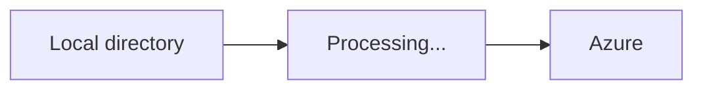
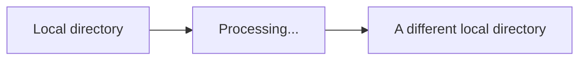
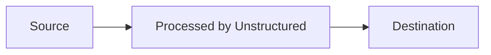
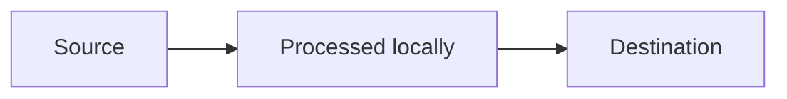

## Concepts

*Ingestion* is the term that Unstructured uses to refer to the set of activities that happens when files are input for processing. Ingestion enables multiple files to be processed as a batch.

You can perform ingestion with the following tools:

- The [Unstructured Platform](/platform/overview), a no-code user interface, unlimited pay-as-you-go platform to get all of your data ready for Retrieval Augmented Generation (RAG) and model fine-tuning.
- The [Unstructured Ingest CLI](#unstructured-ingest-cli), with unlimited pay-as-you-go and limited free options, that enable you to use command-line scripts to get all of your data ready for RAG and model fine-tuning.
- The [Unstructured Ingest Python library](#unstructured-ingest-python-library), with unlimited pay-as-you-go and limited free options, that enable you to use Python code to get all of your data ready for RAG and model fine-tuning.

<Info>
    The [Unstructured Python SDK](/api-reference/api-services/sdk-python) and [Unstructured JavaScript/TypeScript SDK](/api-reference/api-services/sdk-jsts) can process only one file at a time.
</Info>

Files are ingested from an originating *source* location. Each batch of ingested files is processed either [all by Unstructured](#ingestion-options-for-the-unstructured-service) or [all locally](#local-ingestion-options). The processed data is sent to a target *destination* location. The kinds of locations you can specify varies:

When you use the [Unstructured Platform](/platform/overview), the source and destination must both be in cloud storage. Local source or local destination locations are not allowed. For example:

 ```mermaid
flowchart LR
    source[Google Drive]-->api[Processing...]-->destination[S3]
```


The Unstructured Platform enables you to connect to many kinds of [sources](/platform/platform-source-connectors/overview) and [destinations](/platform/platform-destination-connectors/overview).

If you use the Unstructured Ingest CLI or the Unstructured Ingest Python library, the source or destination can be a cloud storage location or a local location. For example:



 ```mermaid
flowchart LR
    source[Google Drive]-->api[Processing...]-->destination[Local directory]
```




Unstructured provides many [source](/api-reference/ingest/source-connectors/overview) and [destination](/api-reference/ingest/destination-connector/overview) connectors.

## Ingestion options for the Unstructured service

This is the flow for sending files to Unstructured for processing and the processed data being delivered by Unstructured:



- This flow always happens for the Unstructured Platform. The Platform only allows sending files from cloud storage and sending processed data to cloud storage.
- For the Unstructured Ingest CLI or the Unstructured Ingest Python library, to use this flow:

  - When using the Unstructured Ingest CLI, include the `--partition-by-api` option and set `--api-key` and `--partition-endpoint` to a valid, matching Unstructured API key and API URL, respectively.
  - When using the Unstructured Ingest Python library, set `partition_by_api=True` and `api_key` and set `partition_endpoint` to a valid, matching Unstructured API key and API URL, respectively.

## Local ingestion options

This is the flow for processing files locally. No files are sent to Unstructured for processing:



- This flow never happens for the Unstructured Platform. The Platform does not allow sending files from a local destination to Unstructured or Unstructured sending processed data to a local destination.
- For the Unstructured Ingest CLI or the Unstructured Ingest Python library, to use this flow:

  - When using the Unstructured Ingest CLI, omit the `--partition-by-api`, `--api-key`, and `--partition-endpoint` options.
  - When using the Unstructured Ingest Python library, omit `partition_by_api` or explicitly set `partition_by_api=False`. Also omit `api_key` and `partition_endpoint`.

## Unstructured Ingest CLI

The Unstructured Ingest CLI enables you to use command-line scripts to get all of your data ready for RAG and model fine-tuning.

One approach to using the CLI is installing Python and then running the following command to install the CLI:

```bash
pip install unstructured-ingest
```

This default installation option enables the ingestion of plain text files, HTML, XML, JSON and emails that do not require any extra dependencies. This default option also enables you to specify local source and destination locations.

import AdditionalIngestDependencies from '/snippets/general-shared-text/ingest-dependencies.mdx';

<AdditionalIngestDependencies />

For additional installation options, see:

- [Run the library in a container](https://github.com/Unstructured-IO/unstructured/tree/main?tab=readme-ov-file#run-the-library-in-a-container)
- [Installing the library](https://github.com/Unstructured-IO/unstructured/tree/main?tab=readme-ov-file#installing-the-library)
- The installation commands for additional connectors for [sources](/api-reference/ingest/source-connectors/overview) and [destinations](/api-reference/ingest/destination-connector/overview)

To display the list of available source connector commands, run the following command:

```bash
unstructured-ingest --help
```

To display the list of available destination connector commands, run the following command:

```bash
unstructured-ingest local --help
```

To display help for a specific source connector command, run the following command:

```bash
unstructured-ingest <command-name> --help
```

To display help for a specific destination connector command, run the following command:

```bash
unstructured-ingest local <command-name> --help
```

To begin using the CLI, see the quickstarts for the:

- [Unstructured Serverless API](/api-reference/api-services/saas-api-development-guide#unstructured-cli)
- [Free Unstructured API](/api-reference/api-services/free-api#unstructured-cli)

<Info>To migrate from older, deprecated versions of the Ingest CLI that used `pip install unstructured`, see the [migration guide](#migration-guide).</Info>

## Unstructured Ingest Python library

The Unstructured Ingest Python library enable you to use Python code to get all of your data ready for RAG and model fine-tuning.

The following 3-minute video shows how to use the Unstructured Ingest Python library to send multiple PDFs from a local directory in batches to be ingested by Unstructured API services for processing:

<iframe
  width="560"
  height="315"
  src="https://www.youtube.com/embed/tSKHFXsBQ-c"
  title="YouTube video player"
  frameborder="0"
  allow="accelerometer; autoplay; clipboard-write; encrypted-media; gyroscope; picture-in-picture"
  allowfullscreen
></iframe>

One approach to using the Unstructured Ingest Python library is installing Python and then running the following command to install the library and the default connectors:

```bash
pip install unstructured-ingest
```

This default installation option enables the ingestion of plain text files, HTML, XML, JSON and emails that do not require any extra dependencies. This default option also enables you to specify local source and destination locations.

<AdditionalIngestDependencies />

For additional installation options, see:

- [Run the library in a container](https://github.com/Unstructured-IO/unstructured/tree/main?tab=readme-ov-file#run-the-library-in-a-container)
- [Installing the library](https://github.com/Unstructured-IO/unstructured/tree/main?tab=readme-ov-file#installing-the-library)
- The installation commands for additional connectors for [sources](/api-reference/ingest/source-connectors/overview) and [destinations](/api-reference/ingest/destination-connector/overview)

Some source and destination connectors provide newer v2 and older v1 implementations, while some provide only older v1 implementations. You should use the v2 implementations wherever they are available, to help ensure better forward-compatibility of your code. For the lists of available v2 and v1 connectors, see:

- [v2 non-fsspec connectors](https://github.com/Unstructured-IO/unstructured-ingest/tree/main/unstructured_ingest/v2/processes/connectors)
- [v2 fsspec connectors](https://github.com/Unstructured-IO/unstructured-ingest/tree/main/unstructured_ingest/v2/processes/connectors/fsspec)
- [v1 non-fsspec connectors](https://github.com/Unstructured-IO/unstructured-ingest/tree/main/unstructured_ingest/connector)
- [v1 fsspec connectors](https://github.com/Unstructured-IO/unstructured-ingest/tree/main/unstructured_ingest/connector/fsspec)
- [v1 Notion connector](https://github.com/Unstructured-IO/unstructured-ingest/tree/main/unstructured_ingest/connector/notion)

To begin using the Unstructured Ingest Python library, see the code examples for the [source](/api-reference/ingest/source-connectors/overview) and [destination](/api-reference/ingest/destination-connector/overview) connectors.

<Info>To migrate from older, deprecated versions of the Ingest Python library that used `pip install unstructured`, see the [migration guide](#migration-guide).</Info>

## Migration guide

import MigrationGuideSteps from '/snippets/general-shared-text/ingest-migration.mdx';

<MigrationGuideSteps/>


