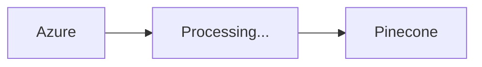
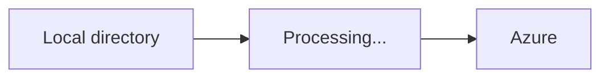
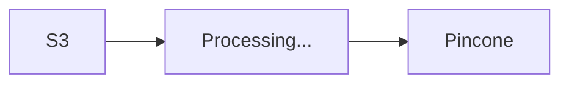
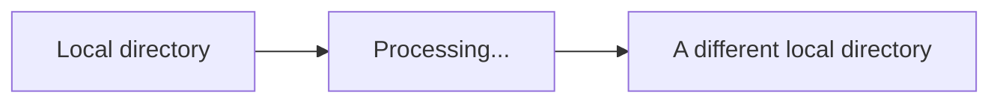
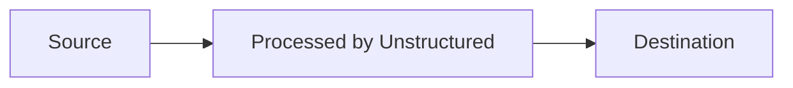
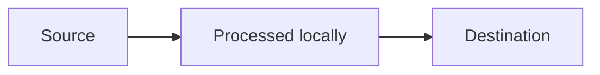

## Concepts

*Ingestion* is the term that Unstructured uses to refer to the set of activities that happens when files are input for processing. Ingestion enables multiple files to be processed as a batch.

Files are ingested from an originating *source* location. Each batch of ingested files is processed either [all by Unstructured](#ingestion-options-for-the-unstructured-service) or [all locally](#local-ingestion-options). The processed data is sent to a target *destination* location. The kinds of locations you can specify varies:

When you use the [Unstructured Platform](/platform/overview), the source and destination must both be in cloud storage. Local source or local destination locations are not allowed. For example:

 ```mermaid
flowchart LR
    source[Google Drive]-->api[Processing...]-->destination[S3]
```



The Unstructured Platform enables you to connect to many kinds of [sources](/platform/platform-source-connectors/overview) and [destinations](/platform/platform-destination-connectors/overview).

If you use the Unstructured CLI, the Unstructured Python SDK, or the Unstructured open source library, the source or destination can be a cloud storage location or a local location. For example:



 ```mermaid
flowchart LR
    source[Google Drive]-->api[Processing...]-->destination[Local directory]
```





Unstructured provides many [source](/api-reference/ingest/source-connectors/overview) and [destination](/api-reference/ingest/destination-connector/overview) connectors.

## Ingestion options for the Unstructured service

This is the flow for sending files to Unstructured for processing and the processed data being delivered by Unstructured:



- This flow always happens for the Unstructured Platform. The Platform only allows sending files from cloud storage and sending processed data to cloud storage.
- For the Unstructured CLI, the Unstructured Python SDK, or the Unstructured open source library, to use this flow:

  - When using the Unstructured CLI, include the `--partition-by-api` option and set `--api-key` and `--partition-endpoint` to a valid, matching Unstructured API key and API URL, respectively.
  - When using the Unstructured Python SDK or the Unstructured open source library, set `partition_by_api=True` and `api_key` and set `partition_endpoint` to a valid, matching Unstructured API key and API URL, respectively.

## Local ingestion options

This is the flow for processing files locally. No files are sent to Unstructured for processing:



- This flow never happens for the Unstructured Platform. The Platform does not allow sending files from a local destination to Unstructured or Unstructured sending processed data to a local destination.
- For the Unstructured CLI or the Unstructured open source library, to use this flow:

  - When using the Unstructured CLI, omit the `--partition-by-api`, `--api-key`, and `--partition-endpoint` options.
  - When using the Unstructured open source library, omit `partition_by_api` or explicitly set `parition_by_api=False`. Also omit `api_key` and `partition_endpoint`.