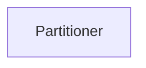
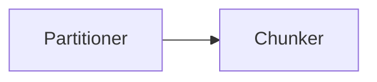
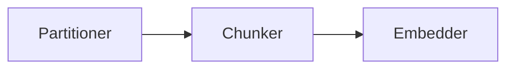
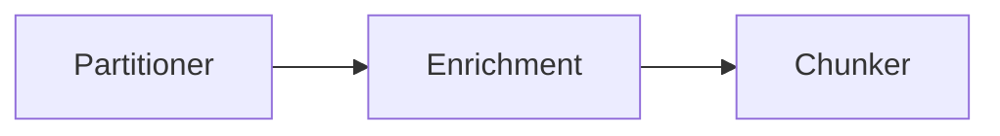
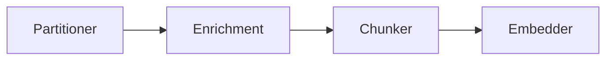

To use the [Unstructured Platform API](/platform/api/overview) to manage workflows, do the following:

- To get a list of available workflows, use the `GET` method to call the `/workflows` endpoint. [Learn more](/platform/api/overview#list-workflows).
- To get information about a workflow, use the `GET` method to call the `/workflows/<workflow-id>` endpoint. [Learn more](/platform/api/overview#get-a-workflow).
- To create a workflow, use the `POST` method to call the `/workflows` endpoint. [Learn more](#create-a-workflow).
- To run a workflow manually, use the `POST` method to call the `/workflows/<workflow-id>/run` endpoint. [Learn more](/platform/api/overview#run-a-workflow).
- To update a workflow, use the `PUT` method to call the `/workflows/<workflow-id>` endpoint. [Learn more](#update-a-workflow).
- To delete a workflow, use the `DELETE` method to call the `/workflows/<workflow-id>` endpoint. [Learn more](/platform/api/overview#delete-a-workflow).

The following examples assume that you have already met the [requirements](/platform/api/overview#requirements) and 
understand the [basics](/platform/api/overview#basics) of working with the Unstructured Platform API.

## Create a workflow

To create a workflow, use the `POST` method to call the `/workflows` endpoint. In the request body, 
specify the settings for the workflow, as follows:

<AccordionGroup>
    <Accordion title="curl">
        ```bash
        curl --request 'POST' --location \
        "$UNSTRUCTURED_API_URL/workflows" \
        --header "unstructured-api-key: $UNSTRUCTURED_API_KEY" \
        --header 'accept: application/json' \
        --data \
        '{
            "name": "<name>",
            "source_id": "<source-connector-id>",
            "destination_id": "<destination-connector-id>",
            "workflow_type": "<type>",
            "workflow_nodes": [
                {
                    "name": "<node-name>",
                    "type": "<node-type>",
                    "subtype": "<node-subtype>",
                    "settings": {
                        "...": "..."
                    }
                },
                {
                    "...": "..." 
                } 
            ],
            "schedule": "<schedule-timeframe>"
        }'
        ```
    </Accordion>
    <Accordion title="Postman">
        1. In the method drop-down list, select **POST**.
        2. In the address box, enter the following URL:

            ```text
            {{UNSTRUCTURED_API_URL}}/workflows
            ```

        3. On the **Headers** tab, enter the following headers:

            - **Key**: `unstructured-api-key`, **Value**: `{{UNSTRUCTURED_API_KEY}}`
            - **Key**: `accept`, **Value**: `application/json`

        4. On the **Body** tab, select **raw** and **JSON**, and specify the settings for the workflow:

           ```json
           {
               "name": "<name>",
               "source_id": "<source-connector-id>",
               "destination_id": "<destination-connector-id>",
               "workflow_type": "<type>",
               "workflow_nodes": [
                   {
                       "name": "<node-name>",
                       "type": "<node-type>",
                       "subtype": "<node-subtype>",
                       "settings": {
                           "...": "..."
                       }
                   },
                   {
                       "...": "..." 
                   } 
               ],
               "schedule": "<schedule-timeframe>"
           }
           ```

        5. Click **Send**.
    </Accordion>
</AccordionGroup>

Replace the preceding placeholders as follows:

- `<name>` (_required_) - A unique name for this workflow.
- `<source-connector-id>` (_required_) - The ID of the target source connector. To get the ID, 
    use the `GET` method to call the `/sources` endpoint. [Learn more](/platform/api/overview#list-source-connectors).
- `<destination-connector-id>` (_required_) - The ID of the target destination connector. To get the ID, 
    use the `GET` method to call the `/destinations` endpoint. [Learn more](/platform/api/overview#list-destination-connectors).
- `<type>` (_required_) - The workflow optimization type. Available values include `advanced`, `basic`, `platinum`, and `custom`. 
  If `<type>` is set to `custom`, you must add a `worfklow_nodes` array. For instructions, see [Custom workflow DAG nodes](#custom-workflow-dag-nodes).
- `<schedule-timeframe>` - The repeating automatic run schedule, specified as a predefined phrase. The available predefined phrases are:

  - `every 15 minutes`: Every 15 minutes (cron expression: `*/15 * * * *`).
  - `every hour`: At the first minute of every hour (cron expression: `0 * * * *`).
  - `every 2 hours`: At the first minute of every second hour (cron expression: `0 */2 * * *`).
  - `every 4 hours`: At the first minute of every fourth hour (cron expression: `0 */4 * * *`).
  - `every 6 hours`: At the first minute of every sixth hour (cron expression: `0 */6 * * *`).
  - `every 8 hours`: At the first minute of every eighth hour (cron expression: `0 */8 * * *`).
  - `every 10 hours`: At the first minute of every tenth hour (cron expression: `0 */10 * * *`).
  - `every 12 hours`: At the first minute of every twelfth hour (cron expression: `0 */12 * * *`).
  - `daily`: At the first minute of every day (cron expression: `0 0 * * *`).
  - `weekly`: At the first minute of every Sunday (cron expression: `0 0 * * 0`).
  - `monthly`: At the first minute of the first day of every month (cron expression: `0 0 1 * *`).
    
  If `schedule` is not specified, the workflow does not automatically run on a repeating schedule.

## Update a workflow

To update information about a workflow, use the `PUT` method to call the `/workflows/<workflow-id>` endpoint, replacing 
`<workflow-id>` with the workflow's unique ID. To get this ID, see [List workflows](#list-workflows).

In the request body, specify the settings for the workflow. For the specific settings to include, see 
[Create a workflow](/platform/api/workflows#create-a-workflow).

<AccordionGroup>
    <Accordion title="curl">
        ```bash
        curl --request 'PUT' --location \
        "$UNSTRUCTURED_API_URL/workflows/<workflow-id>" \
        --header "unstructured-api-key: $UNSTRUCTURED_API_KEY" \
        --header 'accept: application/json' \
        --data \
        '{
            # Specify the settings for the workflow here.
        }'
        ```
    </Accordion>
    <Accordion title="Postman">
        1. In the method drop-down list, select **PUT**.
        2. In the address box, enter the following URL:

            ```text
            {{UNSTRUCTURED_API_URL}}/workflows/<workflow-id>
            ```

        3. On the **Headers** tab, enter the following headers:

            - **Key**: `unstructured-api-key`, **Value**: `{{UNSTRUCTURED_API_KEY}}`
            - **Key**: `accept`, **Value**: `application/json`

        4. On the **Body** tab, select **raw** and **JSON**, and specify the settings for the workflow.
        5. Click **Send**.
    </Accordion>
</AccordionGroup>

## Custom workflow DAG nodes

If `workflow_type` is set to `custom`, you must also specify the settings for the workflow's 
directed acyclic graph (DAG) nodes. These nodes' settings are specified in the `workflow_nodes` array.

- A **Source** node is automatically created when you specify the `source_id` value outside of the  
  `workflow_nodes` array.
- A **Destination** node is automatically created when you specify the `destination_id` value outside of the 
  `workflow_nodes` array.
- You can specify [Partitioner](#partitioner-node), [Chunker](#chunker-node), 
  [Enrichment](#enrichment-node), and [Embedder](#embedder-node) nodes.
- The order of the nodes in the `workflow_nodes` array will be the same order that these nodes appear in the DAG, 
  with the first node in the array added directly after the **Source** node. The **Destination** node 
  follows the last node in the array. 
- Be sure to specify nodes in the allowed order. The following DAG placements are all allowed:







### Partitioner node

A **Partitioner** node has a `type` of `partition` and a `subtype` of `unstructured_api`. The `strategy` setting 
determines the partition strategy to use.

#### Fast strategy

```json
"...": "...",
"workflow_nodes": [
    {
        "name": "Partitioner",
        "type": "partition",
        "subtype": "unstructured_api",
        "settings": {
            "strategy": "fast",
            "include_page_breaks": <true|false>,
            "pdf_infer_table_structure": <true|false>,
            "exclude_elements": [
                "<element-name>",
                "<element-name>"
            ],
            "xml_keep_tags": <true|false>,
            "encoding": "<encoding>",
            "ocr_languages": [
                "<language-code>",
                "<language-code>"
            ],
            "extract_image_block_types": [
                "image",
                "table"
            ],
            "infer_table_structure": <true|false>
        }
    }
],
"...": "..."
```

#### High Res strategy

```json
"...": "...",
"workflow_nodes": [
    {
        "name": "Partitioner",
        "type": "partition",
        "subtype": "unstructured_api",
        "settings": {
            "strategy": "hi_res",
            "include_page_breaks": <true|false>,
            "pdf_infer_table_structure": <true|false>,
            "exclude_elements": [
                "<element-name>",
                "<element-name>"
            ],
            "xml_keep_tags": <true|false>,
            "encoding": "<encoding>",
            "ocr_languages": [
                "<language>",
                "<language>"
            ],
            "extract_image_block_types": [
                "image",
                "table"
            ],
            "infer_table_structure": <true|false>
        }
    }
],
"...": "..."
```

#### VLM strategy

```json
"...": "...",
"workflow_nodes": [
    {
        "name": "Partitioner",
        "type": "partition",
        "subtype": "vlm",
        "settings": {
            "provider": "<provider>",
            "provider_api_key": null,
            "model": "<model>",
            "output_format": "text/html",
            "user_prompt": null,
            "format_html": true,
            "unique_element_ids": <true|false>
        }
    }
],
"...": "...",
```

Allowed values for `provider` and `model` include:

- `"provider": "anthropic"`

  - `"model": "claude-3-5-sonnet-20241022"`

- `"provider": "anthropic""openai"`

  - `"model": "gpt-4o"`

- `"provider": "bedrock"`

  - `"model": "us.anthropic.claude-3-5-sonnet-20241022-v2:0"`
  - `"model": "us.anthropic.claude-3-opus-20240229-v1:0"`
  - `"model": "us.anthropic.claude-3-haiku-20240307-v1:0"`
  - `"model": "us.anthropic.claude-3-sonnet-20240229-v1:0"`
  - `"model": "us.amazon.nova-pro-v1:0"`
  - `"model": "us.amazon.nova-lite-v1:0"`
  - `"model": "us.meta.llama3-2-90b-instruct-v1:0"`
  - `"model": "us.meta.llama3-2-11b-instruct-v1:0"`

### Chunker node

#### Chunk by Character strategy

```json
"...": "..."
"workflow_nodes": [
    {
        "...": "..."
    },
    {
        "name": "Chunker",
        "type": "chunk",
        "subtype": "chunk_by_character",
        "settings": {
            "unstructured_api_url": null,
            "unstructured_api_key": null,
            "include_orig_elements": <true|false>,
            "new_after_n_chars": <new-after-n-chars>,
            "max_characters": <max-characters>,
            "overlap": <overlap>,
            "overlap_all": <true|false>,
            "contextual_chunking_strategy": "v1"
        }
    }
],
"...": "..."
```

#### Chunk by Title strategy

```json
"...": "..."
"workflow_nodes": [
    {
        "...": "..."
    },
    {
        "name": "Chunker",
        "type": "chunk",
        "subtype": "chunk_by_title",
        "settings": {
            "unstructured_api_url": null,
            "unstructured_api_key": null,
            "multipage_sections": <true|false>,
            "combine_text_under_n_chars": <combine-text-under-n-chars>,
            "include_orig_elements": <true|false>,
            "new_after_n_chars": <new-after-n-chars>,
            "max_characters": <max-characters>,
            "overlap": <overlap>,
            "overlap_all": <true|false>,
            "contextual_chunking_strategy": "v1"
        }
    }
],
"...": "..."
```

#### Chunk by Page strategy

```json
"...": "..."
"workflow_nodes": [
    {
        "...": "..."
    },
    {
        "name": "Chunker",
        "type": "chunk",
        "subtype": "chunk_by_page",
        "settings": {
            "unstructured_api_url": null,
            "unstructured_api_key": null,
            "include_orig_elements": <true|false>,
            "new_after_n_chars": <new-after-n-chars>,
            "max_characters": <max-characters>,
            "overlap": <overlap>,
            "overlap_all": <true|false>,
            "contextual_chunking_strategy": "v1"
        }
    }
],
"...": "..."
```

#### Chunk by Similarity strategy

```json
"...": "..."
"workflow_nodes": [
    {
        "...": "..."
    },
    {
        "name": "Chunker",
        "type": "chunk",
        "subtype": "chunk_by_similarity",
        "settings": {
            "unstructured_api_url": null,
            "unstructured_api_key": null,
            "include_orig_elements": <true|false>,
            "new_after_n_chars": <true|false>,
            "max_characters": <max-characters>,
            "overlap": <overlap>,
            "overlap_all": <true|false>,
            "contextual_chunking_strategy": "v1",
            "similarity_threshold": <similarity-threshold>
      }
    }
],
"...": "..."
```

### Enrichment node

#### Image Description task

```json
"...": "..."
"workflow_nodes": [
    {
        "...": "..."
    },
    {
      "name": "Enrichment",
      "type": "prompter",
      "subtype": "<subtype>",
      "settings": {}
    },
    {
        "...": "..."
    }
],
"...": "..."
```

Allowed values for `<subtype>` include:

- `openai_image_description`
- `anthropic_image_description`
- `bedrock_image_description`

#### Table Description task

```json
"...": "..."
"workflow_nodes": [
    {
        "...": "..."
    },
    {
      "name": "Enrichment",
      "type": "prompter",
      "subtype": "<subtype>",
      "settings": {}
    },
    {
        "...": "..."
    }
],
"...": "..."
```

Allowed values for `<subtype>` include:

- `openai_table_description`
- `anthropic_table_description`
- `bedrock_table_description`

#### Table to HTML task

```json
"...": "..."
"workflow_nodes": [
    {
        "...": "..."
    },
    {
      "name": "Enrichment",
      "type": "prompter",
      "subtype": "openai_table2html",
      "settings": {}
    },
    {
        "...": "..."
    }
],
"...": "..."
```

#### Named Entity Recognition (NER) task

```json
"...": "..."
"workflow_nodes": [
    {
        "...": "..."
    },
    {
        "name": "Enrichment",
        "type": "prompter",
        "subtype": "openai_ner",
        "settings": {
            "prompt_interface_overrides": {
                "prompt": {
                    "user": "<user-prompt-override>"
                } 
            }
        }
    },
    {
        "...": "..."
    }
],
"...": "..."
```

Replace the preceding placeholders as follows:

### Embedder node

```json
"...": "..."
"workflow_nodes": [
    {
        "...": "..."
    },
    {
      "name": "Embedder",
      "type": "embed",
      "subtype": "<subtype>",
      "settings": {
        "model_name": "<model-name>"
      }
    }
],
"...": "..."
```

Allowed values for `subtype` and `model_name` include:

- `"subtype": "azure_openai"`

  - `"model_name": "text-embedding-3-small"`
  - `"model_name": "text-embedding-3-large"`
  - `"model_name": "text-embedding-ada-002"`

- `"subtype": "bedrock"`

  - `"model_name": "amazon.titan-embed-text-v2:0"`
  - `"model_name": "amazon.titan-embed-text-v1"`
  - `"model_name": "amazon.titan-embed-image-v1"`
  - `"model_name": "cohere.embed-english-v3"`
  - `"model_name": "cohere.embed-multilingual-v3"`

- `"subtype": "togetherai"`

  - `"model_name": "togethercomputer/m2-bert-80M-2k-retrieval"`
  - `"model_name": "togethercomputer/m2-bert-80M-8k-retrieval"`
  - `"model_name": "togethercomputer/m2-bert-80M-32k-retrieval"`