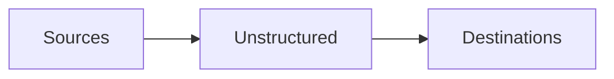

The Unstructured Platform supports connecting to the following source and destination types.

## Sources

- [Azure](/platform/platform-source-connectors/azure-blob-storage)
- [Elasticsearch](/platform/platform-source-connectors/elasticsearch)
- [Google Drive](/platform/platform-source-connectors/google-drive)
- [OneDrive](/platform/platform-source-connectors/onedrive-cloud-storage)
- [OpenSearch](/platform/platform-source-connectors/opensearch)
- [S3](/platform/platform-source-connectors/s3)
- [Salesforce](/platform/platform-source-connectors/salesforce)
- [SFTP](/platform/platform-source-connectors/sftp-storage)
- [SharePoint](/platform/platform-source-connectors/sharepoint)

If your source is not listed here, you might still be able to connect Unstructured to it through scripts or code by using the 
[Unstructured Ingest CLI](/ingestion/overview#unstructured-ingest-cli) or the 
[Unstructured Ingest Python library](/ingestion/overview#unstructured-ingest-python-library). 
[Learn more](/api-reference/ingest/source-connectors/overview).

## Destinations

- [Azure Cognitive Search](/platform/platform-destination-connectors/azure-cognitive-search)
- [Chroma](/platform/platform-destination-connectors/chroma)
- [Databricks Volumes](/platform/platform-destination-connectors/databricks)
- [Elasticsearch](/platform/platform-destination-connectors/elasticsearch)
- [MongoDB](/platform/platform-destination-connectors/mongodb)
- [OpenSearch](/platform/platform-destination-connectors/opensearch)
- [Pinecone](/platform/platform-destination-connectors/pinecone)
- [S3](/platform/platform-destination-connectors/s3)
- [Weaviate](/platform/platform-destination-connectors/weaviate)

If your destination is not listed here, you might still be able to connect Unstructured to it through scripts or code by using the 
[Unstructured Ingest CLI](/ingestion/overview#unstructured-ingest-cli) or the 
[Unstructured Ingest Python library](/ingestion/overview#unstructured-ingest-python-library). 
[Learn more](/api-reference/ingest/destination-connector/overview).

