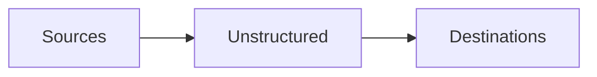

The Unstructured Platform supports connecting to the following source and destination types.

## Sources

- [Azure](/platform/sources/azure-blob-storage)
- [Databricks Volumes](/platform/sources/databricks-volumes)
- [Google Cloud Storage](/platform/sources/google-cloud)
- [MongoDB](/platform/sources/mongodb)
- [OneDrive](/platform/sources/onedrive)
- [S3](/platform/sources/s3)
- [SharePoint](/platform/sources/sharepoint)

If your source is not listed here, you might still be able to connect Unstructured to it through scripts or code by using the 
[Unstructured Ingest CLI](/ingestion/overview#unstructured-ingest-cli) or the 
[Unstructured Ingest Python library](/ingestion/overview#unstructured-ingest-python-library). 
[Learn more](/api-reference/ingest/source-connectors/overview).

## Destinations

- [Astra DB](/platform/destinations/astradb)
- [Azure AI Search](/platform/destinations/azure-ai-search)
- [Couchbase](/platform/destinations/couchbase)
- [Databricks Volumes](/platform/destinations/databricks-volumes)
- [Delta Table](/platform/destinations/delta-table)
- [Elasticsearch](/platform/destinations/elasticsearch)
- [Google Cloud Storage](/platform/destinations/google-cloud)
- [Milvus](/platform/destinations/milvus)
- [MongoDB](/platform/destinations/mongodb)
- [Pinecone](/platform/destinations/pinecone)
- [S3](/platform/destinations/s3)
- [Weaviate](/platform/destinations/weaviate)

If your destination is not listed here, you might still be able to connect Unstructured to it through scripts or code by using the 
[Unstructured Ingest CLI](/ingestion/overview#unstructured-ingest-cli) or the 
[Unstructured Ingest Python library](/ingestion/overview#unstructured-ingest-python-library). 
[Learn more](/api-reference/ingest/destination-connector/overview).

