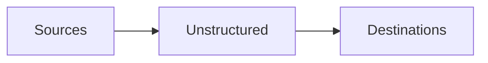

The Unstructured Platform supports connecting to the following source and destination types.

## Sources

- [Azure](/platform/sources/azure-blob-storage)
- [Elasticsearch](/platform/sources/elasticsearch)
- [Google Drive](/platform/sources/google-drive)
- [OneDrive](/platform/sources/onedrive-cloud-storage)
- [OpenSearch](/platform/sources/opensearch)
- [S3](/platform/sources/s3)
- [Salesforce](/platform/sources/salesforce)
- [SFTP](/platform/sources/sftp-storage)
- [SharePoint](/platform/sources/sharepoint)

If your source is not listed here, you might still be able to connect Unstructured to it through scripts or code by using the 
[Unstructured Ingest CLI](/ingestion/overview#unstructured-ingest-cli) or the 
[Unstructured Ingest Python library](/ingestion/overview#unstructured-ingest-python-library). 
[Learn more](/api-reference/ingest/source-connectors/overview).

## Destinations

- [Azure Cognitive Search](/platform/destinations/azure-cognitive-search)
- [Chroma](/platform/destinations/chroma)
- [Databricks Volumes](/platform/destinations/databricks)
- [Elasticsearch](/platform/destinations/elasticsearch)
- [MongoDB](/platform/destinations/mongodb)
- [OpenSearch](/platform/destinations/opensearch)
- [Pinecone](/platform/destinations/pinecone)
- [S3](/platform/destinations/s3)
- [Weaviate](/platform/destinations/weaviate)

If your destination is not listed here, you might still be able to connect Unstructured to it through scripts or code by using the 
[Unstructured Ingest CLI](/ingestion/overview#unstructured-ingest-cli) or the 
[Unstructured Ingest Python library](/ingestion/overview#unstructured-ingest-python-library). 
[Learn more](/api-reference/ingest/destination-connector/overview).

