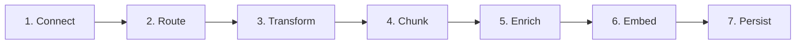
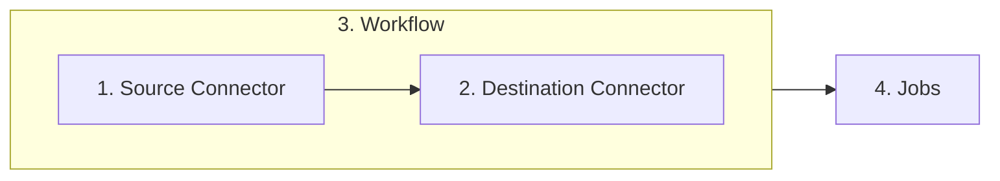

<Note>To start using the Unstructured Platform right away, skip ahead to the [quickstart](/platform/saas-platform-guide).</Note>

## What is the Unstructured Platform?

<iframe
  width="560"
  height="315"
  src="https://www.youtube.com/embed/_mxLMykpFJ0"
  title="YouTube video player"
  frameborder="0"
  allow="accelerometer; autoplay; clipboard-write; encrypted-media; gyroscope; picture-in-picture"
  allowfullscreen
></iframe>

The Unstructured Platform is a no-code user interface, pay-as-you-go platform for transforming your unstructured data into data that is ready for Retrieval Augmented Generation (RAG). 

## How does it work?

To get your data RAG-ready, the Unstructured Platform moves it through the following process:

<Steps>
  <Step title="Connect">
    The Unstructured Platform offers multiple [source connectors](../platform/platform-source-connectors/overview) to connect to your data in its existing location.
  </Step>
  <Step title="Route">
    Routing determines which strategy Unstructured Platform uses to transforming your documents into Unstructured's canonical JSON schema. There are four [partitioning strategies](/api-reference/api-services/partitioning "partitioning strategies") for document transformation: **Fast**, **Hi Res**, **OCR Only**, and **Auto**. Of these:
    
    - **Fast** is great for when there is extractable text available, like in HTML files or in the Microsoft Office Document format.
    - **Hi Res** is best for PDFs and tables and where accurate classification of document elements is critical.
    - **OCR Only** is useful when dealing with image-based files or PDFs that do not have extractable text.
    - If you're unsure which strategy to use, choose **Auto**, and the Unstructured Platform will handle the decision for you.

  </Step>
  <Step title="Transform"> 
    Your source document is transformed into Unstructured's canonical JSON schema. Regardless of the input document, this JSON schema we gives you a [standardized output](/open-source/concepts/document-elements#element-id "Elements and Metadata"). It contains more than 20 elements, such as `Header`, `Footer`, `Title`, `NarrativeText`, `Table`, `Image`, and many more. Each document is wrapped in extensive metadata so you can understand languages, file types, sources, hierarchies, and much more.
  </Step>
    <Step title="Chunk"> 
    Initially, the Unstructured Platform provides two optional [chunking strategies](/open-source/core-functionality/chunking#chunking-basics  "Chunking Strategies"): **Basic** and **By Title**. Of these:
    
    - **Basic** combines sequential elements up to specified size limits. Oversized elements are split, while tables are isolated and divided if necessary. Overlap between chunks is optional.
    - **By Title** uses semantic chunking, understands the layout of the document, and makes intelligent splits.

  </Step>
  <Step title="Enrich">
    Images and tables can be optionally summarized. This generates enriched content around the images or tables that were parsed during the transformation process.
  </Step>
  <Step title="Embed">
    The Unstructured Platform uses optional third-party embedding providers such as OpenAI and AWS Bedrock.
  </Step>
  <Step title="Persist">
    The Unstructured Platform offers multiple [destination connectors](../platform/platform-destination-connectors/overview), including all major vector databases.
  </Step>
</Steps>

To simplify this process and provide it as a no-code solution, the Unstructured Platform brings together four key concepts:

<Steps>
  <Step title="Source Connector">
    [Source connectors](../platform/platform-source-connectors/overview) to ingest your data into the Unstructured Platform for transformation.
  </Step>
  <Step title="Destination Connector">
    [Destination connectors](../platform/platform-destination-connectors/overview) tell the Unstructured Platform where to write your transformed data to.
  </Step>
  <Step title="Workflow">
    [Workflows](../platform/workflows-automation) connect sources to destinations and provide chunking, embedding, and scheduling options.
  </Step>
  <Step title="Jobs">
    [Jobs](../platform/jobs-scheduling) enable you to monitor data transformation progress.
  </Step>
</Steps>

## What support is there for compliance?

The platform is designed for global reach with SOC 2 type 2 compliance. It has support for over 50 languages.

## How do I get started?

Skip ahead to the [quickstart](/platform/saas-platform-guide).

