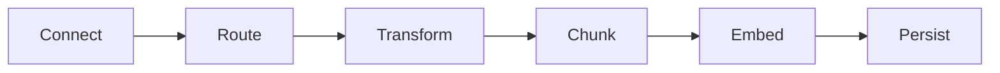
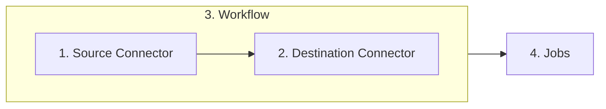

<Warning>
Platform is currently in private beta. [Click here](https://unstructured.io/platform) to join the waitlist.
</Warning>

### What We Do
The ```Unstructured Platform``` is a **no-code platform** for **transforming unstructured data** to **RAG-ready data**. [Read the announcement](https://unstructured.io/blog/introducing-unstructured-platform)&nbsp;&nbsp;<Icon icon="blog"/>.


To **get your data RAG-ready** our platform moves it through the following process:


<Steps>
  <Step title="Connect">
    We offer multiple [Source Connectors](../platform/platform-source-connectors/overview). We can connect to your data in its existing location.
  </Step>
  <Step title="Route">
    **Routing** determines which strategy we will employ in **transforming your document to our canonical JSON schema**. There are three [Partioning Strategies](/api-reference/api-services/partitioning "partioning strategies") for document transformation, ```fast```, ```hires```, or ```ocr_only```. ```fast``` is great for when there is extractable text available, like in HTML files or in the Microsoft Office Document format. ```hires``` is best for PDFs and tables and where accurate classification of document elements is critical. ```ocr_only``` is useful when dealing with image-based files or PDFs that do not have extractable text. **If you're unsure, select ```auto``` and we'll handle the decision for you**.
  </Step>
  <Step title="Transform"> 
    Your source document is **transformed to our canonical JSON schema**. Irrespective of the input document, the JSON schema we provide gives you a [standardized output to code against](/open-source/concepts/document-elements#element-id "Elements and Metadata"). It contains 20+ elements, such as ```Header```, ```Footer```, ```Title```, ```NarrativeText```, ```Table```, ```Image```, and more. Each document is wrapped in extensive metadata so you can understand languages, ```file_type```, ```source```, ```hierarchy``` and much more.
  </Step>
    <Step title="Chunk"> 
    Initially platform comes with [two chunking strategies](/open-source/core-functionality/chunking#chunking-basics  "Chunking Strategies"). **Basic**: Combines sequential elements up to specified size limits. Oversized elements are split, while tables are isolated and divided if necessary. Overlap between chunks is optional. **By Title**: Semantic chunking, understands the layout of the document and makes intelligent splits.
  </Step>
    <Step title="Embed">
    Call out to third party embedding providers, ```Open AI```, ```AWS Bedrock```, and ```Octo ML```.
  </Step>
      <Step title="Persist">
    We have multiple [Destination Connectors](../platform/platform-destination-connectors/overview). Including **all major vector databases**.
  </Step>
</Steps>

### How We Do It

To simplify this  process and provide it as a no-code solution, platform consists of **4 key concepts**:



1. [Source Connectors](../platform/platform-source-connectors/overview) to ingest your data.
2. [Destination Connectors](../platform/platform-destination-connectors/overview) tell our system where to write your transformed data too..
3. [Workflows](../platform/workflows-automation) connect sources to destinations and provide chunking, embedding, and scheduling options.
4. [Jobs](../platform/jobs-scheduling) allow you to monitor data transformation progress.


### Compliance

The platform is designed for global reach with SOC 2 type 2 compliance. It has support for over 50 languages.

### Sign-Up

You can [sign-up here](https://unstructured.io/platform) to our private beta.


