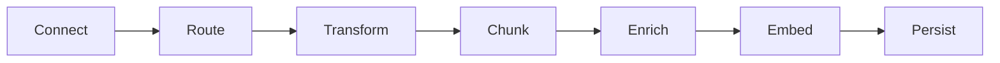
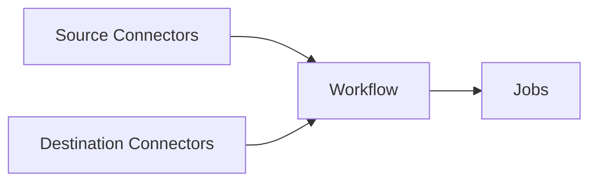

The Unstructured Platform user interface (UI) is a no-code user interface, pay-as-you-go platform for transforming your unstructured data into data that is ready for Retrieval Augmented Generation (RAG). 

<Tip>To start using the Unstructured Platform UI right away, skip ahead to the [quickstart](/platform/quickstart).</Tip>

Here is a screenshot of the Unstructured Platform UI **Start** page:

This 90-second video provides a brief overview of the Unstructured Platform UI:

<iframe
  width="560"
  height="315"
  src="https://www.youtube.com/embed/IVKcQDZa9Zc"
  title="YouTube video player"
  frameborder="0"
  allow="accelerometer; autoplay; clipboard-write; encrypted-media; gyroscope; picture-in-picture"
  allowfullscreen
></iframe>

<Icon icon="blog"/>&nbsp;&nbsp;[Read the announcement](https://unstructured.io/blog/introducing-unstructured-platform-the-enterprise-etl-platform-for-the-genai-tech-stackintroducing-unstructured-platform-beta-the-enterprise-etl-platform-for-the-genai-tech-stack).

## How does it work?

To get your data RAG-ready, the Unstructured Platform moves it through the following process:

import PlatformPartitioningStrategies from '/snippets/general-shared-text/platform-partitioning-strategies.mdx';

<Steps>
  <Step title="Connect">
    The Unstructured Platform offers multiple [source connectors](/platform/sources/overview) to connect to your data in its existing location.
  </Step>
  <Step title="Route">
    Routing determines which strategy Unstructured Platform uses to transform your documents into Unstructured's canonical JSON schema. The Unstructured Platform provides four [partitioning](/platform/partitioning) strategies for document transformation, as follows.
    
    <PlatformPartitioningStrategies />
  </Step>
  <Step title="Transform"> 
    Your source document is transformed into Unstructured's canonical JSON schema. Regardless of the input document, this JSON schema gives you a [standardized output](/platform/document-elements). It contains more than 20 elements, such as `Header`, `Footer`, `Title`, `NarrativeText`, `Table`, `Image`, and many more. Each document is wrapped in extensive metadata so you can understand languages, file types, sources, hierarchies, and much more.
  </Step>
    <Step title="Chunk"> 
    The Unstructured Platform provides these [chunking](/platform/chunking) strategies:
    
    - **Basic** combines sequential elements up to specified size limits. Oversized elements are split, while tables are isolated and divided if necessary. Overlap between chunks is optional.
    - **By Title** uses semantic chunking, understands the layout of the document, and makes intelligent splits.
    - **By Page** attempts to preserve page boundaries when determining the chunks' contents.
    - **By Similarity** uses an embedding model to identify topically similar sequential elements and combines them into chunks.

  </Step>
  <Step title="Enrich">
    Images and tables can be optionally summarized. This generates enriched content around the images or tables that were parsed during the transformation process.
  </Step>
  <Step title="Embed">
    The Unstructured Platform uses optional third-party [embedding](/platform/embedding) providers such as OpenAI.
  </Step>
  <Step title="Persist">
    The Unstructured Platform offers multiple [destination connectors](/platform/destinations/overview), including all major vector databases.
  </Step>
</Steps>

To simplify this process and provide it as a no-code solution, the Unstructured Platform brings together these key concepts:

<Steps>
  <Step title="Source Connectors">
    [Source connectors](/platform/sources/overview) to ingest your data into the Unstructured Platform for transformation.
  </Step>
  <Step title="Destination Connectors">
    [Destination connectors](/platform/destinations/overview) tell the Unstructured Platform where to write your transformed data to.
  </Step>
  <Step title="Workflow">
    A [workflow](/platform/workflows) connects sources to destinations and provide chunking, embedding, and scheduling options.
  </Step>
  <Step title="Jobs">
    [Jobs](/platform/jobs) enable you to monitor data transformation progress.
  </Step>
</Steps>

## What support is there for compliance?

The platform is designed for global reach with SOC2 Type 1, SOC2 Type 2, and HIPAA compliance. It has support for over 50 languages.

## How do I get started?

Skip ahead to the [quickstart](/platform/quickstart).

## How do I get help?

[Contact us directly](https://unstructured.io/contact), or join our [Slack community](https://short.unstructured.io/pzw05l7).

For enterprise support, email Unstructured Sales at [sales@unstructured.io](mailto:sales@unstructured.io).

