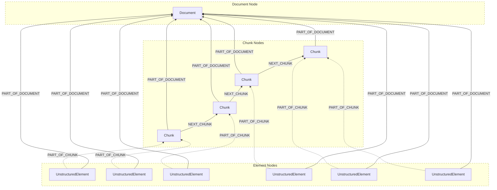

The graph ouput of the Neo4j destination connector is represented in the following diagram:

In the preceding diagram:

- The `Document` node represents the source file.
- The `UnstructuredElement` nodes represent the source file's Unstructured `Element` objects, before chunking.
- The `Chunk` nodes represent the source file's Unstructured `Element` objects, after chunking.
- Each `UnstructuredElement` node has a `PART_OF_DOCUMENT` relationship with the `Document` node.
- Each `Chunk` node also has a `PART_OF_DOCUMENT` relationship with the `Document` node.
- Each `UnstructuredElement` node has a `PART_OF_CHUNK` relationship with a `Chunk` element.
- Each `Chunk` node, except for the "last" `Chunk` node, has a `NEXT_CHUNK` relationship with its "next" `Chunk` node.

Learn more about [document elements](/platform/document-elements) and [chunking](/platform/chunking).