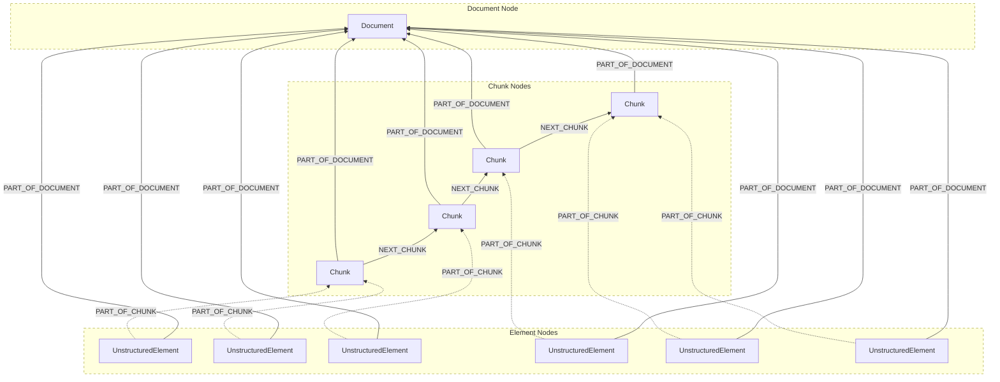
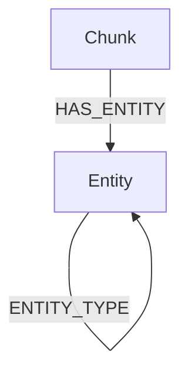

The graph output of the Neo4j destination connector is represented in the following diagram:



[View the preceding diagram in full-screen mode](https://mermaid.live/view#pako:eNqFlN9vgjAQx_-Vps-6REEfeFiyFZYli7hskCyTxXS0ihFaU9oHo_7vq_IjgIzyxN330157d70TjDmh0IFbgQ8JeA4iBvSXq9_CQRhYuTxWGWUS-Br9KQC39pYOyki5VB5Tel2XS8H3dExwnmAh8NEBs4LohKA6hJfSOkJe7hh6k1XI9C4qlkpQUjK1Oh1UrUHVHlRng-p8QO1kgRqzoC8JxuPH8_vTR7BevqzdJQoXnh-cgVvf0wRYJsA2ATMTMP8f6FQz1tVEiWL7Vi3RpHBW5rRtWm3TbpmdnMbGnKIipb73FazRa-i_nXXAKvC9ZFWHuJfs6nrIUCVkKBIy1AjZpgTfGuWhwVRnnDT6ZFC3-vVpo0v6dKvRJH263eiRXh2OYEZFhndEj5nTlY6gTPSriaCjfwndYJXKCEbsolGsJP88shg6-onRERRcbRPobHCaa0sdCJbU3WHdbFmFHDD75jyrIUp2kotFMddu4-3yB3k-fcg).

In the preceding diagram:

- The `Document` node represents the source file.
- The `UnstructuredElement` nodes represent the source file's Unstructured `Element` objects, before chunking.
- The `Chunk` nodes represent the source file's Unstructured `Element` objects, after chunking.
- Each `UnstructuredElement` node has a `PART_OF_DOCUMENT` relationship with the `Document` node.
- Each `Chunk` node also has a `PART_OF_DOCUMENT` relationship with the `Document` node.
- Each `UnstructuredElement` node has a `PART_OF_CHUNK` relationship with a `Chunk` element.
- Each `Chunk` node, except for the "last" `Chunk` node, has a `NEXT_CHUNK` relationship with its "next" `Chunk` node.

Learn more about [document elements](/ui/document-elements) and [chunking](/ui/chunking).

Some related example Neo4j graph queries include the following.

Query for all available nodes and relationships:

```text
MATCH path=(source)-[relationship]->(target)
RETURN path
```

Query for `Chunk` to `Document` relationships:

```text
MATCH (chunk:Chunk)-[relationship:PART_OF_DOCUMENT]->(doc:Document)
RETURN chunk, relationship, doc
```

Query for `UnstructuredElement` to `Document` relationships:

```text
MATCH (element:UnstructuredElement)-[relationship:PART_OF_DOCUMENT]->(doc:Document)
RETURN element, relationship, doc
```

Query for `UnstructuredElement` to `Chunk` relationships:

```text
MATCH (element:UnstructuredElement)-[relationship:PART_OF_CHUNK]->(chunk:Chunk)
RETURN element, relationship, chunk
```

Query for `Chunk` to `Chunk` relationships:

```text
MATCH (this:Chunk)-[relationship:NEXT_CHUNK]->(previous:Chunk)
RETURN this, relationship, previous
```

Query for `UnstructuredElement` to `Chunk` to `Document` relationships:

```text
MATCH (element:UnstructuredElement)-[ecrelationship:PART_OF_CHUNK]-(chunk:Chunk)-[cdrelationship:PART_OF_DOCUMENT]->(doc:Document)
RETURN element, ecrelationship, chunk, cdrelationship, doc
```

Query for `UnstructuredElements` containing the text `jury`, and show their `Chunk` relationships:

```text
MATCH (element:UnstructuredElement)-[relationship:PART_OF_CHUNK]->(chunk:Chunk)
WHERE element.text =~ '(?i).*jury.*'
RETURN element, relationship, chunk
```

Query for the `Chunk` with the specified `id`, and show its `UnstructuredElement` relationships:

```text
MATCH (element:UnstructuredElement)-[relationship:PART_OF_CHUNK]->(chunk:Chunk)
WHERE chunk.id = '731508bf53637ce4431fe93f6028ebdf'
RETURN element, relationship, chunk
```

Additionally, for the [Unstructured UI](/ui/overview) and [Unstructured API's workflow operations](/api-reference/workflow/), 
when a [Named entity recognition (NER)](/ui/enriching/ner) DAG node is added to a custom workflow, 
any recognized entities are output as `Entity` nodes in the graph.

This additional graph output of the Neo4j destination connector is represented in the following diagram:



In the preceding diagram:

- The `Chunk` node represents one of the source file's Unstructured `Element` objects, after chunking. 
- The `Entity` node represents a recognized entity. 
- A `Chunk` node can have `HAS_ENTITY` relationships with `Entity` nodes.
- An `Entity` node can have `ENTITY_TYPE` relationships with other `Entity` nodes. 

Some related example Neo4j graph queries include the following.

Query for all available nodes and relationships:

```text
MATCH path=(source)-[relationship]->(target)
RETURN path
```

Query for `Entity` to `Entity` relationships:

```text
MATCH (child:Entity)-[relationship:ENTITY_TYPE]->(parent:Entity)
RETURN child, relationship, parent
``` 

Query for `Entity` nodes containing the text `PERSON`, and show their `Entity` relationships:

```text
MATCH (child:Entity)-[relationship:ENTITY_TYPE]->(parent:Entity)
WHERE parent.id = 'PERSON'
RETURN child, relationship, parent
```

Query for `Entity` nodes containing the text `amendment`, and show their `Chunk` relationships:

```text
MATCH (element:Chunk)-[relationship:HAS_ENTITY]->(entity:Entity)
WHERE entity.id =~ '(?i).*amendment.*'
RETURN element, relationship, entity
```

QUERY FOR `Entity` nodes containing the text `PERSON`, and show their `Entity` to `Entity` to `Chunk` relationships:

```text
MATCH (chunk:Chunk)-[ccrelationship:HAS_ENTITY]-(child:Entity)-[cprelationship:ENTITY_TYPE]->(parent:Entity)
WHERE parent.id =~ 'PERSON'
RETURN chunk, ccrelationship, child, cprelationship, parent
```

