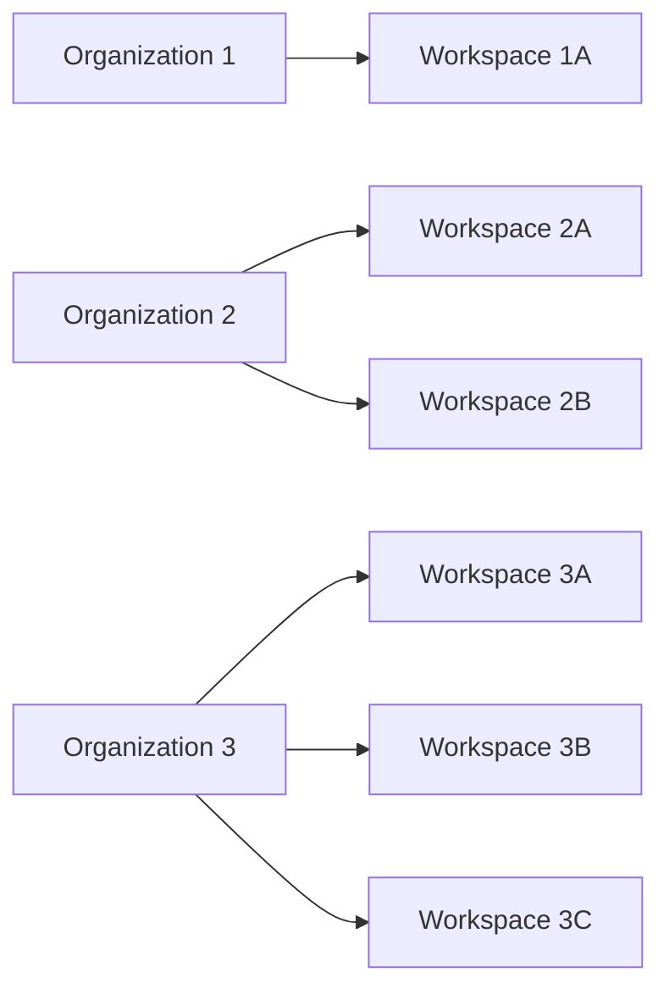
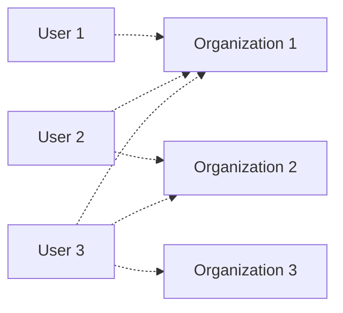
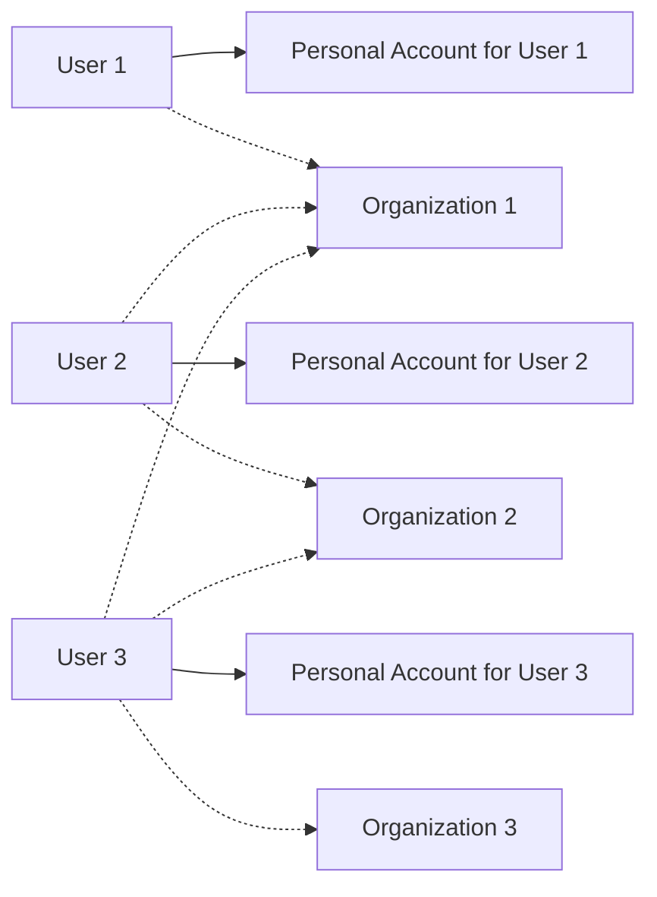
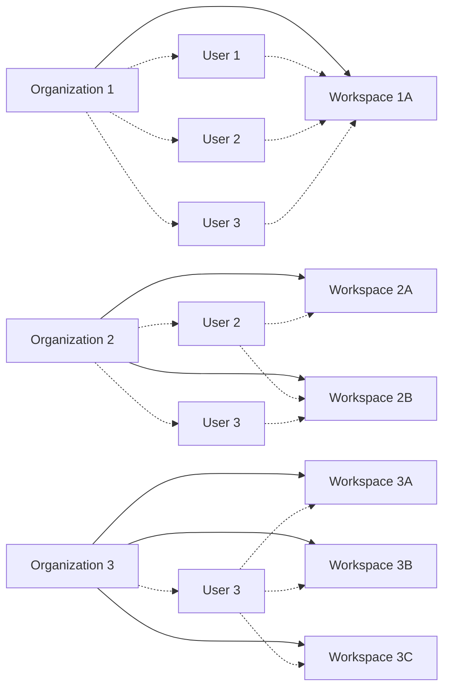

<Note>
    The following information applies only to Unstructured **Team** and **Enterprise** accounts. To upgrade from an Unstructured **Starter** account 
    to a **Team** or **Enterprise** account, contact your Unstructured sales representative, or 
    email Unstructured Sales at [sales@unstructured.io](mailto:sales@unstructured.io).
</Note>

An _organizational account_ is an Unstructured account that allows multiple users to access Unstructured resources and share billing. 
An organizational account contains a collection of Unstructured [workspaces](/ui/account/workspaces) that can share resources 
with subsets of users within the account. An organizational account manages access its organization and the organization's workspaces by inviting Unstructured 
_personal account_ users. Any usage that occurs in an organizational account by any of its invited users is applied to the shared billing for that 
organizational account.

A _workspace_ is a collection of Unstructured resources (such as connectors, workflows, jobs, and API keys) within an organization. 
This is different from a _personal workspace_, which is a collection of resources within an Unstructured personal account. An organizational account 
can have multiple workspaces.

## Organizational account architecture

Each organizational account operates independently of all other organizational accounts. 

Each organizational account can have multiple workspaces. Each workspace operates independently of all other workspaces.

Each organizational account can have multiple users. Users can have access to multiple organizational accounts.

Each user also has a _personal account_, which operates independently of all other organizational accounts and personal accounts. Each personal account has a 
_personal workspace_, which operates independently of all other workspaces. Each user can add a seprate billing method to their personal account that 
will be applied only to usage in their personal account.

Within an organizational account, an invited user (also known as a _member_) can have access to multiple workspaces within that organizational account.

Each user must be explicitly added to the organizational accounts&mdash;and workspaces within those organizational accounts&mdash;that they are allowed to access.

## Create an organizational account

Only authorized Unstructured representatives can create organizational accounts. To request an organizational account to be created, contact your Unstructured 
sales representative, or email Unstructured Sales at [sales@unstructured.io](mailto:sales@unstructured.io).

## Access an organizational account

1. Sign in to your Unstructured account.
2. In the top navigation bar, in the organizational account selector, select the name of the organizational account that you want to access.

   If the organizational account selector is not shown, or if the selector does not show the organizational account you want to access, then 
   your user has not been added to that organizational account. To be added to the organizational account, contact one of the organizational account's administrators.

## Add a member to an organizational account

<Info>
    Your user must have the **Super Administrator** [role](/ui/account/roles) in the organizational account to add members to that organizational account.
</Info>

To add a user to an organizational account as a member:

1. Sign in to your Unstructured account.
2. In the top navigation bar, in the organizational account selector, select the name of the organizational account that you want to add the member to.
3. In the sidebar, above your user icon, click the **Settings** (gear) icon.
4. Click **Manage Account**.
5. In the top navigation bar, click **Members**.
6. Click **New Member**.
7. In the **Add New Member** dialog, enter the email address for the organizational account's new member.
8. In the role selector, select the new member's [role](/ui/account/roles) for this organizational account.
9. Click **Continue**. 

## Change an organizational account role for a member

<Info>
    Your user must have the **Super Administrator** role in the organizational account to change its members' organizational account roles.
</Info>

1. Sign in to your Unstructured account.
2. In the top navigation bar, in the organizational account selector, select the name of the organizational account that contains the member you want to change roles for.
3. In the sidebar, above your user icon, click the **Settings** (gear) icon.
4. Click **Manage Account**.
5. In the top navigation bar, click **Members**.
6. Click the member you want to change roles for.
7. Next to **Role** click the **Edit** (pencil) icon.
8. Select the new role.
9. Click the **Accept** (check mark) icon.

## Remove a member from an organizational account

<Warning>
    Removing a member from an organizational account also removes the member from all of the organizational account's workspaces. The member will no longer 
    have access to the organizational account or any of its workspaces. The member will continue to be able to use their personal account and personal workspace.
    
    Any connectors, workflows, jobs, or other resources that were created by the member within the organizational accounts's workspaces will not be removed.

    The only way to reverse removing a member from an organizational account is to add the member back to the organizational account&mdash;and to each of the workspaces that the member might have previously
    been a member of in that organizational account. 
</Warning>

<Info>
    Your user must have the **Super Administrator** [role](/ui/account/roles) in the organizational account to remove members from that organizational account.
</Info>

1. Sign in to your Unstructured account.
2. In the top navigation bar, in the organizational account selector, select the name of the organizational account that you want to remove the member from.
3. In the sidebar, above your user icon, click the **Settings** (gear) icon.
4. Click **Manage Account**.
5. In the top navigation bar, click **Members**.
6. In the list of members, click the member you want to remove.
7. In the member's settings pane, click **Remove Member**.
8. Confirm the removal by clicking **Continue**.

## Permanently delete an organizational account

<Warning>
    Deleting an organizational account is a permanent action and is not recoverable. Once an organizational account is deleted, all workspaces associated with that 
    organizational account are also deleted and are not recoverable.
    
    The organizational account's members will no longer have access to the deleted organizational account or any of its workspaces. 
    Each member will continue to be able to use their personal account and personal workspace.

    Any code or scripts that reference connectors, workflows, jobs, or workflow API keys that are associated with workflows in the deleted 
    organizational account will fail.
</Warning>

Only authorized Unstructured representatives can delete organizational accounts. To request an organizational account to be permanently deleted, contact your Unstructured 
sales representative, or email Unstructured Sales at [sales@unstructured.io](mailto:sales@unstructured.io).