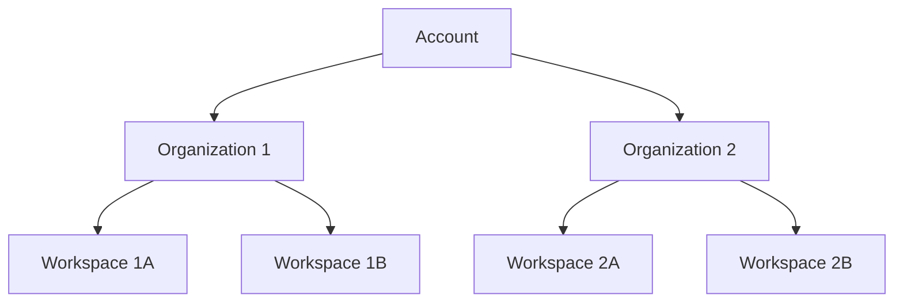
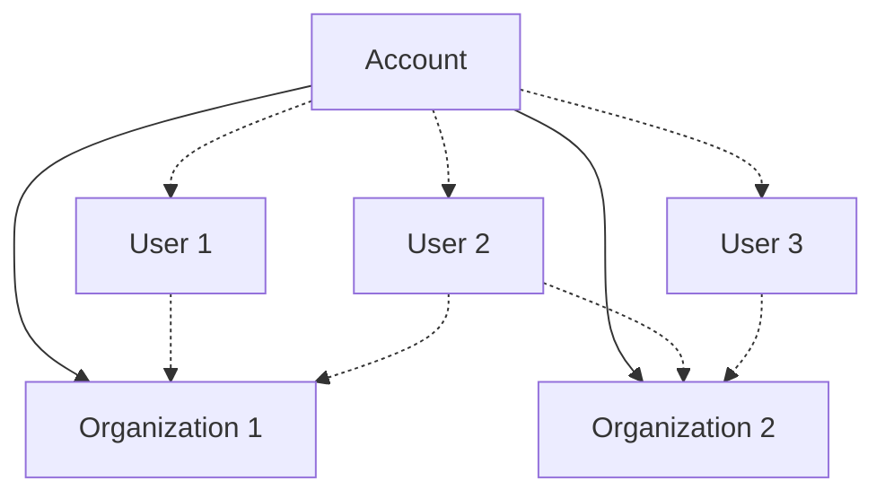

An _organization_ is a collection of users and [workspaces](/account/workspaces) within an Unstructured account. Organizations are used to manage
user access to workspaces within the organization.

Currently, only Unstructured representatives can create organizations in Unstructured accounts. To request an organization to be created in your account, 
contact your Unstructured representative.

## Organizational structure

An organization is part of one (and only one) Unstructured account. An account can have multiple organizations. 
Each organization can have multiple [workspaces](/account/workspaces).

An organization can have multiple users. A user can have access to multiple workspaces within the same organization.

Although an Unstructured account can have multiple users, each user must be added separately to each organization that they are allowed to access. 

## Add a user to an organization

## Remove a user from an organization