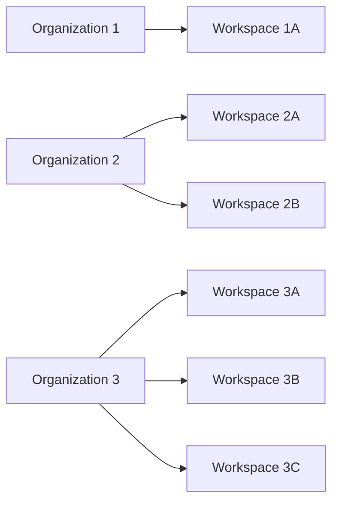
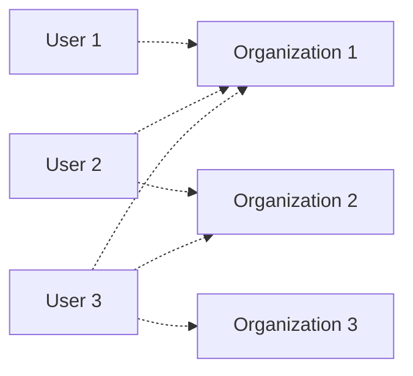
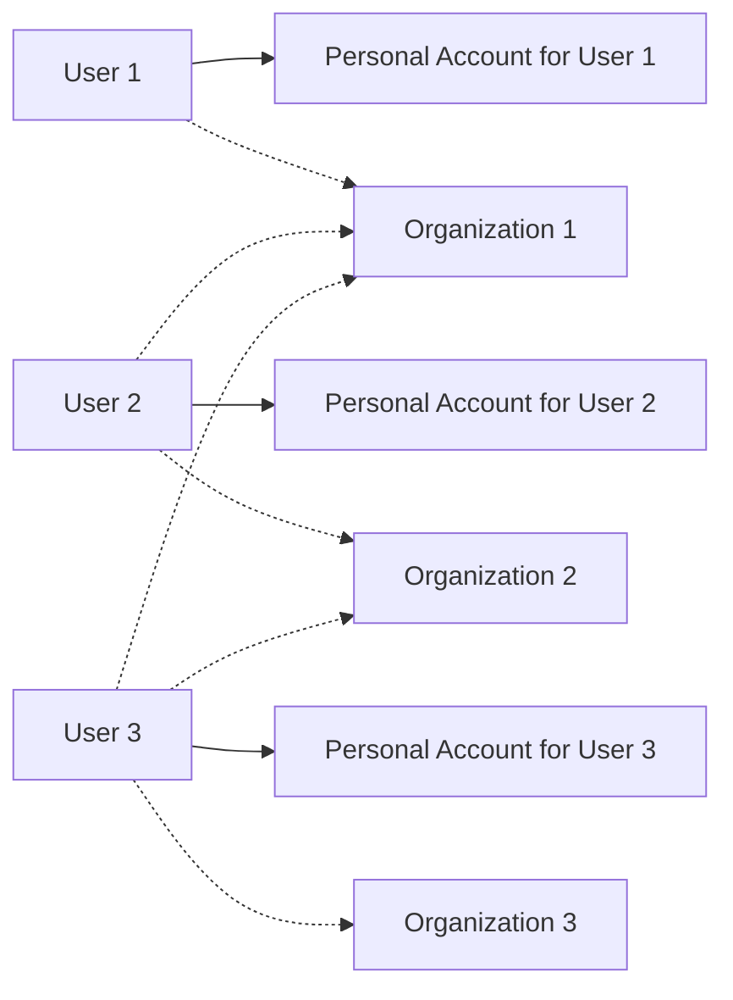
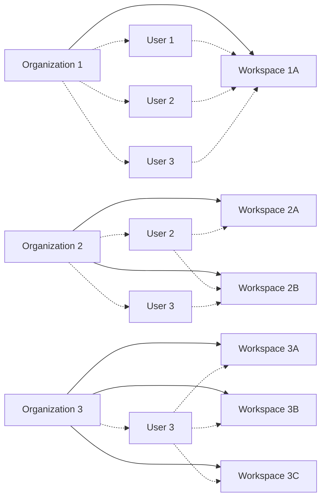

An _organization_ is a collection of Unstructured [workspaces](/account/workspaces). An Unstructured _organizational account_ manages 
Unstructured _account user access_ to workspaces within organizations.

Currently, only Unstructured representatives can create organizational accounts. To request an organizational account to be created, 
contact your Unstructured representative.

## Organizational account structure

An organizational account operates independently of all other organizational accounts. Each organization can have multiple [workspaces](/account/workspaces).

An account user can have access to multiple organizational accounts.

Each user also has access to their own personal account, which is separate from any organizational accounts. Personal accounts do not have workspaces.

Within an organization, a user can have access to multiple workspaces within that organization.

Each user must be explicitly added to the organizations&mdash;and workspaces within those organizations&mdash;that they are allowed to access.

## Create an organization

## Access an organization

1. Sign in to your Unstructured account, at [https://platform.unstructured.io](https://platform.unstructured.io).
2. In the top navigation bar, ...

## Add a member to an organization

An Unstructured user account that is added to an organization is referred to an a _member_ of that organization.

To add a user account to an organization as a member:

1. Sign in to your Unstructured account, at [https://platform.unstructured.io](https://platform.unstructured.io).
2. In the top navigation bar, ...

## Remove a member from an organization

1. Sign in to your Unstructured account, at [https://platform.unstructured.io](https://platform.unstructured.io).
2. In the top navigation bar, ...

## Permanently delete an organization

<Caution>
    Deleting an organization is a permanent action and is not recoverable. Once an organization is deleted, all workspaces associated with that 
    organization are also deleted and are not recoverable.
    
    The organization's users are not deleted, but they will no longer have access to the deleted organization or any of its workspaces.

    Any code or scripts that reference connectors, workflows, jobs, or API keys that are associated with workflows in the deleted 
    organization will fail.
</Caution>

1. Sign in to your Unstructured account, at [https://platform.unstructured.io](https://platform.unstructured.io).
2. In the top navigation bar, ...