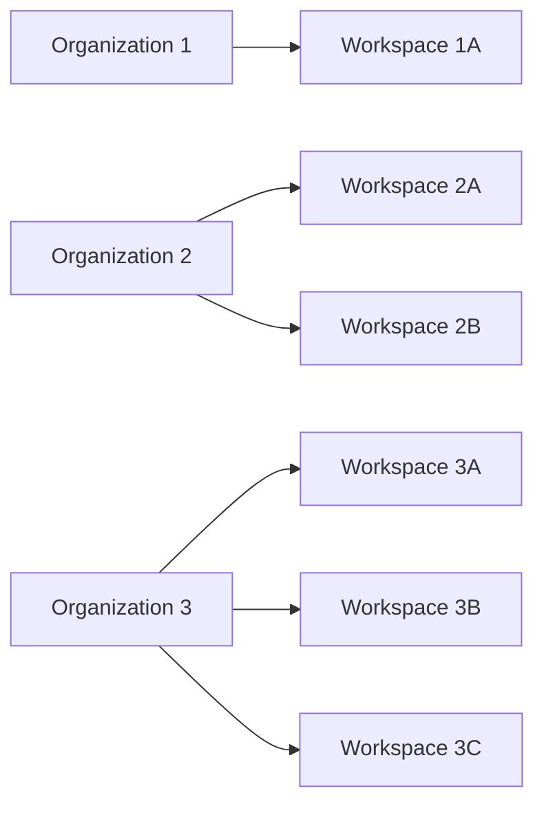
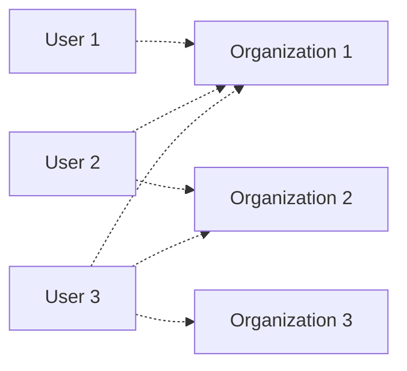
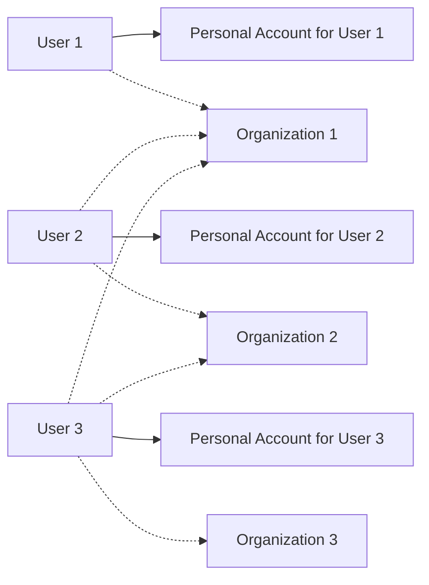
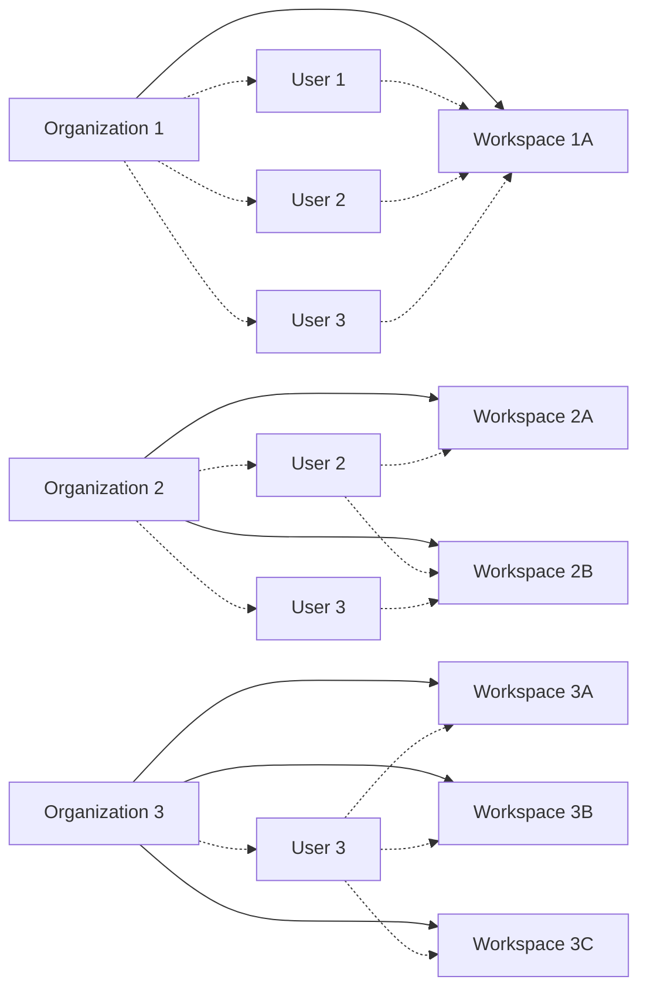

An _organization_ is a collection of Unstructured [workspaces](/account/workspaces). 
An Unstructured _organizational account_ manages access to that organization and its workspaces by invited Unstructured _personal account users_. 
Each organizational account has one and only one organization. 

An _organizational workspace_ is a collection of resources 
(such as connectors, workflows, jobs, and workspace API keys) within an organization. This is different from a _personal workspace_, 
which is a collection of resources within an Unstructured personal account. An organizational account can have multiple organizational workspaces.

## Organization architecture

An organizational account operates independently of all other organizational accounts. Each organization can have multiple [workspaces](/account/workspaces).

A personal account user can have access to multiple organizations.

## Organizational versus personal accounts

Each personal account user always has access to their own _personal account_, which is separate from all organizational accounts and all other personal accounts. Each personal 
account has one and only one personal workspace.

A personal account is created whenever someone initially signs up for Unstructured in one of the following ways:

- Going to [https://platform.unstructured.io](https://platform.unstructured.io) and using their email address, Google account, or GitHub account to 
  sign up for a new Unstructured personal account and sign into that account at the same time.
- Going to the [For Developers](https://unstructured.io/developers) page on the Unstructured website and completing the on-screen [signup form](https://unstructured.io/developers#get-started).

Personal accounts are not associated with any organizational accounts by default. 
Resources in personal accounts (such as personal API keys and personal workspaces and their connectors, workflows, and jobs) cannot 
be shared with or migrated over into any organizational accounts or any other personal accounts.

Within an organization, an invited personal account user (also known as an _organization member_) can have access to multiple workspaces within that organization.

Each personal account user must be explicitly added to the organizations&mdash;and workspaces within those organizations&mdash;that they are allowed to access.

## Create an organization

Only authorized Unstructured representatives can create organizational accounts. To request an organizational to be created, contact your Unstructured 
sales representative, email Unstructured Sales at [sales@unstructured.io](mailto:sales@unstructured.io), or complete the online 
[Unstructured contact form](https://unstructured.io/contact).

## Access an organization

1. Sign in to your Unstructured account, at [https://platform.unstructured.io](https://platform.unstructured.io).
2. In the top navigation bar, in the organization selector, select the name of the organization account that you want to access.

   If the organization selector is not shown, or if the selector does not show the organization you want to access, then 
   your personal account has not been added to that organization. To be added to the organization, contact one of the organization's administrators.

## Add a member to an organization

An Unstructured personal account user that is added to an organizational account is referred to as an _organization member_.

To add a member to an organization:

1. Sign in to your Unstructured account, at [https://platform.unstructured.io](https://platform.unstructured.io).
2. In the top navigation bar, in the organization selector, select the name of the organization that you want to add a member to.
3. In the sidebar, above your user icon, click the **Settings** (gear) icon.
4. Click **Manage Account**.
5. In the top navigation bar, click **Members**.
6. Click **New Member**.
7. In the **Add New Member** dialog, enter the email address of the organization's new team member.
8. In the role selector, select the new team member's role for this organization. [See the available roles and their permissions](/ui/account/roles).
9. Click **Continue**. 

## Remove a member from an organization

<Warning>
    Removing a member from an organization also removes the member from all of the organization's workspaces. The member will no longer 
    have access to the organization or any of its workspaces. The member will continue to be able to use their personal account and personal workspace.
    
    Any connectors, workflows, jobs, or other resources that were created by the member within the organizations's workspaces will not be removed.

    The only way to reverse removing a member from an organization is to add the member back to the organization&mdash;and to each of the workspaces that the member might have previously
    been a member of in that organization. 
</Warning>

1. Sign in to your Unstructured account, at [https://platform.unstructured.io](https://platform.unstructured.io).
2. In the top navigation bar, click **Members**.
3. In the list of members, click the member you want to remove.
4. In the member's settings pane, click **Remove Member**.
5. Confirm the removal by clicking **Continue**.

## Permanently delete an organization

<Warning>
    Deleting an organization is a permanent action and is not recoverable. Once an organization is deleted, all workspaces associated with that 
    organization are also deleted and are not recoverable.
    
    The organization's members will no longer have access to the deleted organization or any of its workspaces. 
    Each member will continue to be able to use their personal account and personal workspace.

    Any code or scripts that reference connectors, workflows, jobs, or workflow API keys that are associated with workflows in the deleted 
    organization will fail.
</Warning>

Only authorized Unstructured representatives can delete organizational accounts. To request an organization to be permanently deleted, contact your Unstructured 
sales representative, email Unstructured Sales at [sales@unstructured.io](mailto:sales@unstructured.io), or complete the online 
[Unstructured contact form](https://unstructured.io/contact).