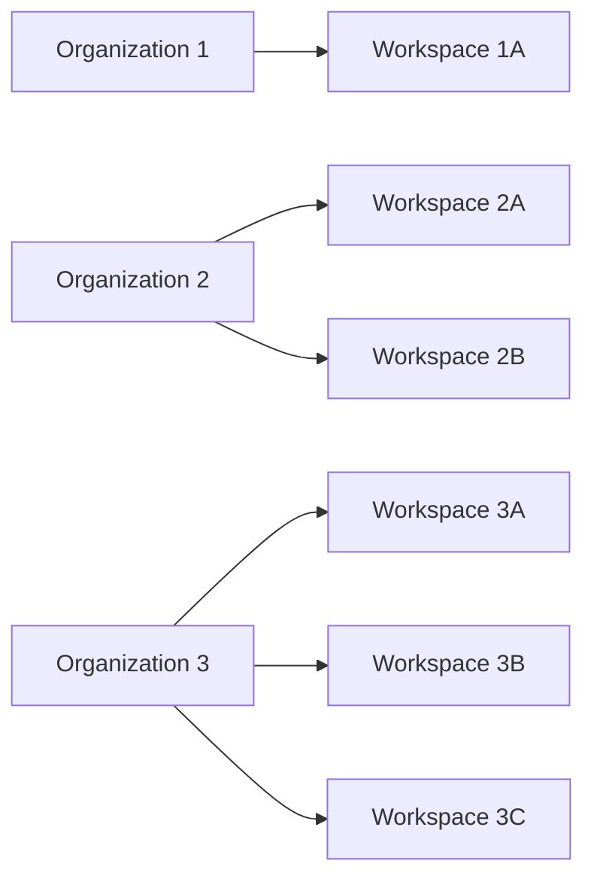
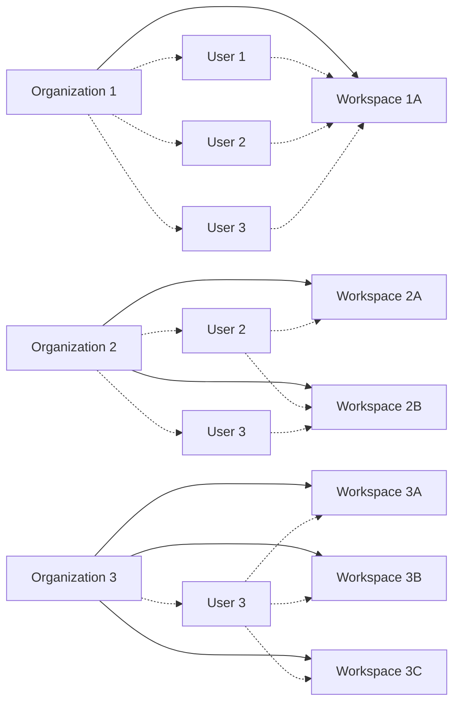

An _organizational workspace_ is a collection of resources (such as connectors, workflows, jobs, and workspace API keys) 
within an Unstructured _organizational account_. Organizational workspace are used to manage 
access to those resources by invited Unstructured _personal account users_ (also known as _workspace members_) that have first 
been added to the organizational workspace's parent organization as _organization members_.

## Workspace architecture

An organizational workspace is part of one and only one [organization](/account/organizations).

An organization can have multiple organizational workspaces.

Unstructured personal account users can have access to multiple organizational workspaces within an organization.

Each personal account user must be explicitly added to each organizational workspace that they are allowed to access. This assumes that the personal account user has first been added 
to the organizational workspace's parent organization.

Each personal account user always has access to their own personal account. This personal account has one and only one personal workspace. 

To make API calls to a workspace, an account user must first create an API key for that workspace, and then use that API key to make API calls to that workspace. 
An API key is valid only for its related workspace, regardless of whether it is an organizational workspace or a personal workspace.

## Create a workspace

To create a workspace, you must first have an available Unstructured organizational account.

Currently, only Unstructured representatives can create organizational accounts. To request an organizational account to be created, 
contact your Unstructured 
sales representative, email Unstructured Sales at [sales@unstructured.io](mailto:sales@unstructured.io), or complete the online 
[Unstructured contact form](https://unstructured.io/contact).

1. Sign in to your Unstructured account, at [https://platform.unstructured.io](https://platform.unstructured.io).
2. In the top navigation bar, in the organization selector, select the name of the organization that you want to add a workspace to.
3. In the sidebar, above your user icon, click the **Settings** (gear) icon.
4. Click **View All Workspaces**.
5. Click **New Workspace**.
6. In the **Create New Workspace** dialog, enter a name for the new workspace.
7. Optionally, enter a budget limit for the new workspace. If you do not want to set a budget limit, leave this field blank.

   <Warning>
       This workspace budget limit is for informational purposes only. Workspace usage is not stopped if this 
       limit is exceeded. 
   </Warning>
   
8. Click **Continue**.

## Access a workspace

1. Sign in to your Unstructured account, at [https://platform.unstructured.io](https://platform.unstructured.io).
2. In the top navigation bar, in the organization selector, select the name of the organization that contains the workspace you want to access.
3. In the workspace selector, select the name of the workspace that you want to access.

   If the workspace selector does not show the workspace you want to access, then 
   your personal account has not been added to that workspace. To be added to the workspace, contact one of the workspace's administrators or its 
   parent organization's administrators.

## Add a member to a workspace

An Unstructured account user that is added to a workspace is referred to as a _workspace member_.

To add a personal account user to a workspace as a member:

1. Make sure the account user that you want to add has already been added as a member of the workspace's parent organization. 
   [Learn how](/ui/account/organizations.mdx#add-a-member-to-an-organization).
2. Sign in to your Unstructured account, at [https://platform.unstructured.io](https://platform.unstructured.io).
3. In the top navigation bar, in the organization selector, select the name of the organization that contains the workspace you want to add a member to.
4. In the workspace selector, select the name of the workspace that you want to add a member to.
5. In the sidebar, above your user icon, click the **Settings** (gear) icon.
6. Click **Manage Workspace**.
7. In the top navigation bar, click **Members**.
8. Click **Add New Member**.
9. In the **Add New Member** dialog, select one of the organization's members to add to this workspace as a member.
10. In the role selector, select the new team member's role for this workspace. [See the available roles and their permissions](/ui/account/roles).
11. Click **Continue**. 

## Remove a member from a workspace

<Warning>
    A member who is removed from a workspace will no longer have access to the workspace. The member will continue to be able to use their personal account and personal workspace.
    
    Any connectors, workflows, jobs, or other resources that were created by the member within the workspace will not be removed.

    The only way to reverse removing a member from a workspace is to add the member back to the workspace. 
</Warning>

1. Sign in to your Unstructured account, at [https://platform.unstructured.io](https://platform.unstructured.io).
2. In the top navigation bar, in the organization selector, select the name of the organization that contains the workspace you want to remove a member from.
3. In the workspace selector, select the name of the workspace that you want to remove a member from.
4. In the sidebar, above your user icon, click the **Settings** (gear) icon.
5. Click **Manage Workspace**.
6. In the top navigation bar, click **Members**.
7. In the list of members, click the ellipses next to the member that you want to remove.
8. Click **Remove Member**.
9. Confirm the removal by clicking **Continue**.

## Create an API key for a workspace

To make API calls to a workspace, a personal account user must first create an API key for that workspace, and then use that API key to make API calls to that workspace.

An API key can be used only with the workspace for which it was created.

1. Sign in to your Unstructured account, at [https://platform.unstructured.io](https://platform.unstructured.io).
2. In the top navigation bar, in the organization selector, select the name of the organization that contains the workspace you want to create an API key for.
3. In the workspace selector, select the name of the workspace that you want to create an API key for.
4. In the sidebar, above your user icon, click the **Settings** (gear) icon.
5. Click **Manage Workspace**.
6. In the top navigation bar, click **API Keys**.
7. Click **Generate New Key**.
8. Enter some name for the key, and click **Continue**.
9. To get the key's value, in the list of available keys, click the **Copy** icon next to the newly created key. The key's value is 
   copies to your system's clipboard.

## Delete an API key for a workspace

<Warning>
    Deleting an existing API key is a permanent operation. Deleted API keys cannot be recovered.

    You cannot use a deleted API key to call the Unstructured APIs.
</Warning>

1. Sign in to your Unstructured account, at [https://platform.unstructured.io](https://platform.unstructured.io).
2. In the top navigation bar, in the organization selector, select the name of the organization that contains the workspace you want to delete an API key for.
3. In the workspace selector, select the name of the workspace that you want to delete an API key for.
4. In the sidebar, above your user icon, click the **Settings** (gear) icon.
5. Click **Manage Workspace**.
6. In the top navigation bar, click **API Keys**.
7. n the list of available keys, click the ellipses next to the key you want to delete.
8. Click **Delete**.
9. Confirm the deletion by clicking **Continue**.

## Permanently delete a workspace

<Warning>
    Deleting a workspace is a permanent action and is not recoverable. Once a workspace is deleted, all connectors, workflows, jobs, and 
    API keys that are associated with that workspace are also deleted and are not recoverable.
    
    The workspace's account users are not deleted, but they will no longer have access to the deleted workspace's connectors, workflows, jobs, and API keys.

    Any code or scripts that reference the deleted workspace's connectors, workflows, jobs, or workspace API keys will fail.
</Warning>

Only authorized Unstructured representatives can delete workspaces. To request a workspace to be permanently deleted, contact your Unstructured 
sales representative, email Unstructured Sales at [sales@unstructured.io](mailto:sales@unstructured.io), or complete the online 
[Unstructured contact form](https://unstructured.io/contact).