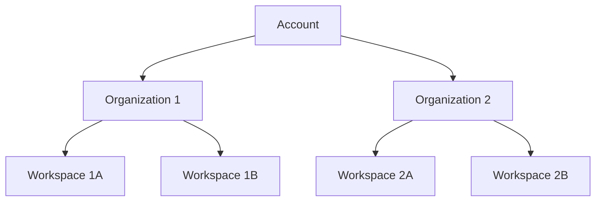
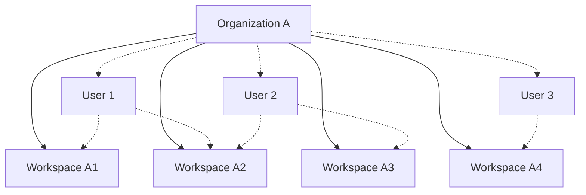

A _workspace_ is a collection of resources within an Unstructured account. Workspaces are used to manage 
access to those resources by users within the related organization.

## Workspace structure

A workspace is part of one (and only one) [organization](/account/organizations) in an Unstructured account.

An organization can have multiple workspaces. An Unstructured account can have multiple organizations.

Organization users can have access to multiple workspaces within the same organization.

## Create a workspace

Currently, only Unstructured representatives can create organizations in Unstructured accounts. To request an organization to be created in your account, 
contact your Unstructured representative.

## Set a budget limit for a workspace

## Track usage for a workspace against a budget limit

