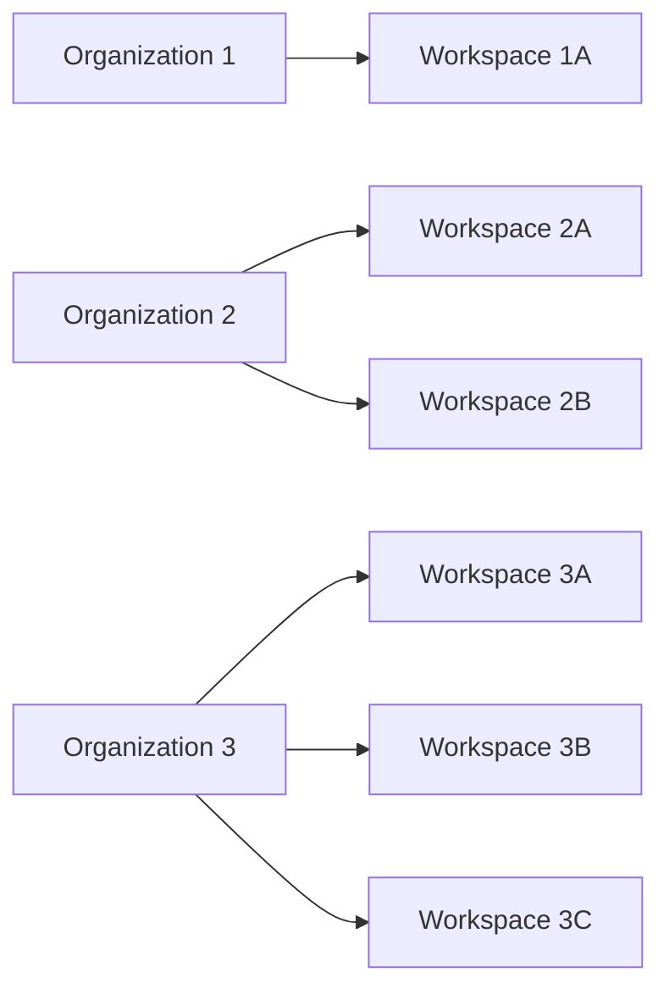
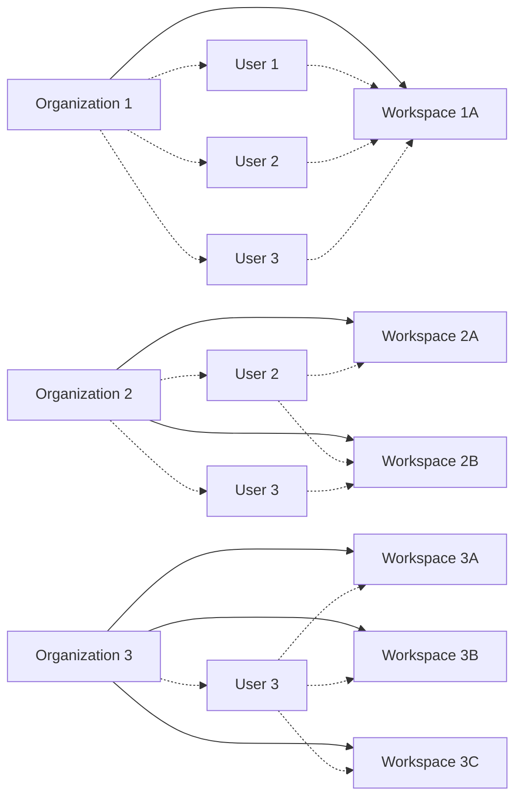

A _workspace_ is a collection of resources (such as connectors, workflows, jobs, and API keys) 
within an Unstructured _organizational account_. Workspaces are used to manage 
access to those resources by Unstructured _account users_ that first have access to the workspace's related _organization_.

## Workspace architecture

A workspace is part of one (and only one) [organization](/account/organizations).

An organization can have multiple workspaces.

Unstructured account users can have access to multiple workspaces within an organization.

Each user must be explicitly added to each workspace that they are allowed to access. This assumes that the user has first been added 
to the workspace's parent organization.

## Create a workspace

To create a workspace, you must first have an available Unstructured organizational account.

Currently, only Unstructured representatives can create organizational accounts. To request an organizational account to be created, 
contact your Unstructured representative.

1. Sign in to your Unstructured account, at [https://platform.unstructured.io](https://platform.unstructured.io).
2. In the top navigation bar, ...

## Access a workspace

1. Sign in to your Unstructured account, at [https://platform.unstructured.io](https://platform.unstructured.io).
2. In the top navigation bar, ...

## Add a member to a workspace

An Unstructured user account that is added to a workspace is referred to an a _member_ of that workspace.

To add a user account to a workspace as a member:

1. Sign in to your Unstructured account, at [https://platform.unstructured.io](https://platform.unstructured.io).
2. In the top navigation bar, ...
3. Make sure the user account that you want to add has already been added as a member of the workspace's parent organization. [Learn how]().
4. ...

## Remove a member from a workspace

1. Sign in to your Unstructured account, at [https://platform.unstructured.io](https://platform.unstructured.io).
2. In the top navigation bar, ...

## Set a budget limit for a workspace

1. Sign in to your Unstructured account, at [https://platform.unstructured.io](https://platform.unstructured.io).
2. In the top navigation bar, ...

## Track usage for a workspace against a budget limit

1. Sign in to your Unstructured account, at [https://platform.unstructured.io](https://platform.unstructured.io).
2. In the top navigation bar, ...

## Permanently delete a workspace

<Caution>
    Deleting a workspace is a permanent action and is not recoverable. Once a workspace is deleted, all connectors, workflows, jobs, and 
    API keys that are associated with that workspace are also deleted and are not recoverable.
    
    The workspace's users are not deleted, but they will no longer have access to the deleted workspace's connectors, workflows, jobs, and API keys.

    Any code or scripts that reference the deleted workspace's connectors, workflows, jobs, or API keys will fail.
</Caution>

1. Sign in to your Unstructured account, at [https://platform.unstructured.io](https://platform.unstructured.io).
2. In the top navigation bar, ...