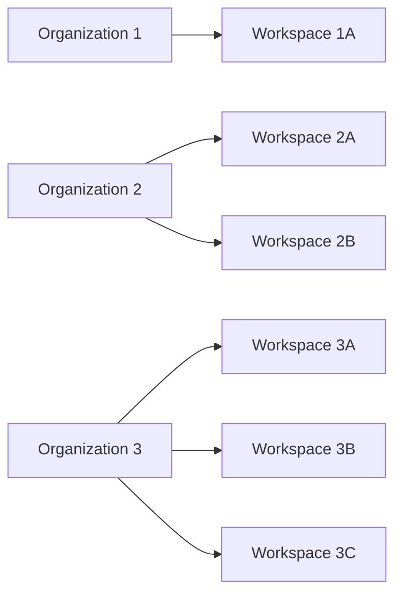
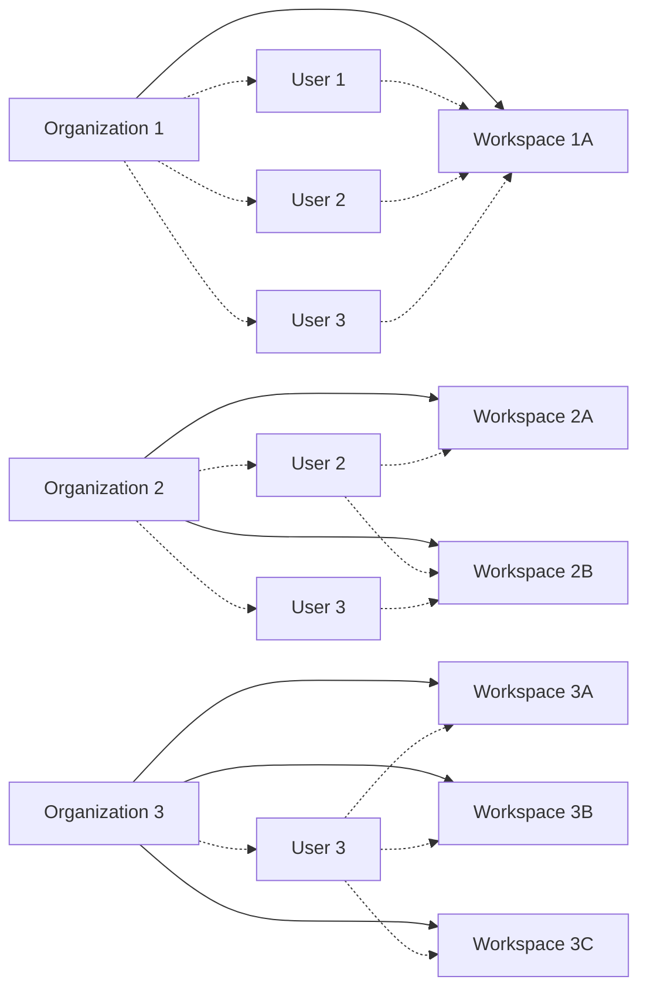

An _organizational workspace_ is a collection of resources (such as connectors, workflows, jobs, and workspace API keys) 
within an Unstructured _organizational account_. Organizational workspace are used to manage 
access to those resources by invited Unstructured _personal account users_ (also known as _workspace members_) that have first 
been added to the organizational workspace's parent organization as _organization members_.

## Workspace architecture

An organizational workspace is part of one (and only one) [organization](/account/organizations).

An organization can have multiple workspaces.

Unstructured personal account users can have access to multiple workspaces within an organization.

Each personal account user must be explicitly added to each workspace that they are allowed to access. This assumes that the account user has first been added 
to the workspace's parent organization.

To make API calls to a workspace, an account user must first create a _workspace API key_ for that workspace and then use that workspace API key to make API calls to that workspace.

Each personal account user always has access to their own personal account. This personal account has one and only one personal workspace. 

_Personal API keys_ for personal accounts work only with personal workspaces; they do not work for making API calls to organization workspaces. Workspace API keys for organization workspaces do not work for making API calls to personal workspaces. 
A personal API key is valid only for its related personal workspace. A workspace API key is valid only for its related organizational workspace.

## Create a workspace

To create a workspace, you must first have an available Unstructured organizational account.

Currently, only Unstructured representatives can create organizational accounts. To request an organizational account to be created, 
contact your Unstructured 
sales representative, email Unstructured Sales at [sales@unstructured.io](mailto:sales@unstructured.io), or complete the online 
[Unstructured contact form](https://unstructured.io/contact).

1. Sign in to your Unstructured account, at [https://platform.unstructured.io](https://platform.unstructured.io).
2. In the top navigation bar, in the organization selector, select the name of the organization that you want to add a workspace to.
3. In the sidebar, above your user icon, click the **Settings** (gear) icon.
4. Click **View All Workspaces**.
5. Click **New Workspace**.
6. In the **Create New Workspace** dialog, enter a name for the new workspace.
7. Optionally, enter a budget usage limit for the new workspace. If you do not want to set a budget limit, leave this field blank.
8. Click **Continue**.

## Access a workspace

1. Sign in to your Unstructured account, at [https://platform.unstructured.io](https://platform.unstructured.io).
2. In the top navigation bar, in the organization selector, select the name of the organization that contains the workspace you want to access.
3. In the workspace selector, select the name of the workspace that you want to access.

   If the workspace selector does not show the workspace you want to access, then 
   your personal account has not been added to that workspace. To be added to the workspace, contact one of the workspace's administrators or its 
   parent organization's administrators.

## Add a member to a workspace

An Unstructured account user that is added to a workspace is referred to an a _member_ of that workspace.

To add an account user to a workspace as a member:

1. Sign in to your Unstructured account, at [https://platform.unstructured.io](https://platform.unstructured.io).
2. In the top navigation bar, ...
3. Make sure the account user that you want to add has already been added as a member of the workspace's parent organization. [Learn how]().
4. ...

## Remove a member from a workspace

1. Sign in to your Unstructured account, at [https://platform.unstructured.io](https://platform.unstructured.io).
2. In the top navigation bar, ...

## Create a workspace API key

To make API calls to a workspace, an account user must first create a workspace API key for that workspace and then use that workspace API key to make API calls to that workspace.

Pesonal API keys for account users' personal accounts do not work for making API calls to workspaces. Workspace API keys do not work for making API calls to personal accounts.

1. Sign in to your Unstructured account, at [https://platform.unstructured.io](https://platform.unstructured.io).
2. In the top navigation bar, ...

## Delete an API key for a workspace

1. Sign in to your Unstructured account, at [https://platform.unstructured.io](https://platform.unstructured.io).
2. In the top navigation bar, ...

## Set a budget limit for a workspace

1. Sign in to your Unstructured account, at [https://platform.unstructured.io](https://platform.unstructured.io).
2. In the top navigation bar, ...

## Track usage for a workspace against a budget limit

1. Sign in to your Unstructured account, at [https://platform.unstructured.io](https://platform.unstructured.io).
2. In the top navigation bar, ...

## Permanently delete a workspace

<Caution>
    Deleting a workspace is a permanent action and is not recoverable. Once a workspace is deleted, all connectors, workflows, jobs, and 
    workspace API keys that are associated with that workspace are also deleted and are not recoverable.
    
    The workspace's account users are not deleted, but they will no longer have access to the deleted workspace's connectors, workflows, jobs, and workspace API keys.

    Any code or scripts that reference the deleted workspace's connectors, workflows, jobs, or workspace API keys will fail.
</Caution>

1. Sign in to your Unstructured account, at [https://platform.unstructured.io](https://platform.unstructured.io).
2. In the top navigation bar, ...