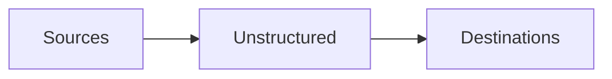

Unstructured supports connecting to the following source and destination types.

## Sources

- [Azure](/ui/sources/azure-blob-storage)
- [Box](/ui/sources/box)
- [Confluence](/ui/sources/confluence)
- [Couchbase](/ui/sources/couchbase)
- [Databricks Volumes](/ui/sources/databricks-volumes)
- [Dropbox](/ui/sources/dropbox)
- [Elasticsearch](/ui/sources/elasticsearch)
- [Google Cloud Storage](/ui/sources/google-cloud)
- [Google Drive](/ui/sources/google-drive)
- [Kafka](/ui/sources/kafka)
- [MongoDB](/ui/sources/mongodb)
- [OneDrive](/ui/sources/onedrive)
- [Outlook](/ui/sources/outlook)
- [PostgreSQL](/ui/sources/postgresql)
- [S3](/ui/sources/s3)
- [Salesforce](/ui/sources/salesforce)
- [SharePoint](/ui/sources/sharepoint)
- [Snowflake](/ui/sources/snowflake)
- [Zendesk](/ui/sources/zendesk)

If your source is not listed here, you might still be able to connect Unstructured to it through scripts or code by using the 
[Unstructured Ingest CLI](/ingestion/overview#unstructured-ingest-cli) or the 
[Unstructured Ingest Python library](/ingestion/python-ingest). 
[Learn more](/ingestion/source-connectors/overview).

## Destinations

- [Astra DB](/ui/destinations/astradb)
- [Azure AI Search](/ui/destinations/azure-ai-search)
- [Couchbase](/ui/destinations/couchbase)
- [Databricks Volumes](/ui/destinations/databricks-volumes)
- [Delta Tables in Amazon S3](/ui/destinations/delta-table)
- [Delta Tables in Databricks](/ui/destinations/databricks-delta-table)
- [Elasticsearch](/ui/destinations/elasticsearch)
- [Google Cloud Storage](/ui/destinations/google-cloud)
- [Kafka](/ui/destinations/kafka)
- [Milvus](/ui/destinations/milvus)
- [MotherDuck](/ui/destinations/motherduck)
- [MongoDB](/ui/destinations/mongodb)
- [Neo4j](/ui/destinations/neo4j)
- [OneDrive](/ui/destinations/onedrive)
- [Pinecone](/ui/destinations/pinecone)
- [PostgreSQL](/ui/destinations/postgresql)
- [Qdrant](/ui/destinations/qdrant)
- [Redis](/ui/destinations/redis)
- [S3](/ui/destinations/s3)
- [Snowflake](/ui/destinations/snowflake)
- [Weaviate](/ui/destinations/weaviate)

If your destination is not listed here, you might still be able to connect Unstructured to it through scripts or code by using the 
[Unstructured Ingest CLI](/ingestion/overview#unstructured-ingest-cli) or the 
[Unstructured Ingest Python library](/ingestion/python-ingest). 
[Learn more](/ingestion/destination-connectors/overview).

