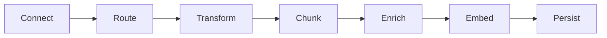
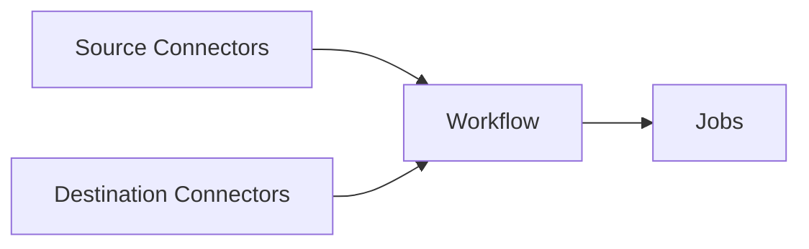

<Tip>To start using the Unstructured UI right away, skip ahead to the [quickstarts](/ui/quickstart) now!</Tip>

## What is the Unstructured UI?

The Unstructured user interface (UI) is a no-code user interface, pay-as-you-go platform for transforming your unstructured data into data that is ready for retrieval-augmented generation (RAG). 

Here is a screenshot of the Unstructured UI **Start** page:

This 90-second video provides a brief overview of the Unstructured UI:

<iframe
  width="560"
  height="315"
  src="https://www.youtube.com/embed/IVKcQDZa9Zc"
  title="YouTube video player"
  frameborder="0"
  allow="accelerometer; autoplay; clipboard-write; encrypted-media; gyroscope; picture-in-picture"
  allowfullscreen
></iframe>

<Icon icon="blog"/>&nbsp;&nbsp;[Read the announcement](https://unstructured.io/blog/introducing-unstructured-platform-the-enterprise-etl-platform-for-the-genai-tech-stackintroducing-unstructured-platform-beta-the-enterprise-etl-platform-for-the-genai-tech-stack).

## How does it work?

To get your data RAG-ready, Unstructured moves it through the following process:

import PlatformPartitioningStrategies from '/snippets/general-shared-text/platform-partitioning-strategies.mdx';

<Steps>
  <Step title="Connect">
    Unstructured offers multiple [source connectors](/ui/sources/overview) to connect to your data in its existing location.
  </Step>
  <Step title="Route">
    Routing determines which strategy Unstructured uses to transform your documents into Unstructured's canonical JSON schema. Unstructured provides four [partitioning](/ui/partitioning) strategies for document transformation, as follows.
    
    <PlatformPartitioningStrategies />
  </Step>
  <Step title="Transform"> 
    Your source document is transformed into Unstructured's canonical JSON schema. Regardless of the input document, this JSON schema gives you a [standardized output](/ui/document-elements). It contains more than 20 elements, such as `Header`, `Footer`, `Title`, `NarrativeText`, `Table`, `Image`, and many more. Each document is wrapped in extensive metadata so you can understand languages, file types, sources, hierarchies, and much more.
  </Step>
    <Step title="Chunk"> 
    Unstructured provides these [chunking](/ui/chunking) strategies:
    
    - **Basic** combines sequential elements up to specified size limits. Oversized elements are split, while tables are isolated and divided if necessary. Overlap between chunks is optional.
    - **By Title** uses semantic chunking, understands the layout of the document, and makes intelligent splits.
    - **By Page** attempts to preserve page boundaries when determining the chunks' contents.
    - **By Similarity** uses an embedding model to identify topically similar sequential elements and combines them into chunks.

  </Step>
  <Step title="Enrich">
    Images and tables can be optionally summarized. This generates enriched content around the images or tables that were parsed during the transformation process.
  </Step>
  <Step title="Embed">
    Unstructured uses optional third-party [embedding](/ui/embedding) providers such as OpenAI.
  </Step>
  <Step title="Persist">
    Unstructured offers multiple [destination connectors](/ui/destinations/overview), including all major vector databases.
  </Step>
</Steps>

To simplify this process and provide it as a no-code solution, Unstructured brings together these key concepts:

<Steps>
  <Step title="Source Connectors">
    [Source connectors](/ui/sources/overview) to ingest your data into Unstructured for transformation.
  </Step>
  <Step title="Destination Connectors">
    [Destination connectors](/ui/destinations/overview) tell Unstructured where to write your transformed data to.
  </Step>
  <Step title="Workflow">
    A [workflow](/ui/workflows) connects sources to destinations and provide chunking, embedding, and scheduling options.
  </Step>
  <Step title="Jobs">
    [Jobs](/ui/jobs) enable you to monitor data transformation progress.
  </Step>
</Steps>

## What support is there for compliance?

The platform is designed for global reach with SOC2 Type 1, SOC2 Type 2, HIPAA, GDPR, and ISO 27001 compliance. It has support for over 50 languages. 
For details, see the [Unstructured Trust Portal](https://trust.unstructured.io/).

## How am I billed?

To use the Unstructured UI, you must have an Unstructured account for billing purposes.

import Pricing from '/snippets/general-shared-text/pricing-platform.mdx';

<Pricing />

## How do I get started?

Skip ahead to the [quickstart](/ui/quickstart).

## Questions? Need help?

- For general questions about Unstructured products and pricing, email Unstructured Sales at [sales@unstructured.io](mailto:sales@unstructured.io).
- For technical support for Unstructured accounts, email Unstructured Support at [support@unstructured.io](mailto:support@unstructured.io).

